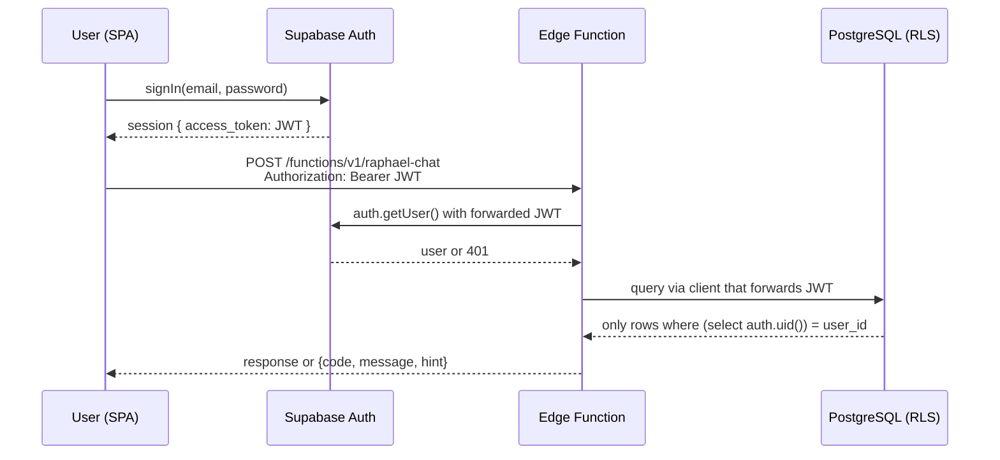

# Authentication and JWT Flow

Supabase Auth issues every JWT in EverAfter; the SPA guards routes with `ProtectedRoute`, Edge Functions re-validate the token per request, and the same JWT is forwarded to PostgreSQL so [[Row Level Security]] policies decide what rows the user can touch. Auth is enforced twice — at the function boundary and at the database — so a missing check in one layer is caught by the other.

## How It Works

### Frontend

`src/contexts/AuthContext.tsx` wraps the app (mounted in `src/App.tsx`) and exposes `user`, `session`, `loading`, `isDemoMode`, plus `signUp/signIn/signOut/resetPassword`. Notable mechanics, all verified in the code:

- **Warm boot**: before Supabase responds, it hydrates from a localStorage snapshot (`everafter_auth_snapshot` or the derived `sb-<projectRef>-auth-token` key) so returning users do not flash the login screen (`readWarmAuthState`).
- **Boot timeout**: session restore is bounded by `AUTH_BOOT_TIMEOUT_MS = 3000` via `src/lib/withTimeout.ts`.
- **Demo mode**: `startDemoMode()` installs a fetch interceptor (`src/lib/demo/demo-data-provider.ts`) so demo sessions never hit the real backend with a fake token.
- **Null-safe client**: `src/lib/supabase.ts` exports `null` instead of throwing when `VITE_SUPABASE_URL`/`VITE_SUPABASE_ANON_KEY` are missing; auth-backed routes degrade instead of white-screening.

`src/components/ProtectedRoute.tsx` is the route guard used throughout `src/App.tsx`. It does three checks in order:

1. **Session** — no `user` after loading → `<Navigate to="/login" />`.
2. **Runtime readiness** — `src/lib/runtime-readiness.ts` route gates; a hard blocker on `auth.session` or `frontend.supabase` renders `FeatureBlockedState` instead of the page.
3. **Onboarding** — `getOnboardingStatus()` (2.5s timeout plus a watchdog that releases the guard) redirects incomplete users to `/onboarding`, with a sessionStorage cache per user id. See [[Onboarding Flow]].

### Edge Functions

There is no framework middleware — each function validates explicitly. The pattern from `supabase/functions/raphael-chat/index.ts`:

1. Read the `Authorization` header; missing → `401 AUTH_MISSING`.
2. Create a supabase client with the **anon key** and `global: { headers: { Authorization: authHeader } }` so the user's JWT rides along on every query.
3. Call `supabase.auth.getUser()`; failure → `401 AUTH_FAILED`.
4. All subsequent table reads/writes go through that client, so RLS is enforced by PostgreSQL — the function never needs to add `WHERE user_id = ...` for safety (though ownership checks like the engram check in `raphael-chat` add defense in depth).

### Database (RLS)

Every table has RLS policies keyed on the JWT's user id. Policies use `(select auth.uid())` rather than bare `auth.uid()` so the planner can use indexes — a deliberate optimization applied across six migrations named `optimize_rls_policies_part1_core_tables` through `part6_final` (dated 2025-10-25). Family-sharing policies extend this with `EXISTS` checks against `family_members`. Background/admin work uses the service-role key, which bypasses RLS. Details in [[Row Level Security]] and [[Security Overview]].

## Gotchas

> [!warning] The Express server bypasses all of this
> `server/index.ts:20-23` sets `req.user = { id: 'demo-user-001' }` on every request — no JWT verification exists on the Node backend. The flow described above only holds for the Supabase side of the [[Dual Backend System]]. Any real deployment of the Express server needs proper Supabase JWT validation first.

> [!warning] Forgetting to forward the JWT silently breaks RLS
> If an Edge Function creates its client without the `Authorization` header pass-through, queries run as the anon role and return empty result sets (or fail) rather than erroring loudly. This is `CLAUDE.md` gotcha #4 and the first thing to check when a function "sees no data".

- Public routes exist by design: `/`, `/login`, `/signup`, `/forgot-password`, `/reset-password`, `/quiz/:token`, and `/career/public/:token` render without a session (`src/App.tsx`).
- The catch-all route sends unknown URLs to `/dashboard`, relying on `ProtectedRoute` to bounce logged-out users to `/login`.
- `AuthContext` has an auth-config self-healing path (`src/lib/auth-config-recovery.ts`) triggered on "invalid API key" errors.

## Key Files

- `src/contexts/AuthContext.tsx` — session state, warm boot, demo mode, error notifier
- `src/components/ProtectedRoute.tsx` — login + readiness + onboarding gate
- `src/lib/supabase.ts` — null-safe supabase-js client creation
- `src/lib/auth-session.ts` — session helpers
- `src/hooks/useAuth.tsx` — auth hook consumed by components
- `supabase/functions/raphael-chat/index.ts` — reference JWT validation pattern for all 55 functions
- `supabase/migrations/20251025082208_optimize_rls_policies_part1_core_tables.sql` — first of six migrations implementing `(select auth.uid())`
- `scripts/audit-rls-gap.mjs` — `npm run audit:rls` checks for tables missing policies

## Related

- [[Row Level Security]] — the database half of enforcement
- [[Dual Backend System]] — why the Express server has different (weaker) auth
- [[Contexts and Hooks]] — where AuthContext fits among the frontend providers
- [[Onboarding Flow]] — the redirect ProtectedRoute performs for new users
- [[Edge Functions Overview]] — every function repeats this validation pattern
- [[Security Overview]] — threat model this flow supports
- [[Pages and Routing]] — which routes are public vs. guarded
