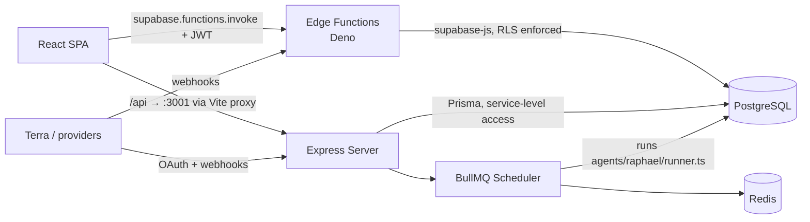

# Dual Backend System

The two backends actually live in production are Supabase Edge Functions (Deno, serverless, the primary API surface) and the Python FastAPI service in `backend/` (Render web service `everafter-api`, proxied at `/api/v1/*` and `/governance/*` via `netlify.toml`, reached through `src/lib/backend-request.ts`). The Express/Node server (`server/`, Terra plumbing plus BullMQ background jobs) that this note originally paired with the Edge Functions is **legacy and not deployed** — no deploy config references it. The Express and Supabase sides share the same PostgreSQL database but access it through different clients — Supabase client vs. [[Prisma Schema|Prisma]].

## Overview

| | Supabase Edge Functions | Express Server (legacy) |
|---|---|---|
| Runtime | Deno (TypeScript, `Deno.serve`) | Node (tsx, `express`) |
| Location | `supabase/functions/` (55 functions) | `server/` |
| DB access | supabase-js with forwarded user JWT → [[Row Level Security|RLS]] | Prisma Client (direct connection, no RLS) |
| Auth | Validates user JWT per request | Stubbed (see warning below) |
| Deploy | `supabase functions deploy` (project `sncvecvgxwkkxnxbvglv`) | **Not deployed** — no deploy config anywhere in the repo |
| Run locally | `supabase functions serve` | `npm run dev:server` (port 3001) |
| Scaling | Auto-scales | Single process + separate worker |

**What actually serves which** (per `CURRENT_STATE.md`, verified against deploy configs):

- Frontend + Edge Functions cover [[St Raphael]] chat, [[Custom Engrams]], tasks, [[Payments and Subscriptions|payments]], and all health OAuth/webhook flows — [[Terra Integration]] webhooks run through the `webhook-terra` Edge Function (signature-verified), **not** the Express stack.
- The Python FastAPI backend on Render serves the Saints runtime, monitoring/audit, family/genealogy, finance, and personality-training APIs at `/api/v1/*` and `/governance/*`.
- The [[Express Server]] and [[BullMQ Scheduler]] run only locally (`npm run dev:server` / `dev:worker`); do not build new features on them — owner decision pending on fix-vs-remove.

## How It Works

**Edge Function shape** — every function is an `index.ts` with `Deno.serve`, CORS preflight handling, manual `Authorization` header validation, and the standard `{ code, message, hint }` error envelope. `supabase/functions/raphael-chat/index.ts` is the canonical example: it builds a supabase client that forwards the caller's JWT (so RLS applies), calls `supabase.auth.getUser()`, verifies engram ownership, then calls OpenAI. Shared helpers (logging, token refresh, provider APIs, glucose math, validation) live in `supabase/functions/_shared/` — see [[Shared Edge Function Utilities]].

**Express side** — `server/index.ts` mounts five routers: Terra connections, bridges, generic provider webhooks, IoT webhooks, and Raphael API routes. It instantiates Prisma directly and, outside development, starts the scheduler when `REDIS_URL` is set (`isSchedulerEnabled()`). The scheduler enqueues per-user `agent-run` jobs on BullMQ queues (`agent-schedule`, `agent-run`) but only for users with active `Consent` rows (`purpose in ('train','project')`, not revoked) — consent gating is enforced in `server/workers/scheduler.ts` before any autonomous run.

> [!warning] The Express server does not validate JWTs
> `server/index.ts:20-23` installs middleware that hard-codes `req.user = { id: 'demo-user-001' }` for every request. There is no Supabase JWT verification on this backend today, unlike the Edge Functions. Treat any Express endpoint as unauthenticated until this stub is replaced; do not expose it publicly as-is. This contradicts docs that imply uniform JWT auth across backends.

> [!note] A third backend exists but is optional/legacy
> `ARCHITECTURE.md` describes an optional Python FastAPI backend (`backend/app/main.py`) for advanced NLP/ML with Celery. It is still in the tree (and `vite.config.ts` proxies `/api/v1` and `/ws` to `localhost:8010` for it), but the active secondary backend is the Express server. `health-api/` is yet another standalone Dockerized service with its own Prisma schema, exercised via `npm run test:health`.

## Gotchas

- **Never mix clients in one file**: Edge Functions (Deno) use supabase-js via `npm:` specifiers; the Node server uses Prisma. Importing Prisma into a Deno function or supabase-js server-side patterns into Express is the classic mistake (`CLAUDE.md` gotcha #1). `vite.config.ts:43-45` even isolates `@prisma` into its own chunk in case a stray client import slips into the frontend.
- **Two migration systems**: Supabase SQL migrations (`supabase/migrations/`, 122 files) define the real schema; `prisma/schema.prisma` + `prisma/migrations/` model the subset the Node server touches. Keep them in sync manually — see [[Migrations]].
- **Secrets live in different places**: Edge Function secrets go in the Supabase Dashboard ([[Secrets Management]]); the Express server reads `.env` (`DATABASE_URL`, `REDIS_URL`, `TERRA_API_KEY`).
- The scheduler silently no-ops without `REDIS_URL` — "background jobs not running" usually means Redis is not configured, not a code bug.

## Key Files

- `supabase/functions/raphael-chat/index.ts` — canonical Edge Function: JWT validation, RLS-forwarding client, OpenAI call
- `supabase/functions/_shared/` — cross-function utilities (`connectors.ts`, `token-refresh.ts`, `glucose.ts`, `logger.ts`, ...)
- `server/index.ts` — Express entry: routers, Prisma init, scheduler startup, auth stub
- `server/api/connections/terra.ts` — Terra OAuth + webhook handlers
- `server/api/raphael.ts` — Raphael routes on the Node side
- `server/lib/terra-client.ts` — [[Terra Client Library|Terra API client]]
- `server/workers/scheduler.ts` — BullMQ queues + consent-gated agent runs
- `agents/raphael/runner.ts` — the agent the scheduler executes
- `vite.config.ts` — dev proxies wiring the SPA to both backends

## Related

- [[System Overview]] — where the two backends sit in the whole platform
- [[Edge Functions Overview]] — per-function catalog of the Deno side
- [[Express Server]] — deeper dive on the Node side
- [[BullMQ Scheduler]] — the background job half of the Express stack
- [[Prisma Schema]] — the ORM models only the Node server uses
- [[Authentication and JWT Flow]] — why the auth guarantees differ between backends
- [[Terra Integration]] — the main reason the Express server exists
