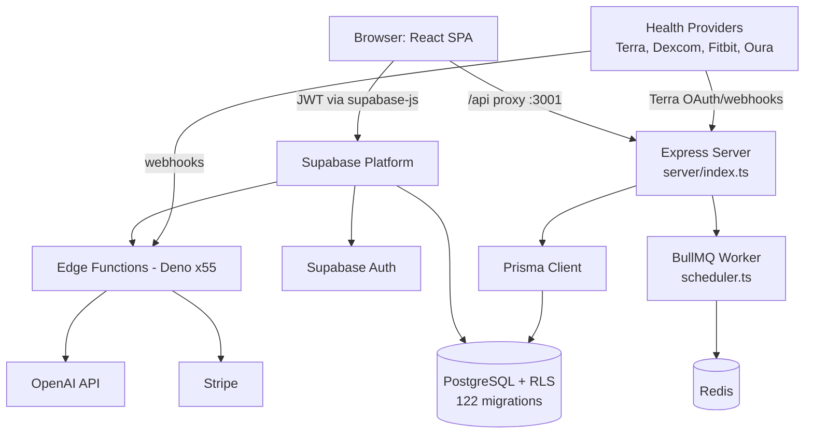

# System Overview

EverAfter is a digital legacy and health companion platform: a React SPA backed primarily by Supabase (PostgreSQL + Auth + Deno Edge Functions), with a secondary Express/Node server for health-provider integrations and a BullMQ worker for background agent runs. Its flagship features are the [[St Raphael]] health AI, [[Custom Engrams]] (AI personalities trained via [[365-Day Personality Training]]), multi-provider health monitoring, and family/legacy tools.

## Overview

The platform is "Supabase-first": the frontend talks to Supabase directly (auth, CRUD under [[Row Level Security]], realtime) and invokes 55 Edge Functions in `supabase/functions/` for anything that needs secrets or server-side logic — AI chat, embeddings, OAuth flows, webhooks, Stripe. See [[Edge Functions Overview]] for the full catalog.

A second backend, the [[Express Server]] in `server/`, exists specifically for [[Terra Integration]] and other health-provider OAuth/webhook plumbing, using [[Prisma Schema|Prisma]] models instead of the Supabase client. A [[BullMQ Scheduler]] worker (`server/workers/scheduler.ts`) runs consent-gated autonomous agent jobs against Redis queues. The split is documented in [[Dual Backend System]].

Major product surfaces (routed in `src/App.tsx`):

- **Health**: St. Raphael Health Hub (`/health-dashboard`), devices, glucose/CGM, Terra setup — see [[Health Integrations MOC]]
- **AI personalities**: [[The Saints]] dashboards (Michael/security, Joseph/family, Gabriel/finance, Anthony/audit), [[Trinity and Council]], engram chat
- **Legacy**: [[Legacy Vault]], [[Digital Legacy and Memorials|Digital Legacy]], [[Time Capsules]], memorial services
- **Commerce**: [[Marketplace and Creator Dashboard|Marketplace]], [[Payments and Subscriptions|Stripe payments]], [[Eternal Care Insurance]] (behind the `VITE_ENABLE_NON_CORE_ROUTES` flag)

## How It Works

Data flow in one paragraph: the user authenticates through [[Authentication and JWT Flow|Supabase Auth]]; the SPA calls Edge Functions with the JWT in the `Authorization` header; each function re-validates the user and forwards the JWT so RLS applies to every query. Health providers push data in via webhook functions (`webhook-terra`, `webhook-dexcom`, `webhook-fitbit`, `webhook-oura`), which normalize readings into `health_metrics`/`glucose_readings` per [[Health Data Normalization]] conventions. Chat requests hit `raphael-chat`/`engram-chat`, which pull personality context and [[Embeddings and Vector Search|vector embeddings]] before calling the LLM, with [[Safety Guardrails]] applied to health advice.

> [!warning] Root docs disagree with each other and with the code
> `ARCHITECTURE.md` describes a "Supabase + optional Python FastAPI backend" and never mentions the Express server; `CLAUDE.md` describes the Express server as the secondary backend. The code has **both**: `server/` (Express + Prisma, actively wired into `vite.config.ts` proxies) and `backend/` (Python FastAPI, largely legacy/experimental with dozens of one-off debug scripts). Trust `CLAUDE.md` + the code: the Express server is the real secondary backend. Also `FILE_ORGANIZATION.md` (Oct 2025) is badly stale — it counts 26 edge functions and 37 migrations; the repo actually has 55 functions and 122 migrations.

> [!note] There are more services in the tree than the two backends
> `health-api/` (standalone Dockerized health API with its own Prisma schema), `voice-ai-service/` (Python), `nextjs-implementation/`, and `smart-contracts/` all exist as auxiliary or exploratory codebases. See [[Repository Layout]] for what is live vs. parked.

## Key Files

- `src/App.tsx` — root component: provider stack, all routes, lazy loading, release-flag gating
- `src/lib/supabase.ts` — the shared supabase-js client (exports `null` if env vars are missing rather than crashing)
- `src/lib/api-client.ts` — unified API client wrapping Edge Function calls
- `supabase/functions/` — 55 Deno Edge Functions plus `_shared/` utilities
- `supabase/migrations/` — 122 SQL migrations (the real schema source of truth)
- `server/index.ts` — Express entry point mounting Terra/webhook/Raphael routers
- `server/workers/scheduler.ts` — BullMQ agent scheduler (requires `REDIS_URL`)
- `prisma/schema.prisma` — Prisma models for the Node server (User, Source, Device, Metric, Consent, ...)
- `ARCHITECTURE.md` — legacy architecture doc (Supabase-first framing; see warning above)
- `CLAUDE.md` — most current single-file description of the system

## Gotchas

> [!warning] Dev server port
> `CLAUDE.md` says the Vite dev server runs on 5173, but `vite.config.ts:52` sets `port: 5000` with `strictPort: true`. It is 5000. The same config proxies `/api` → `localhost:3001` (Express) and `/api/v1` + `/ws` → `localhost:8010` (the optional Python backend).

- Deployment targets: frontend on Netlify (`netlify.toml`, prod at everafterai.net), Edge Functions on Supabase project `sncvecvgxwkkxnxbvglv` — see [[Deployment]].
- Non-core routes (pricing, marketplace, admin portal, insurance...) render only when `VITE_ENABLE_NON_CORE_ROUTES === 'true'` (`src/App.tsx:64`); otherwise they redirect to `/` or `/dashboard`.

## Related

- [[Dual Backend System]] — the Supabase-vs-Express split in detail
- [[Authentication and JWT Flow]] — how identity moves through every layer above
- [[Tech Stack]] — each technology in the diagram and why it is there
- [[Repository Layout]] — where all of this lives on disk
- [[Edge Functions Overview]] — catalog of the 55 serverless functions
- [[Database Overview]] — the PostgreSQL schema both backends share
- [[Architecture MOC]] — hub for all architecture notes
