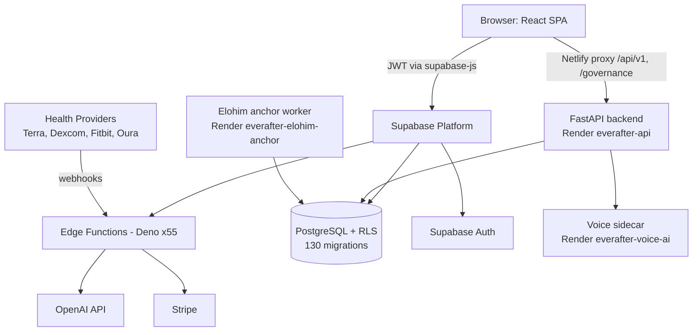

# System Overview

EverAfter is a digital legacy and health companion platform: a React SPA backed primarily by Supabase (PostgreSQL + Auth + Deno Edge Functions), with a Python FastAPI backend (`backend/`) and a voice sidecar (`voice-ai-service/`) both live on Render. Its flagship features are the [[St Raphael]] health AI, [[Custom Engrams]] (AI personalities trained via [[365-Day Personality Training]]), multi-provider health monitoring, and family/legacy tools.

## Overview

The platform is "Supabase-first": the frontend talks to Supabase directly (auth, CRUD under [[Row Level Security]], realtime) and invokes 55 Edge Functions in `supabase/functions/` for anything that needs secrets or server-side logic — AI chat, embeddings, OAuth flows, webhooks, Stripe. See [[Edge Functions Overview]] for the full catalog.

The second live backend is the Python FastAPI service in `backend/`, deployed as Render web service `everafter-api` (`render.yaml`) and proxied at `/api/v1/*` and `/governance/*` via `netlify.toml`; 20+ `src/` files reach it through `src/lib/backend-request.ts`. A companion Render worker `everafter-elohim-anchor` (same tree) seals engrams and daily responses into a signed ledger, and `voice-ai-service/` runs as Render service `everafter-voice-ai` (ElevenLabs), consumed via `src/lib/joseph/voice.ts`. The [[Express Server]] in `server/` and its [[BullMQ Scheduler]] worker are **legacy and not deployed** — no deploy config references them; Terra webhooks actually run through the `webhook-terra` Edge Function. The split (and its history) is documented in [[Dual Backend System]].

Major product surfaces (routed in `src/App.tsx`):

- **Health**: St. Raphael Health Hub (`/health-dashboard`), devices, glucose/CGM, Terra setup — see [[Health Integrations MOC]]
- **AI personalities**: [[The Saints]] dashboards (Michael/security, Joseph/family, Gabriel/finance, Anthony/audit), [[Trinity and Council]], engram chat
- **Legacy**: [[Legacy Vault]], [[Digital Legacy and Memorials|Digital Legacy]], [[Time Capsules]], memorial services
- **Commerce**: [[Marketplace and Creator Dashboard|Marketplace]], [[Payments and Subscriptions|Stripe payments]], [[Eternal Care Insurance]] (behind the `VITE_ENABLE_NON_CORE_ROUTES` flag)

## How It Works

Data flow in one paragraph: the user authenticates through [[Authentication and JWT Flow|Supabase Auth]]; the SPA calls Edge Functions with the JWT in the `Authorization` header; each function re-validates the user and forwards the JWT so RLS applies to every query. Health providers push data in via webhook functions (`webhook-terra`, `webhook-dexcom`, `webhook-fitbit`, `webhook-oura`), which normalize readings into `health_metrics`/`glucose_readings` per [[Health Data Normalization]] conventions. Chat requests hit `raphael-chat`/`engram-chat`, which pull personality context and [[Embeddings and Vector Search|vector embeddings]] before calling the LLM, with [[Safety Guardrails]] applied to health advice.

> [!warning] Ground truth lives in `CURRENT_STATE.md`
> The repo-root `CURRENT_STATE.md` (dated, verified against deploy configs) is the single source of truth for what is live; `CLAUDE.md`'s architecture section was rewritten 2026-07-12 to match it. The 150+ contradictory root-level status docs were moved to `docs/archive/` — including `ARCHITECTURE.md` and `FILE_ORGANIZATION.md` — and none of them should be treated as current. Earlier revisions of this vault (and of `CLAUDE.md`) called the Express `server/` stack the "real secondary backend"; deploy configs show it is not deployed at all. The live backends are Supabase Edge Functions plus the Render services above.

> [!note] There are more services in the tree than the live backends
> `health-api/` (standalone Node/Prisma health service — broken, not deployed), `nextjs-implementation/` (dead scaffolding), and `smart-contracts/` (unstarted roadmap) exist as parked codebases awaiting an owner decision. See [[Repository Layout]] for what is live vs. parked.

## Key Files

- `src/App.tsx` — root component: provider stack, all routes, lazy loading, release-flag gating
- `src/lib/supabase.ts` — the shared supabase-js client (exports `null` if env vars are missing rather than crashing)
- `src/lib/api-client.ts` — unified API client wrapping Edge Function calls
- `supabase/functions/` — 55 Deno Edge Functions plus `_shared/` utilities
- `supabase/migrations/` — 130 SQL migrations (the real schema source of truth)
- `src/lib/backend-request.ts` — how the SPA reaches the FastAPI backend through the Netlify proxy
- `render.yaml` — blueprint for the three live Render services (`everafter-api`, `everafter-elohim-anchor`, `everafter-voice-ai`)
- `server/index.ts` — Express entry point (legacy, not deployed; local-only via `npm run dev:server`)
- `prisma/schema.prisma` — Prisma models for the legacy Node server (User, Source, Device, Metric, Consent, ...)
- `CURRENT_STATE.md` — dated ground-truth doc; trust it over anything else
- `CLAUDE.md` — day-to-day agent guidance, aligned with `CURRENT_STATE.md`

## Gotchas

> [!warning] Dev server port
> `CLAUDE.md` says the Vite dev server runs on 5173, but `vite.config.ts:52` sets `port: 5000` with `strictPort: true`. It is 5000. The same config proxies `/api` → `localhost:3001` (Express) and `/api/v1` + `/ws` → `localhost:8010` (the optional Python backend).

- Deployment targets: frontend on Netlify (`netlify.toml`, prod at everafterai.net), Edge Functions on Supabase project `sncvecvgxwkkxnxbvglv`, FastAPI backend + Elohim worker + voice sidecar on Render (`render.yaml`) — see [[Deployment]].
- Non-core routes (pricing, marketplace, admin portal, insurance...) render only when `VITE_ENABLE_NON_CORE_ROUTES === 'true'` (`src/App.tsx:64`); otherwise they redirect to `/` or `/dashboard`.

## Related

- [[Dual Backend System]] — which backends are live vs. legacy, in detail
- [[Authentication and JWT Flow]] — how identity moves through every layer above
- [[Tech Stack]] — each technology in the diagram and why it is there
- [[Repository Layout]] — where all of this lives on disk
- [[Edge Functions Overview]] — catalog of the 55 serverless functions
- [[Database Overview]] — the PostgreSQL schema both backends share
- [[Architecture MOC]] — hub for all architecture notes
