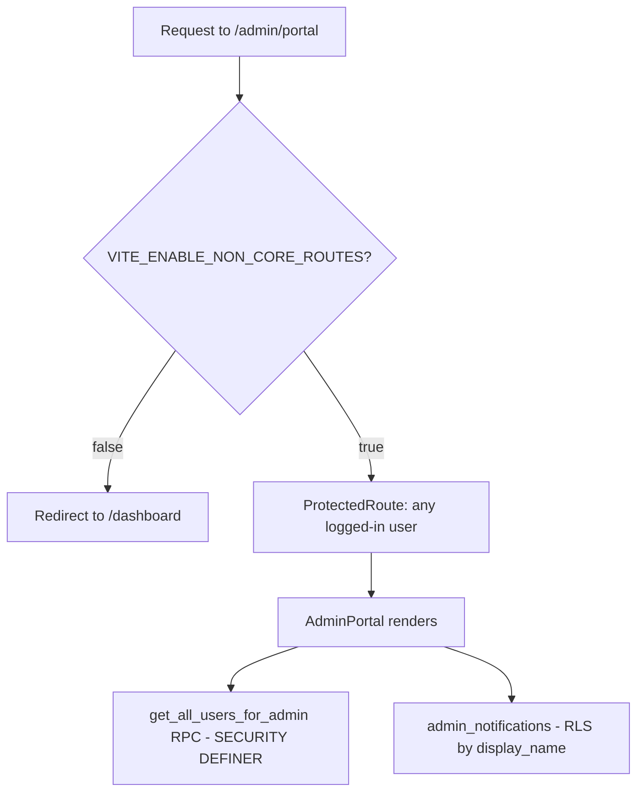

# Admin Portal

The admin surfaces: a user-management dashboard (`/admin/portal`), a manual user-creation form (`/admin/create-user`), an OAuth credentials viewer component, and the `send-admin-notification` Edge Function that emails admin notifications. Access control is thin — mostly the `VITE_ENABLE_NON_CORE_ROUTES` release flag plus login, not a real role system.

## Overview

- `src/pages/AdminPortal.tsx` (route `/admin/portal`, flag-gated + `ProtectedRoute`) — three-tab dashboard. Stats cards (total users, new today, connections, pending notifications); a Users tab listing every account via the `get_all_users_for_admin` RPC with CSV export; a Notifications tab reading `admin_notifications` with mark-as-read. In demo mode it renders empty state; on RPC failure it degrades to empty rather than erroring.
- `src/pages/AdminUserCreation.tsx` (route `/admin/create-user`, flag-gated but **not** wrapped in ProtectedRoute — it is a public route when the flag is on) — form that calls the `create_user_manually(email, password)` RPC to provision accounts when self-signup is disabled.
- `src/components/OAuthCredentialsAdmin.tsx` — lists rows from the `oauth_credentials` table with masked access/refresh tokens, reveal toggles, expiry status, activate/deactivate and delete actions.
- `supabase/functions/send-admin-notification/index.ts` — Edge Function using the service-role key: fetches `admin_notifications` where `is_emailed = false`, renders an HTML email addressed to `ADMIN_EMAIL` (default `raphael@everafter.com`), and marks them sent.

## Access Control — What Actually Gates Admin

> [!warning] `get_all_users_for_admin()` (defined in `supabase/migrations/20251029170000_create_user_portal_system.sql:373`) is `SECURITY DEFINER` with **no role check inside the function body** — any authenticated user who can reach the RPC can enumerate every user's email, phone, and location. The only UI gate is the release flag and being logged in.

> [!warning] `create_user_manually` is granted to both `authenticated` **and `anon`** (`supabase/migrations/20251025135259_create_admin_user_function.sql:90-91`, re-granted in `20251025135412_fix_user_creation_function.sql:80-81`). With the flag on, anyone can create accounts without logging in. Several follow-up migrations fix bcrypt cost and identity structure but none revoke the anon grant.

> [!warning] "Admin" for `admin_notifications` RLS is defined as `user_profiles.display_name = 'Raphael Admin'` (same migration, line 215) — a display name any user can potentially set on their own profile via `src/pages/UserProfileSetup.tsx`. This is not a robust role model; see [[Row Level Security]] and [[Security Overview]].

> [!warning] `OAuthCredentialsAdmin` is not imported by any page — it is an orphaned component. If revived, note it renders raw OAuth tokens in the browser on reveal, which conflicts with the "never log/expose credentials" rule in [[PHI Handling]].

## How Notifications Flow

1. Signup/user events insert rows into `admin_notifications` (INSERT policy is `WITH CHECK (true)` for authenticated users).
2. `send-admin-notification` (invoked manually or by a scheduler; nothing in `src/` calls it) emails unsent rows to `ADMIN_EMAIL` and flips `is_emailed`.
3. `AdminPortal`'s Notifications tab shows them with user metadata (email, location, interests) and mark-as-read.

## Key Files

- `src/pages/AdminPortal.tsx` — stats, user table, CSV export, notifications tab
- `src/pages/AdminUserCreation.tsx` — manual account creation form (public when flag on)
- `src/components/OAuthCredentialsAdmin.tsx` — orphaned OAuth credential viewer
- `supabase/functions/send-admin-notification/index.ts` — notification email sender (service role)
- `supabase/migrations/20251029170000_create_user_portal_system.sql` — `admin_notifications` table, RLS, `get_all_users_for_admin`
- `supabase/migrations/20251025135259_create_admin_user_function.sql` — `create_user_manually` + grants

## Gotchas

> [!note] There is no `is_admin` column, admin role table, or JWT claim check anywhere in the admin UI path. Admin capability today = release flag + login (+ the display-name trick for notifications). Treat `/admin/*` as unsafe to enable in production until a real role check exists.

## Related

- [[Pages and Routing]] — how the flag gates `/admin/*` routes
- [[Row Level Security]] — the policy model these tables lean on
- [[Security Overview]] — broader threat model context
- [[Authentication and JWT Flow]] — the session that is the only real gate
- [[Contexts and Hooks]] — demo-mode behavior AdminPortal honors
- [[Secrets Management]] — where `ADMIN_EMAIL` and service keys live
