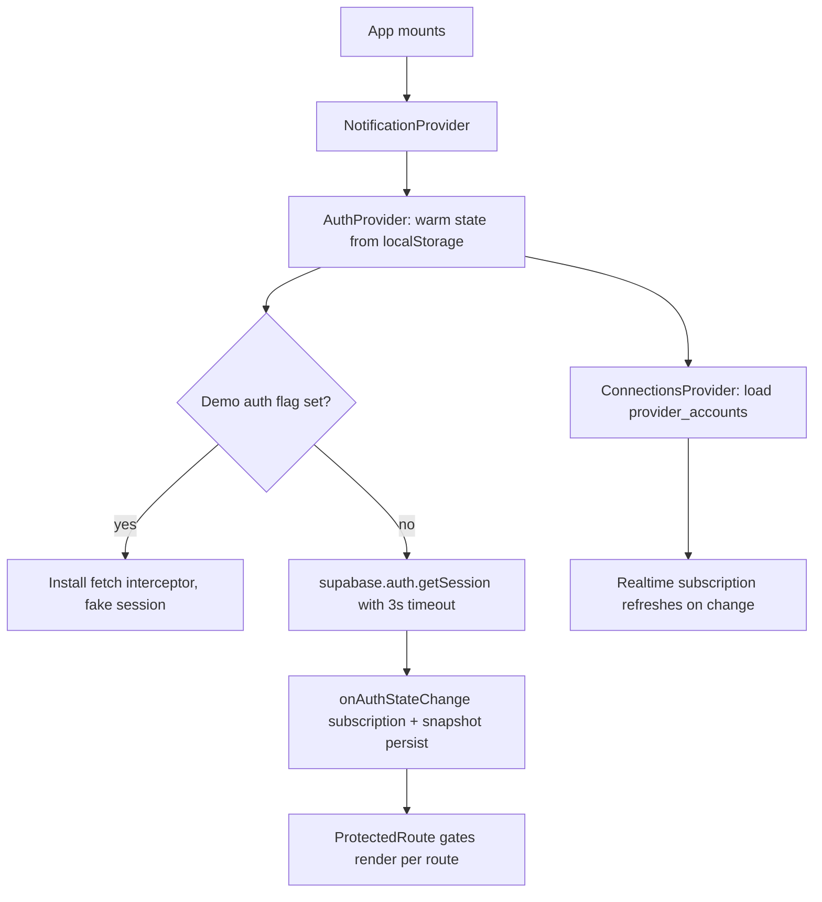

# Contexts and Hooks

State management is plain React Context + hooks — no Redux, no Zustand. Three providers wrap the app in `src/App.tsx` (`NotificationProvider > AuthProvider > ConnectionsProvider`), and a small set of shared hooks live in `src/hooks/`.

## AuthContext (`src/contexts/AuthContext.tsx`)

The heart of client auth, wrapping Supabase Auth (see [[Authentication and JWT Flow]]). Exposes `user`, `session`, `loading`, `isDemoMode`, `signUp`, `signIn`, `signOut`, `resetPassword`, `startDemoMode`, `setErrorNotifier`.

Notable mechanics:

- **Warm boot** — before Supabase responds, initial state is hydrated synchronously from localStorage: a custom snapshot key `everafter_auth_snapshot` or the derived Supabase key `sb-<projectRef>-auth-token` (`readWarmAuthState`, line 45). This kills the login-spinner flash on reload.
- **Timeout + watchdog** — `getSession()` is wrapped in `withTimeout` (3 s, `AUTH_BOOT_TIMEOUT_MS`) and a second watchdog force-releases `loading` after +2 s so the app never hangs on a dead backend.
- **Demo mode** — `startDemoMode()` installs a fetch interceptor (`src/lib/demo/demo-data-provider.ts`) so all API calls are served locally with a fake token; the interceptor must be re-installed on reload (comment at line 89 explains the 401-storm failure mode otherwise). Sign-in/up/out all call `clearDemoAuth()` first.
- **Error notifier bridge** — `ErrorNotifierConnector` in `src/App.tsx:83` injects `showNotification` from NotificationContext into AuthContext, so auth errors surface as toasts without a circular provider dependency.
- **Config recovery** — invalid-API-key errors trigger `attemptAuthConfigRecovery` (`src/lib/auth-config-recovery.ts`) before giving up.

> [!warning] There are two `useAuth` implementations: the context hook exported from `src/contexts/AuthContext.tsx` (the one nearly everything uses) and a standalone legacy hook `src/hooks/useAuth.tsx` that subscribes to Supabase directly and knows nothing about demo mode, warm boot, or error notification. Importing the wrong one silently loses demo-mode awareness.

## ConnectionsContext (`src/contexts/ConnectionsContext.tsx`)

Global list of health/service connections plus the slide-over panel state. Loads `provider_accounts` rows for the current user, subscribes to Postgres realtime changes on that table (channel `connections-changes`), and exposes `openConnectionsPanel(category?)` / `closeConnectionsPanel` used by the [[Health UI Components|health hub]] header and the globally mounted `ConnectionsPanel`. Helpers: `getConnectionsByCategory`, `getActiveConnectionsCount`. In demo mode it returns an empty list rather than intercepting.

## NotificationContext (`src/contexts/NotificationContext.tsx`)

Minimal toast queue: `showNotification(message, type, duration=5000)` with auto-dismiss, `dismissNotification`, `clearAll`. Rendered by the lazily mounted `src/components/NotificationToast.tsx` at the app root. Types: `success | error | warning | info`.

## Hooks (`src/hooks/`)

- `useAuth.tsx` — legacy standalone auth hook (see warning above).
- `useAuthModal.tsx` — state for a sign-in/sign-up modal with an "auth intent" (action + data + redirect) persisted to sessionStorage under `auth_intent`, so an anonymous user's intended action can resume after login. Pairs with `src/components/AuthModal.tsx`.
- `useKeyboardNavigation.tsx` — an accessibility toolkit built on `src/lib/keyboard-navigation.ts`: `useKeyboardClick`, `useEscapeKey`, `useFocusTrap`, `useFocusRestore`, `useArrowNavigation`, `useRovingTabIndex`, `useKeyboardShortcuts`, `useFocusVisible`, `useSkipLink`, `useAnnouncement` (ARIA live regions). These back the [[Design System]] accessibility commitments.

> [!note] Feature-specific hooks live next to their features rather than in `src/hooks/` — e.g. `src/components/joseph/useAudioRecorder.ts`. `src/hooks/` only holds the three cross-cutting ones.

## How It Works — App Boot

## Key Files

- `src/contexts/AuthContext.tsx` — auth state, demo mode, warm boot, watchdogs
- `src/contexts/ConnectionsContext.tsx` — provider connections + panel state, realtime
- `src/contexts/NotificationContext.tsx` — toast queue
- `src/hooks/useAuth.tsx` — legacy direct-Supabase auth hook (avoid)
- `src/hooks/useAuthModal.tsx` — auth modal + intent resumption
- `src/hooks/useKeyboardNavigation.tsx` — a11y hook suite
- `src/lib/withTimeout.ts` — promise timeout helper used by auth and onboarding checks
- `src/lib/demo-auth.ts`, `src/lib/demo/demo-data-provider.ts` — demo session + fetch interception

## Related

- [[Authentication and JWT Flow]] — server-side view of the session these contexts manage
- [[Pages and Routing]] — provider nesting and ProtectedRoute consumption
- [[Health UI Components]] — main consumer of ConnectionsContext
- [[Onboarding Flow]] — relies on AuthContext user + withTimeout patterns
- [[Design System]] — accessibility standards implemented by the keyboard hooks
