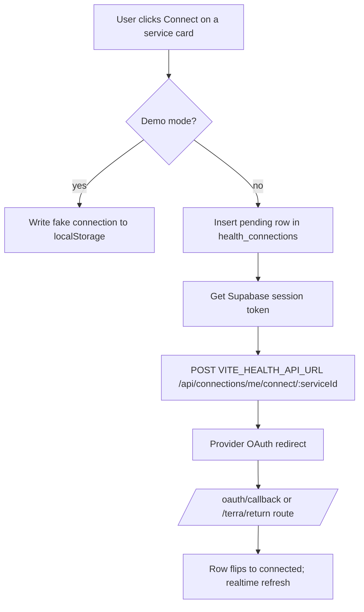

# Health UI Components

The health-facing React surfaces: the St. Raphael hub page at `/health-dashboard`, the provider-connection manager, device monitoring, analytics, and the vitals/medication/goals trackers. Most read Supabase tables directly from the browser (RLS-scoped); the hub itself talks to the Express backend.

## Overview

`src/pages/StRaphaelHealthHub.tsx` (route `/health-dashboard`, see [[Pages and Routing]]) is the umbrella. It loads a health summary from the Express API (`/api/v1/health/summary` via `src/lib/backend-request.ts` + `apiClient.getAuthHeaders()`), checks the `raphael.hub` capability in `src/lib/runtime-readiness.ts`, and renders `FeatureBlockedState` rather than fabricating data when live dependencies are down. Views: Command Overview, Decision Simulator (`causal-twin/WhatIfSimulator`), Experiment Lab, Governance, Biometric Analytics, Neural Trajectory, and Raphael AI Oracle (`RaphaelChat`, the client of [[St Raphael]]'s chat pipeline in [[AI Chat Edge Functions]]).

The Overview view embeds `MedicationTracker`, `HealthGoals`, a `SynapsePulse` panel (POST to `/api/v1/causal-twin/predictions`), a family risk heatmap (`/api/v1/health-predictions/predict-family`, falling back to `/api/v1/causal-twin/ancestry/family-map`), plus `PhoneHealthConnect` and `ComprehensiveHealthConnectors`. The Analytics view composes `DeviceMonitorDashboard`, `ConnectionRotationConfig`/`ConnectionRotationMonitor` (see [[Connection Rotation]]) and `ComprehensiveAnalyticsDashboard`.

## Component Inventory

- `src/components/ComprehensiveHealthConnectors.tsx` (836 lines) — catalog of 25+ providers grouped by category (aggregators, wearables, glucose, EHR, research, platform, custom), each flagged `available` or `coming_soon`. Terra, Particle Health and 1upHealth are among the `available` ones. State lives in the `health_connections` table; in demo mode it round-trips localStorage via `src/lib/demo-storage.ts`.
- `src/components/DeviceMonitorDashboard.tsx` — polls every 30 s: `device_connections` (joined to `device_registry`), unresolved `device_alerts`, 24 h of `data_quality_logs`, and the `get_device_status_summary` RPC. Opens `TroubleshootingWizard` per device — see [[Device Monitoring and Troubleshooting]].
- `src/components/RaphaelHealthInterface.tsx` — a 10-tab Raphael health workspace (chat, overview, insights, predictions, analytics, medications, appointments, goals, connections, emergency) that resolves the St. Raphael engram id and checks `health_premium_features` for premium gating.
- `src/components/HealthAnalytics.tsx` — reads `health_metrics` for the current and previous periods and computes trends/weekly aggregates client-side; feeds [[Health Insights and Analytics]] surfaces.
- `src/components/HealthVitalsLogger.tsx` — manual vitals entry, inserts rows into `health_metrics` (units normalized per [[Health Data Normalization]]).
- `src/components/MedicationTracker.tsx` — CRUD on `prescriptions` and dose logging in `medication_logs`.
- `src/components/HealthGoals.tsx` — CRUD on `health_goals` with progress tracking.
- `src/components/raphael/Today.tsx` + `Today*Card.tsx` — "Today" overview cards (alerts, vitals, trends, reports, tasks) with the cursor-proximity `--neon-intensity` glow from the [[Design System]].
- Supporting cast: `HealthAlertListener` (mounted globally in `App.tsx`, pairs with [[Glucose Monitoring and Alerts]]), `TerraIntegration`/`TerraSetupWizard` ([[Terra Integration]]), `PredictiveHealthInsights`, `HealthReportGenerator`, `AppointmentManager`, `EmergencyContacts`.

> [!warning] `RaphaelHealthInterface` is only imported by `src/components/StRaphaelHealthHub.tsx` — and that component version of the hub is itself imported nowhere. The routed hub is the *page* `src/pages/StRaphaelHealthHub.tsx`, which does not use `RaphaelHealthInterface`. Both the component-hub and `RaphaelHealthInterface` are effectively dead layers kept from an earlier iteration; edit the page version.

## How It Works — Connecting a Provider

`ComprehensiveHealthConnectors.connectService()` (`src/components/ComprehensiveHealthConnectors.tsx:427`):

> [!note] `VITE_HEALTH_API_URL` defaults to `http://localhost:4000` — the Express [[Express Server]] connections API, not a Supabase Edge Function. The broader OAuth story is in [[Health OAuth Flow]]; connection state shown in the header badge comes from `provider_accounts` via ConnectionsContext ([[Contexts and Hooks]]), which is a *different* table than `health_connections` used here.

## Key Files

- `src/pages/StRaphaelHealthHub.tsx` — routed health hub (`/health-dashboard`)
- `src/components/ComprehensiveHealthConnectors.tsx` — provider catalog + connect flow
- `src/components/DeviceMonitorDashboard.tsx` — device status, alerts, data quality
- `src/components/RaphaelHealthInterface.tsx` — legacy tabbed health workspace (unrouted)
- `src/components/HealthAnalytics.tsx` — client-side trend computation over `health_metrics`
- `src/components/HealthVitalsLogger.tsx` — manual vitals entry
- `src/components/MedicationTracker.tsx` — prescriptions + medication logs
- `src/components/HealthGoals.tsx` — goal CRUD and progress
- `src/components/PhoneHealthConnect.tsx` — phone-native (Apple Health / Google Fit) connect card
- `src/components/TroubleshootingWizard.tsx` — guided device troubleshooting

## Gotchas

> [!warning] Two parallel connection stores exist in the UI: `health_connections` (ComprehensiveHealthConnectors) and `provider_accounts` (ConnectionsContext / ConnectionsPanel). Counts shown in different headers can disagree.

## Related

- [[Health Integrations MOC]] — backend counterpart of everything here
- [[St Raphael]] — the AI persona this hub fronts
- [[Health OAuth Flow]] — full OAuth sequence behind the Connect button
- [[Device Monitoring and Troubleshooting]] — deeper device pipeline docs
- [[Glucose Monitoring and Alerts]] — alert thresholds surfaced by HealthAlertListener
- [[Contexts and Hooks]] — ConnectionsContext powering the connections panel
- [[Design System]] — the dark neumorphic style this hub exemplifies
