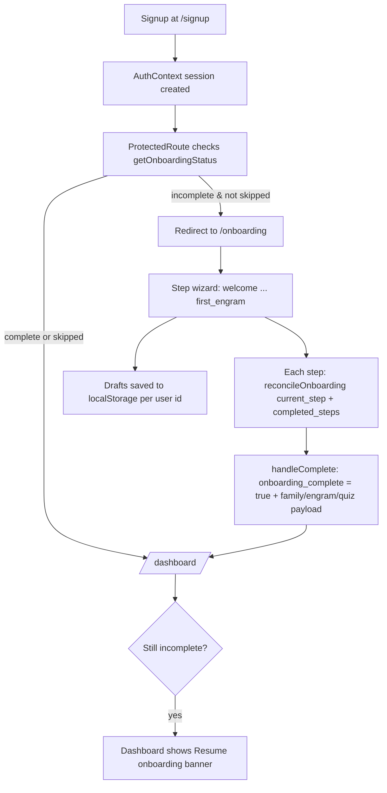

# Onboarding Flow

The signup-to-dashboard journey: a 7-step wizard at `/onboarding` (`src/pages/Onboarding.tsx`) whose step components live in `src/components/onboarding/`. Progress is reconciled to a canonical backend record while drafts are mirrored to localStorage so nothing is lost offline.

## Overview

Step order (`STEP_ORDER`, `src/pages/Onboarding.tsx:26`):

1. `welcome` — `WelcomeStep.tsx`
2. `meet_raphael` — `MeetRaphaelStep.tsx`, introduces [[St Raphael]]
3. `health_profile` — `HealthProfileStep.tsx` (DOB, gender, weight/height, conditions, allergies, goals, activity level)
4. `health_connections` — `HealthConnectionStep.tsx`, optional provider picks (Apple Health, Fitbit, Google Fit, Oura, WHOOP, …) feeding [[Health OAuth Flow]]
5. `media_permissions` — `MediaPermissionsStep.tsx` (photo/camera/video consent, face detection, expression analysis)
6. `first_engram` — `FirstEngramStep.tsx` (~930 lines; starter AI name + archetype, a personality quiz seed, and family setup — the entry point to [[Custom Engrams]] and [[365-Day Personality Training]])
7. `complete` — `OnboardingComplete.tsx`

`OnboardingProgress.tsx` renders the step bar; every step except `welcome`/`complete` offers "Skip for now".

## How It Works

Key mechanics in `src/pages/Onboarding.tsx`:

- **Canonical status** — `getOnboardingStatus()` / `reconcileOnboarding()` from `src/lib/onboardingApi.ts` are the source of truth (profile flags `has_completed_onboarding`, `onboarding_skipped`; status record with `completed_steps` and `current_step`). Loading is wrapped in `withTimeout` (7 s) plus a watchdog that releases the spinner with a warning banner.
- **Local drafts** — `src/lib/onboardingDraft.ts` persists the health profile and the starter-engram bundle (first engram, quiz answers, family setup) per user id. On load, database values win but unsynced drafts are recovered with an amber "recovered from this device" banner.
- **Skip** — `handleSkip` marks `onboarding_skipped: true` and goes straight to `/dashboard`; skipped users are not redirected back by `ProtectedRoute` (its check requires *neither* completed *nor* skipped, `src/components/ProtectedRoute.tsx:116`), but `src/pages/Dashboard.tsx` shows a "Resume onboarding" progress card until complete.
- **Callback stability** — `updateOnboardingData` is `useCallback`-stable because `FirstEngramStep` calls `onUpdate` inside an effect; an unstable identity caused infinite render loops (comment at line 335).

## Enforcement and Resume

- `src/components/ProtectedRoute.tsx` runs the onboarding check on every protected route (2.5 s timeout, sessionStorage cache `everafter_onboarding_required_<userId>`, exempt routes `/onboarding` and `/portal/profile`). While the check is in flight it optimistically renders children.
- `src/pages/Dashboard.tsx:100-188` computes two resume banners: onboarding progress (6 labelled steps) and a follow-up "Joseph Personality" card nudging the full 50-question OCEAN assessment at `/family-dashboard?tab=quiz` once a starter seed exists.

## UserProfileSetup

`src/pages/UserProfileSetup.tsx` (route `/portal/profile`) is *not* part of the wizard — it edits the social/portal profile (`user_profiles` table: display name, phone, location, interests, skills, bio, visibility, messaging consents), with a demo-mode localStorage fallback. It shares the onboarding exemption in ProtectedRoute so incomplete users can still edit their profile.

> [!note] Dashboard's banner hard-codes step labels `Welcome, Raphael, Health, Connect, Permissions, AI + Family` (6 entries) while the wizard has 6 real steps + `complete`; the label list is a display convenience, not the canonical order.

## Key Files

- `src/pages/Onboarding.tsx` — wizard orchestration, reconcile + draft logic
- `src/components/onboarding/WelcomeStep.tsx` — step 1
- `src/components/onboarding/MeetRaphaelStep.tsx` — step 2
- `src/components/onboarding/HealthProfileStep.tsx` — step 3
- `src/components/onboarding/HealthConnectionStep.tsx` — step 4 provider picker
- `src/components/onboarding/MediaPermissionsStep.tsx` — step 5 consent toggles
- `src/components/onboarding/FirstEngramStep.tsx` — step 6, largest step (lazy-loaded reason)
- `src/components/onboarding/OnboardingComplete.tsx` — finish screen
- `src/components/onboarding/OnboardingProgress.tsx` — progress bar
- `src/lib/onboardingApi.ts` — `getOnboardingStatus` / `reconcileOnboarding`
- `src/lib/onboardingDraft.ts` — localStorage draft persistence
- `src/pages/UserProfileSetup.tsx` — portal profile editor at `/portal/profile`

## Related

- [[Pages and Routing]] — `/onboarding` is lazy-loaded and ProtectedRoute enforces the redirect
- [[Contexts and Hooks]] — AuthContext user + withTimeout pattern reused here
- [[Custom Engrams]] — what the first-engram step seeds
- [[365-Day Personality Training]] — long-form continuation of the starter quiz
- [[St Raphael]] — introduced in step 2, owns the health profile data
- [[Saints Dashboard UI]] — the dashboard that shows resume banners
