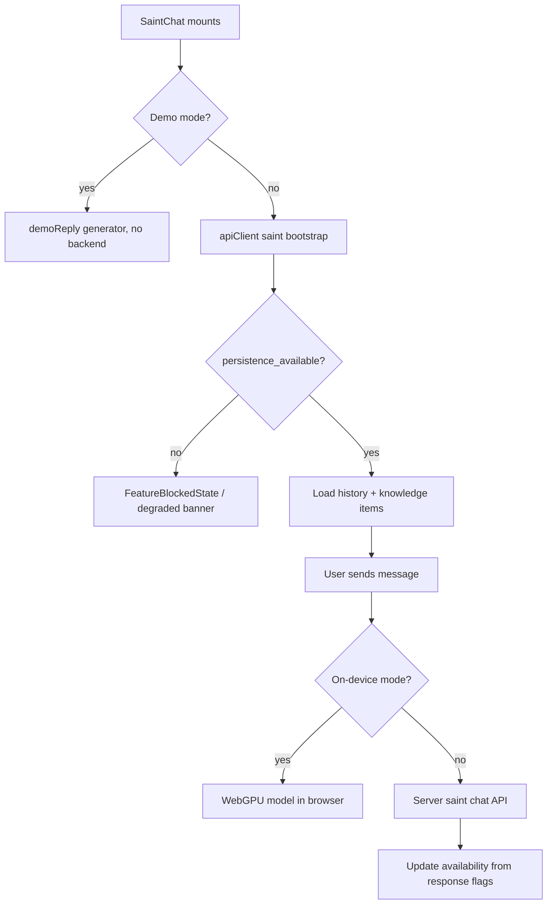

# Saints Dashboard UI

How [[The Saints]] are surfaced in the React app: the main `/dashboard` page, the fixed bottom `SaintsNavigation` bar, the shared `SaintChat` widget, and the per-saint component directories (`michael/`, `gabriel/`, `joseph/`, `raphael/`, `saints/`).

> [!warning] `src/components/SaintsDashboard.tsx` does not exist, despite `CLAUDE.md` naming it as the "Main Saints AI interface". The actual saints hub is `src/pages/Dashboard.tsx` plus `src/components/SaintsNavigation.tsx`. Trust the code here.

## Overview

- `src/pages/Dashboard.tsx` — the authenticated home. Tabs for Engrams (default: `TrajectoryDashboard`, `FamilyEngrams`, `UnifiedFamilyInterface`, `CustomEngramsDashboard` — see [[Custom Engrams]] and [[Family Engrams]]) and Trinity (navigates to `/trinity`, [[Trinity and Council]]). Shows resume banners for unfinished [[Onboarding Flow|onboarding]] and the 50-question Joseph OCEAN quiz. Renders `StarfieldBackground` and mounts `SaintsNavigation` at the bottom.
- `src/components/SaintsNavigation.tsx` — fixed bottom bar with a 5-saint grid: Michael (`/security-dashboard`), Joseph (`/family-dashboard`), Raphael (`/health-dashboard`, center card, scaled up), Gabriel (`/finance-dashboard`), Anthony (`/anthony-dashboard`). It queries `getRuntimeReadiness()` and disables any saint whose route gate is blocking, showing the reason as a tooltip.
- `src/components/SaintChat.tsx` (669 lines) — reusable chat surface parameterized by `saintId`, persona `systemPrompt`, and an optional keyless `demoReply` generator. Used by the Michael and Joseph dashboards. Supports an on-device WebGPU LLM mode (`src/lib/llm/onDeviceLLM.ts`) as a fallback/privacy option next to the server chat in [[AI Chat Edge Functions]].
- `src/components/CompactSaintsOverlay.tsx` — expandable overlay listing five saint definitions (Raphael, Michael, Joseph, plus premium Martin $29.99 and Agatha $34.99) with activity counts from `saints_subscriptions` and `saint_activities` tables.

> [!warning] `CompactSaintsOverlay` is not imported anywhere in `src/` — it is an orphaned component. The premium saints (Martin, Agatha) it describes have no live UI today.

## How It Works

SaintChat runs a staged bootstrap; each stage can degrade independently (`SaintStep = 'bootstrap' | 'history' | 'knowledge' | 'chat'`):

Error text is normalized by `formatSaintError` (`src/components/SaintChat.tsx:60`) — 401/403 → re-login, 404 → "Saint not available", storage-down messages keep the saint blocked rather than faking replies.

Cross-saint coordination on the client goes through `src/lib/saintBridge.ts`: an event bus ("Divine Protocol"/SEP envelopes from `src/lib/saints/sep.ts`) using a `BroadcastChannel` for cross-tab sync and a localStorage event log (`everafter_saint_events_v2`, capped at 100). `App.tsx` starts/stops the heartbeat via `startSaintHeartbeat()`.

## Per-Saint Component Directories

- `src/components/michael/` — security widgets composed by `src/components/StMichaelSecurityDashboard.tsx`: `ThreatDetection`, `VulnerabilityScanner`, `FileIntegrityMonitor`, `CompliancePanel`, `GuardianLog`, `DHTAnomalyAlertChain`.
- `src/components/joseph/` — 24 family/genealogy widgets composed by `src/components/StJosephFamilyDashboard.tsx`: `FamilyTreeView`, `FamilyMembersGrid`, `FamilyTimeline`, `GeneWebTools`, `PersonalityQuiz` (OCEAN), `FamilyHealthHeatmap`, `FamilyPredictionIntelligencePanel`, GEDCOM import/export, voice profile cards, and advanced tasks/shopping tabs.
- `src/components/gabriel/` — finance widgets including `StGabrielFinanceDashboard.tsx` itself (note: the dashboard lives inside the subdirectory, unlike Michael/Joseph), `BudgetEnvelopes`, `TransactionLedger`, `WiseGoldPanel`, `CrossChainBridgeModal`, `CouncilChat`.
- `src/components/raphael/` — the "Today" overview cards (`Today.tsx` plus `TodayAlertsCard`, `TodayVitalsCard`, `TodayTrendsCard`, `TodayReportsCard`, `TodayTasksCard`). `Today.tsx` tracks the cursor and sets `--neon-intensity` on `.neon-border` cards by proximity — part of the [[Design System]] reactive-glow language.
- `src/components/saints/` — cross-saint surfaces: `SystemMonitorDashboard` (route `/monitor`), `CouncilRoom`, `MissionBoard`, `SaintsGuardian`, `SystemRelationshipsGraph`.
- `src/components/shared/` — `SaintsQuickNav`, `SecurityIntegrityBadge`, `TrinitySynapsePanel`, `SharedPredictionPanel`, `GenerationalTimeline` used across saint dashboards.

## Key Files

- `src/pages/Dashboard.tsx` — main authenticated hub; lazy-loads its heavy panels with a 250 ms stagger
- `src/components/SaintsNavigation.tsx` — fixed bottom 5-saint launcher with runtime-readiness gating
- `src/components/SaintChat.tsx` — shared saint chat with demo/on-device/server modes
- `src/components/CompactSaintsOverlay.tsx` — orphaned saints activity overlay (not mounted)
- `src/components/StMichaelSecurityDashboard.tsx` — St. Michael page at `/security-dashboard`
- `src/components/StJosephFamilyDashboard.tsx` — St. Joseph page at `/family-dashboard`
- `src/components/gabriel/StGabrielFinanceDashboard.tsx` — St. Gabriel page at `/finance-dashboard`
- `src/components/anthony/StAnthonyAuditDashboard.tsx` — St. Anthony page at `/anthony-dashboard`
- `src/lib/saintBridge.ts` — BroadcastChannel event bus + heartbeat between saints

## Related

- [[The Saints]] — product concept behind these dashboards
- [[Pages and Routing]] — the routes each saint dashboard mounts on
- [[St Raphael]] — Raphael's health-focused surface is documented in [[Health UI Components]]
- [[AI Chat Edge Functions]] — server side of SaintChat conversations
- [[Design System]] — glass cards and neon-glow styling used throughout
- [[Contexts and Hooks]] — `useAuth` demo mode that SaintChat honors
