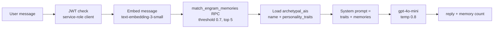

# AI Chat Edge Functions

The five conversational edge functions: `raphael-chat`, `engram-chat`, `career-chat`, `device-troubleshooting-ai`, and `health-insights-ai`. All LLM traffic goes to OpenAI's Chat Completions API — mostly `gpt-4o-mini` — with `text-embedding-3-small` for retrieval.

> [!warning] Docs vs code: CLAUDE.md states `GROQ_API_KEY` is the secret set for `raphael-chat`. The code at `supabase/functions/raphael-chat/index.ts:91` reads `OPENAI_API_KEY` and calls `https://api.openai.com/v1/chat/completions` with `gpt-4o-mini`. There is no Groq usage anywhere under `supabase/functions/`.

## How It Works

### raphael-chat — St. Raphael companion

`supabase/functions/raphael-chat/index.ts` is the reference implementation of the "clean" pattern: validate `Authorization` header → anon-key client forwarding the JWT ([[Row Level Security]] enforced) → `auth.getUser()` → validate `{ input, engramId?, system? }` → optional engram ownership check → OpenAI call (temperature 0.7, max 600 tokens) → fire-and-forget `get_or_create_user_progress` RPC → `{ reply, user_id }`. The hardcoded system prompt encodes the [[Safety Guardrails]]: never diagnose, never prescribe, escalate emergencies to 911.

> [!note] Callers can pass a custom `system` prompt that **replaces** the safety prompt entirely — the guardrails are prompt-level only; there is no output filtering in this function (that lives conceptually in `safety-monitor`, which actually monitors table row counts, not chat content).

### engram-chat — personality chat with memory

`supabase/functions/engram-chat/index.ts` implements retrieval-augmented chat for [[Custom Engrams]]:

Personality comes from the `archetypal_ais` table (see [[Archetypal AIs]]); memories come from [[Embeddings and Vector Search]] via the `match_engram_memories` RPC. If `OPENAI_API_KEY` is unset it returns a graceful "basic mode" fallback instead of erroring.

### career-chat — tool-calling agent

`supabase/functions/career-chat/index.ts` (642 lines, the largest chat function) powers the [[Career Companion]]. It has **dual auth**: an `Authorization` JWT makes the caller the profile owner (coach mode), while an `X-Public-Token` header resolves a shareable token via the `get_career_profile_by_token` RPC for anonymous visitors (assistant mode). It defines four OpenAI tools — `record_user_details` (lead capture into `career_leads`), `record_unknown_question`, `track_career_goal` (owner-only), `get_career_context` — and loops tool execution up to 3 rounds using a service-role client so anonymous visitors can write leads despite RLS. Both sides of the conversation are persisted to `career_chat_messages`. Its sibling `career-profile-update` manages `career_profiles` and mints the 12-character public tokens.

### device-troubleshooting-ai

`supabase/functions/device-troubleshooting-ai/index.ts` takes `{ deviceType, deviceName, manufacturer, issue, userContext }` and asks `gpt-4-turbo-preview` (the only non-mini model, max 2000 tokens) for step-by-step guidance, persona'd as St. Raphael the device expert. Auth is optional: without a JWT it still answers; with one it logs the interaction to `troubleshooting_ai_context` via raw REST calls with the service key. Used by [[Device Monitoring and Troubleshooting]].

### health-insights-ai — no LLM

Despite the name, `supabase/functions/health-insights-ai/index.ts` makes **zero** OpenAI calls. It pulls up to 30 days of `health_metrics` (quality score ≥ 0.5), runs local `analyzeTrends` / `detectAnomalies` / `analyzeCorrelations` / `generateRecommendations` functions, and stores results against the user's St. Raphael engram so the chat functions can surface them. See [[Health Insights and Analytics]].

## Context Building Summary

| Function | Context source | Model |
|---|---|---|
| `raphael-chat` | None (system prompt only) | gpt-4o-mini |
| `engram-chat` | `match_engram_memories` vector RPC + `archetypal_ais` traits | gpt-4o-mini + embeddings |
| `career-chat` | `career_profiles` row + last 10 history messages + tools | gpt-4o-mini |
| `device-troubleshooting-ai` | Request payload (device, issue, prior attempts) | gpt-4-turbo-preview |
| `health-insights-ai` | `health_metrics` (statistical, no model) | — |

The related `agent` function (see [[Agent and Task Edge Functions]]) is effectively raphael-chat v2 with memory and task tools; `marketplace-template-run` is chat driven by a purchased template manifest.

## Key Files

- `supabase/functions/raphael-chat/index.ts` — safety-prompted companion chat
- `supabase/functions/engram-chat/index.ts` — embedding retrieval + personality chat
- `supabase/functions/career-chat/index.ts` — tool-calling career agent, dual auth
- `supabase/functions/career-profile-update/index.ts` — career profile CRUD + public tokens
- `supabase/functions/device-troubleshooting-ai/index.ts` — device support AI
- `supabase/functions/health-insights-ai/index.ts` — statistical insights (no LLM)
- `EDGE_FUNCTIONS_SETUP.md` — request/response contracts and error codes for raphael-chat

## Gotchas

> [!warning] Inconsistent auth strength: `raphael-chat` enforces RLS via forwarded JWT, but `engram-chat` uses the service-role key and only checks identity — its `archetypal_ais` lookup does not verify the engram belongs to the caller.

- Conversation history is client-supplied for `career-chat` (last 10 messages) — nothing is loaded server-side.
- `engram-chat` requires `conversationId` in the request but never uses it for storage.

## Related

- [[St Raphael]] — the product persona these functions implement
- [[Safety Guardrails]] — the prompt rules and their limits
- [[Custom Engrams]] — what engram-chat is chatting *as*
- [[Embeddings and Vector Search]] — retrieval layer behind engram-chat
- [[Career Companion]] — frontend for career-chat
- [[Agent and Task Edge Functions]] — the tool-calling sibling `agent`
- [[Edge Functions Overview]] — full function inventory
