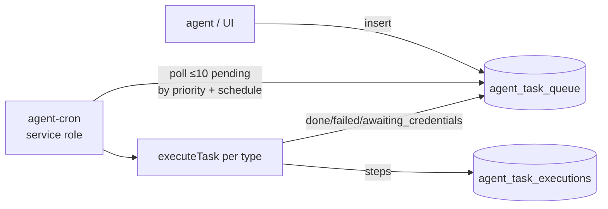

# Agent and Task Edge Functions

The five functions behind the [[Autonomous Task System]]: `agent` (tool-calling chat), `agent-cron` (queue executor), `manage-agent-tasks` (CRUD API), `task-create` (engram task insert), and `marketplace-template-run` (paid template execution).

## How It Works

### agent — St. Raphael with tools and memory

`supabase/functions/agent/index.ts` (529 lines) is the evolved version of `raphael-chat`: JWT-forwarded auth, the [[St Raphael]] [[Safety Guardrails]] system prompt, plus three OpenAI tools executed in a loop of up to 3 rounds:

- `retrieve_memory` — embeds the query (`text-embedding-3-small`) and calls the `search_agent_memories` RPC (threshold 0.7) over [[Embeddings and Vector Search|vector memories]].
- `store_memory` — persists conversation facts/preferences with an importance score.
- `create_health_task` — inserts into `agent_task_queue` for later autonomous execution.

### agent-cron — the queue executor

`supabase/functions/agent-cron/index.ts` polls `agent_task_queue` for due `pending` tasks (priority desc, max 10 per run), switches on `task_type` (`doctor_appointment`, `prescription_refill`, ...), tracks `completion_percentage`, and writes a step-by-step log to `agent_task_executions`. Tasks needing credentials flip to `awaiting_credentials`.

> [!warning] Execution is **simulated**. The `doctor_appointment` branch returns hardcoded results ("Dr. Smith", "Main Health Center", a `APPT-${Date.now()}` confirmation number) without contacting any external service (`supabase/functions/agent-cron/index.ts:19,105-124`). The file's own comment says "in production, this would integrate with actual services." Treat completed tasks as demo output, not real bookings.

### manage-agent-tasks — CRUD API

A REST-ish handler over the `agent_tasks` table (note: *different* from `agent_task_queue`): `GET` lists by `saint_id` (default `raphael`) and status, `POST` creates, `PUT` updates status/result (stamping `completed_at`), `DELETE` removes. Every mutation also writes `agent_task_logs`. Uses a service-role client but scopes all queries by the authenticated `user_id`. This is the API behind the task views in [[Saints Dashboard UI]].

### task-create — engram tasks

The minimal, well-behaved one: JWT-forwarded client (so [[Row Level Security]] does the ownership work), verifies the engram exists via the `engrams` table, then inserts into `engram_ai_tasks` with `status: 'pending'`. Response is `{ task }` with HTTP 201; errors use the `{ code, message, hint }` shape.

> [!warning] CLAUDE.md calls `engram_ai_tasks` the "single source of truth for all health/personal tasks," but the code maintains **three** parallel task tables: `engram_ai_tasks` (task-create), `agent_task_queue` (agent + agent-cron), and `agent_tasks` (manage-agent-tasks). Nothing in these functions synchronizes them.

### marketplace-template-run

Runs a purchased AI template from [[Marketplace and Creator Dashboard]]: verifies the template is `is_active` and `approval_status='approved'`, checks a `marketplace_purchases` row (unless `run_type='demo'`, which caps output at 500 tokens), then calls OpenAI with the manifest's `system_prompt`, `model` (default gpt-4o-mini), and `temperature`. Token usage and runtime are logged to `marketplace_template_runs` and `total_runs` is incremented for paid runs.

## Data Model

| Table | Owner function(s) | Status values seen |
|---|---|---|
| `agent_task_queue` | `agent` (insert), `agent-cron` (execute) | pending, in_progress, awaiting_credentials, completed, failed |
| `agent_task_executions` | `agent-cron` | per-step started/completed/failed |
| `agent_tasks` + `agent_task_logs` | `manage-agent-tasks` | pending, completed, ... |
| `engram_ai_tasks` | `task-create` | pending → (in_progress/done/failed per docs) |
| `agent_memories` | `agent` via RPCs | typed memories with importance |
| `marketplace_template_runs` | `marketplace-template-run` | completed |

## Key Files

- `supabase/functions/agent/index.ts` — tool-calling agent chat with memory
- `supabase/functions/agent-cron/index.ts` — simulated queue executor
- `supabase/functions/manage-agent-tasks/index.ts` — task CRUD per saint
- `supabase/functions/task-create/index.ts` — engram task insert (RLS-enforced)
- `supabase/functions/marketplace-template-run/index.ts` — paid template execution

## Gotchas

- `agent-cron` uses the service-role key and has no caller authentication — anyone who can invoke it triggers task processing (mostly harmless given simulation, but it also mutates task state).
- Tool-call arguments in `agent` are `JSON.parse`d directly from the model output; malformed JSON throws into the generic error path.

## Related

- [[Autonomous Task System]] — product concept these functions implement
- [[St Raphael]] — the persona operating the agent
- [[AI Chat Edge Functions]] — the simpler chat siblings
- [[Embeddings and Vector Search]] — memory retrieval layer
- [[Marketplace and Creator Dashboard]] — where templates are bought
- [[Key Tables]] — schema for the task tables above
- [[Edge Functions Overview]] — inventory and shared conventions
