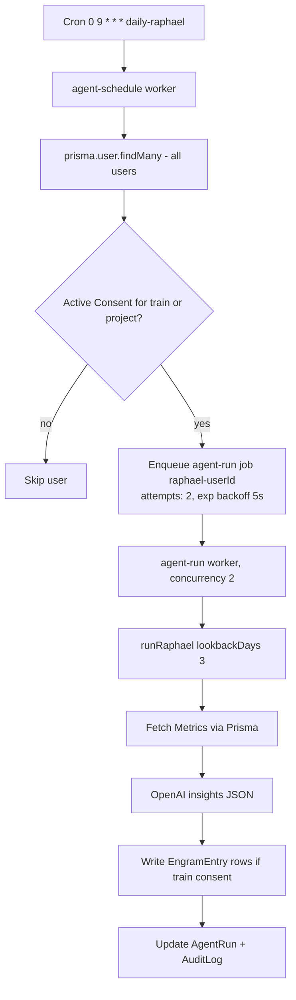

# BullMQ Scheduler

`server/workers/scheduler.ts` defines the background-job layer of the [[Express Server]]: two BullMQ queues backed by Redis that fan out a daily [[St Raphael]] agent run to every consenting user. It only functions when `REDIS_URL` is set.

## Overview

The module exports two functions:

- `isSchedulerEnabled()` — `Boolean(process.env.REDIS_URL)`; the single feature flag.
- `startScheduler()` — creates the queues and workers, registers the repeatable job, and returns `{ scheduleWorker, runWorker }` (or `null` if Redis is unconfigured).

Queues and workers created (all on the same `REDIS_URL` connection):

| Name | Kind | Role |
|---|---|---|
| `agent-schedule` | Queue + Worker | Fan-out: one repeatable job that enumerates users |
| `agent-run` | Queue + Worker (concurrency 2) | Executes `runRaphael()` per user |
| `ingest-terra` | Queue only (producer in `server/api/connections/webhooks.ts`) | Terra webhook payloads — **no consumer exists** |

## How It Works

The repeatable job `daily-raphael` is registered on `agent-schedule` with the cron pattern from `agents/raphael/manifest.json` → `capabilities.scheduleDefault` = `"0 9 * * *"` (daily at 09:00).

Details worth remembering:

- **Consent gating happens twice.** The schedule worker skips users with no unrevoked `Consent` for purpose `train` or `project` (`server/workers/scheduler.ts:40-53`); `runRaphael()` then re-checks `train` consent before writing engrams. Consent rows live in the [[Prisma Schema]]; the schedule worker queries them directly via Prisma (revocation only — it ignores `expiresAt` and `interactionCap`), while `runRaphael()`'s re-check goes through `checkConsent()` in `server/lib/consent.ts`, which enforces both.
- **Retry policy**: `agent-run` jobs get `attempts: 2` with exponential backoff starting at 5s; Terra ingest jobs (from the webhook route) get `attempts: 3` starting at 2s.
- **Run bookkeeping**: each execution creates an `AgentRun` row (`status: running → completed/failed`, `tokensUsed`, `steps` JSON) — the [[Autonomous Task System]]'s Prisma-side counterpart to the Supabase task tables.
- Completion/failure of both workers is logged via `.on('completed')` / `.on('failed')` handlers.

## How To Run

In production mode the scheduler starts **in-process** with the Express server: `server/index.ts:41-46` calls `startScheduler()` when `NODE_ENV !== 'development'` and `REDIS_URL` is set.

> [!warning] `npm run dev:worker` does not actually start the workers
> The script is `tsx server/workers/scheduler.ts` (`package.json`), but the module has no top-level call to `startScheduler()` — it only exports functions, so the process defines them and exits. `CLAUDE.md`'s claim that the worker "must run separately with `npm run dev:worker`" does not match the code. To run the scheduler today you must either run the server with `NODE_ENV` unset/non-development and `REDIS_URL` configured, or add a small entry script that imports and calls `startScheduler()`.

> [!warning] Orphaned queue
> `server/api/connections/webhooks.ts` enqueues Terra webhook payloads onto `ingest-terra`, but no `Worker('ingest-terra', ...)` exists anywhere in the repo. Jobs accumulate in Redis and are never written to `Metric` rows. The working Terra ingestion path is the Supabase side — see [[Webhook Ingestion Pipeline]] and [[Terra Integration]].

> [!note] Redis is optional by design. Without `REDIS_URL` the server logs "Scheduler disabled" and the webhook route logs-and-skips enqueueing (responding `{ queued: false }`) instead of crashing. See [[Environment Variables]] for what to set where.

## Key Files

- `server/workers/scheduler.ts` — queues, workers, repeatable job registration
- `server/index.ts` — conditional in-process `startScheduler()` call at boot
- `server/api/connections/webhooks.ts` — producer for the (unconsumed) `ingest-terra` queue
- `agents/raphael/manifest.json` — agent id `raphael.healer.v1`, cron default `0 9 * * *`, guardrails
- `agents/raphael/runner.ts` — `runRaphael()` executed by the `agent-run` worker
- `server/lib/consent.ts` — `checkConsent()` used by `runRaphael()`'s engram-write gate (the schedule worker queries Prisma directly)

## Related

- [[Express Server]] — hosts the scheduler in-process in production
- [[St Raphael]] — the agent these jobs execute
- [[Autonomous Task System]] — Supabase-side task execution this parallels
- [[Terra Integration]] — source of the `ingest-terra` payloads
- [[Prisma Schema]] — `AgentRun`, `Consent`, `Metric`, `EngramEntry` models involved
- [[Common Gotchas]] — the dev:worker mismatch belongs on any pitfalls list
- [[Backend MOC]] — sibling backend notes
