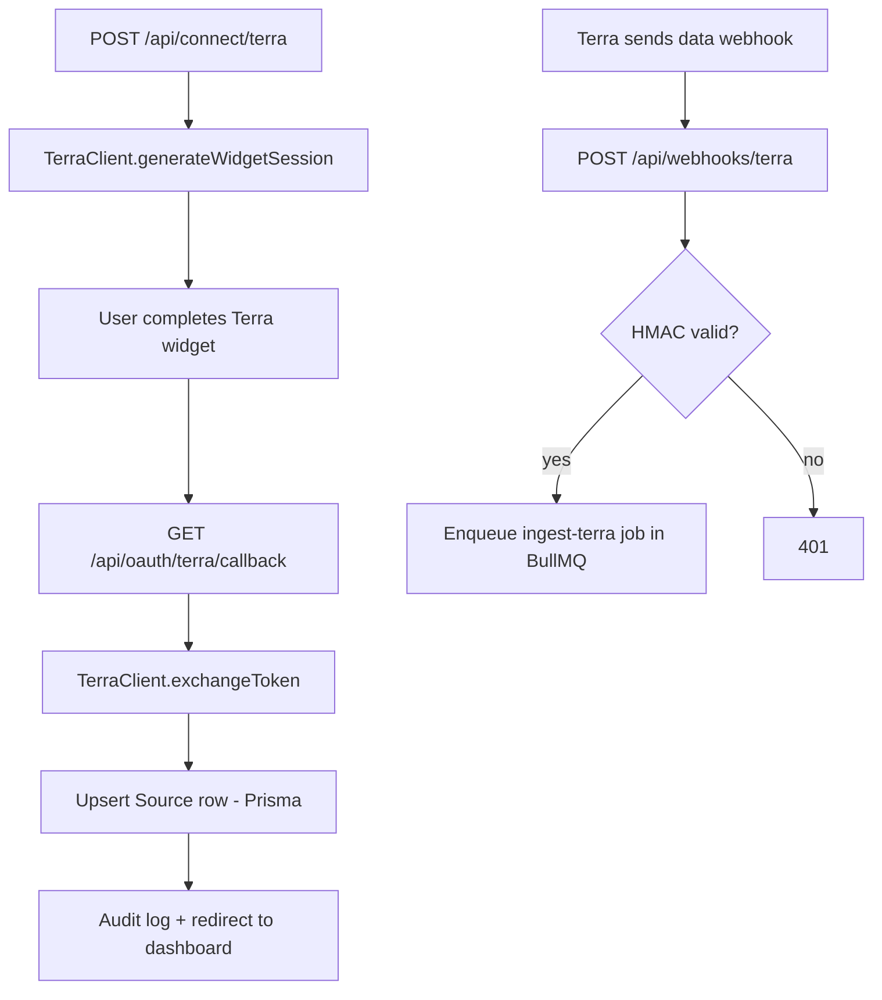

# Express Server

The secondary Node backend in `server/` — an Express app that fronts Prisma-backed health data: Terra OAuth, native-app health bridges, the Terra webhook receiver, and a REST API for the St. Raphael agent. It is one half of the [[Dual Backend System]]; most product features live in Supabase Edge Functions instead (see [[Edge Functions Overview]]).

## Overview

Entry point is `server/index.ts` (~55 lines). It loads `dotenv/config`, creates an Express app with `cors()` and `express.json()`, instantiates a `PrismaClient`, and mounts five routers:

| Mount | Router file | Purpose |
|---|---|---|
| `/api` | `server/api/connections/terra.ts` | Terra OAuth connect + callback |
| `/api` | `server/api/connections/bridges.ts` | Apple Health / Health Connect push bridges |
| `/api` | `server/api/connections/webhooks.ts` | Terra webhook receiver → BullMQ |
| `/api` | `server/api/raphael.ts` | Raphael summary/run/log + metrics/engrams reads |
| `/api/iot` | `server/api/connections/iot_webhooks.ts` | Simulated IoT "Altar" scene trigger |

`GET /health` returns `{ status: 'healthy', service: 'raphael-production' }`. Default port is **3001** (`PORT` env). On startup, when `NODE_ENV !== 'development'` and `REDIS_URL` is set, it also starts the [[BullMQ Scheduler]] in-process via `startScheduler()`. `SIGTERM` triggers a graceful `prisma.$disconnect()`.

Run locally with `npm run dev:server` (`tsx watch server/index.ts`).

> [!warning] Authentication is stubbed
> `server/index.ts:20-23` installs middleware that hardcodes `req.user = { id: 'demo-user-001' }` for every request. There is **no JWT validation** on this backend, unlike the Edge Functions' [[Authentication and JWT Flow]], and Prisma bypasses [[Row Level Security]] entirely. Root docs describing this server as production-secured overstate it — do not expose it publicly without adding real auth. The `Request.user` type comes from `server/types/express.d.ts`.

## How It Works

### Raphael API (`server/api/raphael.ts`)

All routes read `req.user.id` (the stubbed demo user) and use Prisma models from the [[Prisma Schema]]:

- `GET /api/me/raphael/summary` — last 24h of `Metric` rows, the latest completed `AgentRun` for agent `raphael.healer.v1`, and the 3 newest `EngramEntry` rows of kind `raphael-insight`; computes averaged vitals (HR, HRV, steps, sleep, glucose).
- `POST /api/me/raphael/run` — manual [[St Raphael]] agent run via `runRaphael()` from `agents/raphael/runner.ts`; rate-limited to one run per 5 minutes by checking recent `AgentRun` rows (returns 429).
- `POST /api/me/raphael/log` — writes a `raphael-insight` engram via `agents/raphael/tools.ts`; requires an active `train` consent (403 otherwise).
- `GET /api/me/metrics` — up to 1000 metrics, filterable by `?types=A,B&since=ISO`.
- `GET /api/me/engrams` — up to 100 engrams, filterable by `?kind=`.

### Terra OAuth (`server/api/connections/terra.ts`)

`POST /api/connect/terra` validates input with zod, refuses WebContainer hosts, requires an HTTPS `BASE_URL`, then calls the [[Terra Client Library]] to create a widget session with callback `${BASE_URL}/oauth/terra/callback`. `GET /api/oauth/terra/callback` exchanges the code for tokens, upserts a `Source` row (`provider: 'TERRA'`, unique on `(userId, provider)`), and redirects to `/dashboard/health?connected=terra`. Both steps write audit rows. See [[Health OAuth Flow]] for the Edge Function equivalent.

### Native bridges (`server/api/connections/bridges.ts`)

`POST /api/bridge/apple-health` and `POST /api/bridge/health-connect` accept batched metrics pushed from mobile apps. Each request must carry an HMAC-SHA256 signature over the JSON payload keyed by `BRIDGE_SHARED_SECRET` (compared with `crypto.timingSafeEqual`) and a timestamp no older than 5 minutes. Valid payloads upsert a `Source` (`APPLE_HEALTH` / `SAMSUNG_HEALTH`), map metric names to `MetricType` enums (`heart_rate → HEART_RATE`, etc. — see [[Health Data Normalization]]), and bulk-insert with `createMany({ skipDuplicates: true })` for idempotency.

### Terra webhooks (`server/api/connections/webhooks.ts`)

`POST /api/webhooks/terra` verifies the `terra-signature` header (HMAC-SHA256 with `TERRA_WEBHOOK_SECRET`) — part of the broader [[Webhook Signature Verification]] story — then enqueues the payload onto a BullMQ queue named `ingest-terra` (3 attempts, exponential backoff) and writes an audit row. See [[Webhook Ingestion Pipeline]] for the end-to-end picture.

> [!warning] Two ingestion gaps in the webhook path
> 1. If `TERRA_WEBHOOK_SECRET` is unset, `verifyTerraWebhook()` returns `true` — unsigned webhooks are accepted silently (`server/api/connections/webhooks.ts:25-29`).
> 2. Nothing in the repo consumes the `ingest-terra` queue — `server/workers/scheduler.ts` only creates workers for `agent-schedule` and `agent-run`. Queued Terra payloads are never turned into `Metric` rows by this server.

### Consent and audit libraries

- `server/lib/consent.ts` — `checkConsent(userId, purpose)` finds a non-revoked, non-expired `Consent` row for the purpose, enforces `interactionCap`, and **increments `usageCount` as a side effect** on every successful check. Also exports `grantConsent`, `revokeConsent`, `listConsents`. Used by the Raphael routes, `agents/raphael/*`, and the scheduler.
- `server/lib/audit.ts` — `createAuditLog()` writes an `AuditLog` row with a SHA-256 hash of the metadata JSON; `getAuditTrail()` reads back. Relevant to [[PHI Handling]] since it logs actions, not payloads.

> [!note] The `AuditLog` model defines hash-chain fields (`prevHash`, `signature`, `signerId`) in `prisma/schema.prisma:128-131`, but `createAuditLog()` never populates them — the cryptographic chaining is schema-only today.

### IoT bridge (`server/api/connections/iot_webhooks.ts`)

`POST /api/iot/trigger` is a **simulation**: it logs the requested scene/intensity/ancestor and returns success without touching any device or database. No Hue/Lutron integration actually exists.

## When This Backend Is Required

Frontend + Edge Functions cover chat, engrams, tasks, and payments. You need the Express server (plus Postgres reachable via `PRISMA_DATABASE_URL` and optionally Redis) only for: Terra server-side OAuth and webhooks, the Apple Health / Health Connect push bridges, and the Prisma-backed Raphael agent API and its scheduled runs.

> [!warning] Env var name mismatch
> `prisma/schema.prisma:8` reads `env("PRISMA_DATABASE_URL")`, but `CLAUDE.md` documents `DATABASE_URL` for the backend server. Set `PRISMA_DATABASE_URL` — the code wins. See [[Environment Variables]].

## Key Files

- `server/index.ts` — Express entry: middleware, router mounts, port 3001, in-process scheduler start
- `server/api/raphael.ts` — Raphael summary/run/log routes + metrics/engrams reads
- `server/api/connections/terra.ts` — Terra OAuth connect + callback, Source upsert
- `server/api/connections/bridges.ts` — HMAC-verified Apple Health / Health Connect metric ingestion
- `server/api/connections/webhooks.ts` — Terra webhook receiver, enqueues to `ingest-terra`
- `server/api/connections/iot_webhooks.ts` — simulated IoT scene trigger (logs only)
- `server/lib/consent.ts` — consent checks with expiry and interaction caps
- `server/lib/audit.ts` — audit log writer/reader (SHA-256 of metadata)
- `server/types/express.d.ts` — `Request.user` type augmentation
- `agents/raphael/runner.ts` — `runRaphael()` agent loop called by API and worker

## Related

- [[Dual Backend System]] — where this server sits relative to Edge Functions
- [[BullMQ Scheduler]] — the worker started from this server's entry point
- [[Terra Client Library]] — the API wrapper the Terra routes call
- [[Terra Integration]] — full Terra picture across both backends
- [[Prisma Schema]] — the models (User, Source, Metric, Consent, AuditLog, EngramEntry, AgentRun) this server reads/writes
- [[St Raphael]] — the agent this API exposes
- [[Webhook Ingestion Pipeline]] — how provider webhooks are supposed to flow into storage
- [[Backend MOC]] — sibling backend notes
