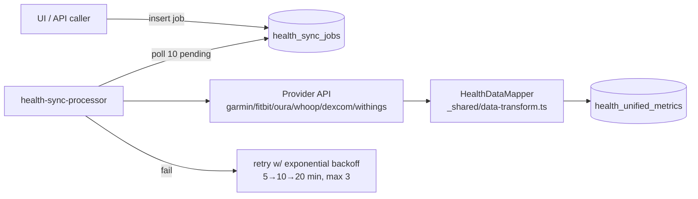

# Health Data Edge Functions

The ten functions that pull, process, and analyze health data outside the webhook path: on-demand syncs, backfills, job processors, token refresh, and analytics. They write to several parallel metric stores (`health_metrics`, `health_unified_metrics`, `terra_metrics_raw`, `glucose_readings`), reflecting multiple generations of the health pipeline.

## How It Works

### Pull syncs

- **`sync-health-now`** (`supabase/functions/sync-health-now/index.ts`) — user-triggered. JWT-authenticated, looks up `provider_accounts`, then calls the provider API directly: Fitbit daily activity summary (steps, resting HR) or Oura daily activity (steps), ingesting through the shared `ingestMetric()` from [[Shared Edge Function Utilities]] into `health_metrics` and stamping `last_sync_at`. Terra is a no-op ("requires backfill endpoint"); other providers return an error.
- **`sync-health-data`** (`supabase/functions/sync-health-data/index.ts`) — works against `health_connections`/`oauth_credentials` but then calls `generateMockHealthData()` and inserts **random** steps/heart-rate/sleep/active-minutes rows.

> [!warning] `sync-health-data` is demo scaffolding: every "synced" metric is `Math.random()` output, not provider data (`supabase/functions/sync-health-data/index.ts:76,135`). Do not enable it for real users; prefer `sync-health-now` or the Terra pipeline.

### Backfills and job processing

- **`health-sync-processor`** — service-role worker meant to be invoked on a schedule. Marks jobs `running`, fetches from the provider (URL templates per `health_providers_registry` row), maps via `_shared/data-transform.ts`, writes `health_unified_metrics`, and implements retry with exponential backoff plus `increment_connection_errors` on exhaustion.
- **`device-backfill`** — thin: validates `{ user_id, provider, days }` (no JWT) and inserts a `sync_jobs` row for something else to process.
- **`terra-backfill`** — pulls activity/sleep/body/daily for the last N days straight from `api.tryterra.co` using `TERRA_API_KEY`/`TERRA_DEV_ID`, records a `terra_sync_jobs` row, and stores raw payloads in `terra_metrics_raw`. Part of the [[Terra Integration]] suite; no JWT check — `user_id` comes from the body.

### Scheduled aggregation

- **`glucose-aggregate-cron`** — for yesterday's `glucose_readings` (excluding `src='manual'`), computes time-in-range (70–180 mg/dL), mean/SD/GMI via `computeTIR`/`computeGlucoseStats` from `_shared/glucose.ts`, and upserts `glucose_daily_agg` keyed on `(day, user_id, engram_id)`. Low-TIR (<70%) and hypo (>4% below range) conditions are only `console.warn`ed — no alert rows are written. Audit trail goes to `glucose_job_audit` via `logJobAudit`. See [[Glucose Monitoring and Alerts]].

### Token maintenance

- **`token-refresh`** — JWT-authenticated; refreshes one account, one provider, or every account expiring within 10 minutes, using provider configs from `_shared/connectors.ts`. See [[Health OAuth Flow]].

> [!warning] Column drift: this function filters on `refresh_token`/`expires_at`, while `_shared/token-refresh.ts` reads `access_token_encrypted`/`token_expires_at` and `connect-callback` writes plain `access_token` — three views of the same `provider_accounts` table. Verify against the live schema in [[Key Tables]] before relying on any of them.

### Analytics and reports

- **`analytics-aggregator`** — per active provider, serves cached aggregates from `analytics_cache` (unless `refreshCache`) or recomputes stats from `health_metrics` for today/week/month/year windows.
- **`predictive-health-analytics`** — compares the last 7 days of each metric against the prior 7 to label trends improving/stable/declining, emits an expected range and risk level for the next week. Pure arithmetic, no model.
- **`insights-report`** — assembles KPIs across `health_metrics`, medications, `health_goals`, and `agent_memories` for a period, optionally generates a ≤150-word St. Raphael narrative via gpt-4o-mini, and inserts an `insight_reports` row. See [[Health Insights and Analytics]].

## Data Model

Four metric stores coexist; know which pipeline you are touching:

| Table | Written by |
|---|---|
| `health_metrics` | `sync-health-now`, `webhook-terra`, `webhook-fitbit`, `sync-health-data` (mock) |
| `health_unified_metrics` | `health-sync-processor` |
| `terra_metrics_raw` / `terra_metrics_normalized` | `terra-backfill`, `terra-webhook` |
| `glucose_readings` → `glucose_daily_agg` | `cgm-dexcom-webhook`, `cgm-manual-upload` → `glucose-aggregate-cron` |

Normalization rules (mg/dL conversion, standard metric names) are described in [[Health Data Normalization]].

## Key Files

- `supabase/functions/sync-health-now/index.ts` — real on-demand Fitbit/Oura sync
- `supabase/functions/sync-health-data/index.ts` — mock-data sync (demo)
- `supabase/functions/health-sync-processor/index.ts` — job queue worker with retries
- `supabase/functions/device-backfill/index.ts` — queues `sync_jobs` rows
- `supabase/functions/terra-backfill/index.ts` — historical Terra pull
- `supabase/functions/glucose-aggregate-cron/index.ts` — daily TIR/GMI aggregation
- `supabase/functions/token-refresh/index.ts` — provider token refresh
- `supabase/functions/analytics-aggregator/index.ts` — cached analytics
- `supabase/functions/predictive-health-analytics/index.ts` — trend predictions
- `supabase/functions/insights-report/index.ts` — periodic KPI + narrative reports

## Gotchas

- Nothing in the repo schedules the cron-style functions — `supabase/config.toml` has no cron config; scheduling must exist in the Supabase dashboard or pg_cron. The [[BullMQ Scheduler]] on the Express side is a separate mechanism.
- `device-backfill` and `terra-backfill` accept `user_id` in the body with no authentication.
- `health-sync-processor` throws "Token expired - refresh needed" rather than refreshing — token refresh is not wired into the job path.

## Related

- [[Webhook Edge Functions]] — the push half of ingestion
- [[Health Data Normalization]] — units and metric naming rules
- [[Glucose Monitoring and Alerts]] — thresholds behind the aggregation
- [[Terra Integration]] — the aggregator these backfills serve
- [[Health OAuth Flow]] — how tokens got there in the first place
- [[Health Insights and Analytics]] — consumer of reports and insights
- [[Edge Functions Overview]] — full inventory and conventions
