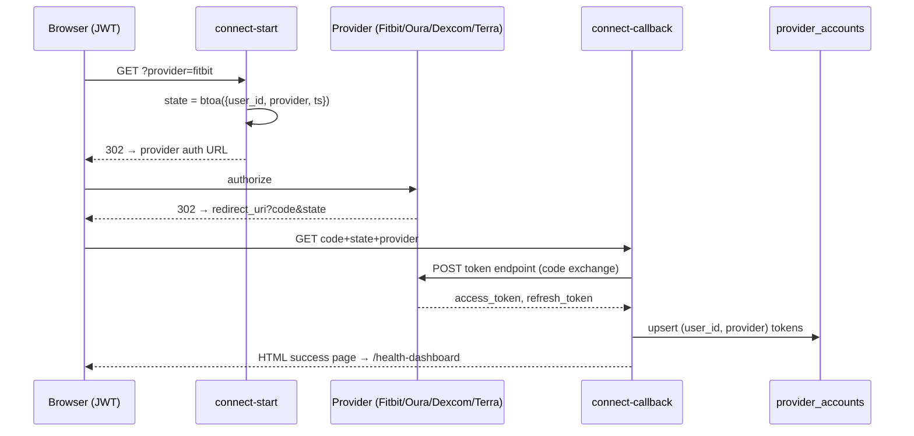

# OAuth Edge Functions

The seven functions that connect user accounts to health providers: a hardcoded-config pair (`connect-start`/`connect-callback`), a registry-driven pair (`health-oauth-initiate`/`health-oauth-callback`), a Dexcom-specific flow, [[SMART on FHIR]] for EHRs, and Terra's widget-session generator. These are the entry points of the [[Health OAuth Flow]].

## How It Works

### connect-start / connect-callback (hardcoded generation)

`connect-start` requires a JWT, gets a `ProviderConfig` from `_shared/connectors.ts` (`getProviderConfig()` — Terra, Fitbit, Oura, Dexcom with client IDs from env and `redirectUri = ${APP_BASE_URL}/api/connect-callback`), builds the provider-specific auth URL, and 302-redirects. `connect-callback` decodes the base64 state, calls `exchangeCodeForTokens()`, and upserts `provider_accounts` (conflict on `user_id,provider`) before rendering an HTML success page that meta-refreshes to the dashboard.

> [!warning] The `state` parameter is plain base64 JSON with no signature and no server-side nonce storage; `connect-callback` requires no authentication. Anyone who can obtain/forge a `state` with a victim's `user_id` and supply their own auth code can attach an attacker-controlled provider account. Also note `getProviderConfig()` pins Dexcom to the **sandbox** URLs.

### health-oauth-initiate / health-oauth-callback (registry generation)

The newer pair drives everything from the `health_providers_registry` table: enabled flag, `oauth_authorize_url`, `oauth_token_url`, scopes, and the **name of the env var** holding the client ID (`oauth_client_id_env_key`, with `_CLIENT_SECRET` derived by string replace). `health-oauth-initiate` is JWT-authenticated, checks the per-user feature flag via the `user_has_provider_access` RPC, adds a `nonce` to the state, and returns the authorization URL as JSON (the frontend performs the redirect). `health-oauth-callback` enforces a 15-minute state expiry, exchanges the code, and stores tokens in `health_connections`, redirecting to `${APP_URL}/health-dashboard?...` on both success and every error case. Both write `health_connection_audit` rows.

### cgm-dexcom-oauth

One function, two actions via `?action=init|callback`. `init` requires a JWT and 302s to Dexcom's login (sandbox vs production chosen by `DEXCOM_ENVIRONMENT`); `callback` exchanges the code and stores tokens for the [[Dexcom CGM]] pipeline, rendering HTML like `connect-callback`.

### fhir-smart-auth

Implements the SMART App Launch framework for Epic/Oracle Health: `?action=launch` discovers `${iss}/.well-known/smart-configuration` (falling back to the capability statement) and builds the EHR authorization URL; `callback` exchanges the code; `metadata` inspects a FHIR server. JWT-required, read-only by design.

### terra-widget

Not OAuth at all from our side: it POSTs to `https://api.tryterra.co/v2/auth/generateWidgetSession` with `TERRA_API_KEY`/`TERRA_DEV_ID` and returns Terra's hosted widget URL, where the user picks a provider (default list: FITBIT, OURA, GARMIN, DEXCOM, FREESTYLELIBRE, WITHINGS, POLAR). Terra then handles provider OAuth and calls back via the [[Webhook Edge Functions|Terra webhooks]].

> [!warning] `terra-widget` performs no JWT check — any caller who can reach the function can mint widget sessions for an arbitrary `reference_id`.

## Token Storage

Three destinations, three column conventions on effectively the same concern:

| Flow | Table | Token columns |
|---|---|---|
| connect-callback | `provider_accounts` | `access_token`, `refresh_token` |
| `_shared/token-refresh.ts` helpers | `provider_accounts` | `access_token_encrypted`, `refresh_token_encrypted` |
| health-oauth-callback | `health_connections` | provider-generation columns |

Despite the `_encrypted` suffix, `storeTokens()` writes the raw token strings — encryption is aspirational naming. Cross-check with [[Key Tables]] and [[Secrets Management]].

## Key Files

- `supabase/functions/connect-start/index.ts` — JWT → 302 to provider auth
- `supabase/functions/connect-callback/index.ts` — code exchange → `provider_accounts`
- `supabase/functions/health-oauth-initiate/index.ts` — registry-driven start + feature flags
- `supabase/functions/health-oauth-callback/index.ts` — registry-driven exchange → `health_connections`
- `supabase/functions/cgm-dexcom-oauth/index.ts` — Dexcom init/callback with sandbox switch
- `supabase/functions/fhir-smart-auth/index.ts` — SMART on FHIR launch/callback/metadata
- `supabase/functions/terra-widget/index.ts` — Terra widget session generator
- `supabase/functions/_shared/connectors.ts` — `getProviderConfig`, `exchangeCodeForTokens`

## Related

- [[Health OAuth Flow]] — conceptual walkthrough of these flows
- [[Webhook Edge Functions]] — connect first, then pushed data flows in
- [[Terra Integration]] — the widget/aggregator path
- [[SMART on FHIR]] — clinical EHR connections
- [[Shared Edge Function Utilities]] — provider configs and token helpers
- [[Secrets Management]] — client IDs/secrets these flows read from env
- [[Security Overview]] — state handling and token-at-rest caveats
