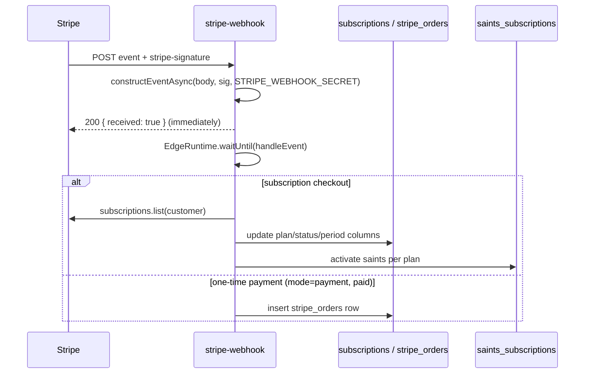

# Payment Edge Functions

Two functions handle money: `stripe-checkout` creates Stripe customers and Checkout sessions, and `stripe-webhook` verifies Stripe events and syncs subscription state into the database, activating premium Saints. They implement the backend of [[Payments and Subscriptions]].

## How It Works

### stripe-checkout

`supabase/functions/stripe-checkout/index.ts` (Stripe SDK `npm:stripe@17.7.0`, app name "Bolt Integration"):

1. Validates `{ price_id, success_url, cancel_url, mode }` where mode ∈ `payment | subscription`.
2. Authenticates via `supabase.auth.getUser(token)` on a service-role client.
3. Looks up `subscriptions.stripe_customer_id` for the user; if absent, creates a Stripe customer (email + `userId` metadata) and inserts/updates a `subscriptions` row (`plan_name: 'free'`, `status: 'incomplete'`). On insert failure it deletes the just-created Stripe customer to avoid orphans.
4. Creates the Checkout session and returns `{ sessionId, url }` for the frontend redirect.

### stripe-webhook

Signature verification uses the official `stripe.webhooks.constructEventAsync` with `STRIPE_WEBHOOK_SECRET` — the strongest [[Webhook Signature Verification]] in the codebase. Processing is deferred with `EdgeRuntime.waitUntil()` so Stripe gets a fast 200.

`syncCustomerFromStripe()` fetches the customer's latest subscription from Stripe (not from the event payload — self-healing against out-of-order events), maps the price ID to a plan via `PRICE_TO_PLAN_MAP`, and updates the `subscriptions` row (`stripe_subscription_id`, `plan_name`, `status`, period bounds, `cancel_at_period_end`, `trial_end`). No active subscription downgrades the row to `free/canceled`.

Plan effects on [[The Saints]]:

| Plan | Saints activated in `saints_subscriptions` |
|---|---|
| pro | michael |
| enterprise | michael, martin, agatha |

See [[Pricing Tiers]] for what those plans mean product-side.

> [!warning] `PRICE_TO_PLAN_MAP` still contains placeholder price IDs (`price_1234567890` → pro, `price_0987654321` → enterprise) at `supabase/functions/stripe-webhook/index.ts:128-131`, and unmapped prices **default to `pro`**. Until real price IDs are filled in, every paid subscription resolves to pro. Replace before launch.

## Data Model

- `subscriptions` — one row per user: `stripe_customer_id`, `stripe_subscription_id`, `stripe_price_id`, `plan_name` (free/pro/enterprise), `status`, period timestamps.
- `stripe_orders` — one-time payments from `checkout.session.completed` with `mode='payment'`.
- `saints_subscriptions` — upserted on `(user_id, saint_id)` with `is_active`, `activated_at`.

## Key Files

- `supabase/functions/stripe-checkout/index.ts` — session creation + customer bootstrap
- `supabase/functions/stripe-webhook/index.ts` — event verification, sync, saint activation

## Gotchas

- Secrets required: `STRIPE_SECRET_KEY` and `STRIPE_WEBHOOK_SECRET` (see [[Secrets Management]]); both are read at module scope with `!`, so a missing secret crashes the function on cold start rather than returning a clean error.
- `stripe-webhook` intentionally has no CORS/auth beyond the Stripe signature — do not add JWT checks or Stripe deliveries will fail.
- Saint deactivation on downgrade is not implemented: cancelling drops the plan to `free` but leaves previously activated rows in `saints_subscriptions` untouched.

## Related

- [[Payments and Subscriptions]] — full product/payment picture
- [[Pricing Tiers]] — what pro/enterprise unlock
- [[The Saints]] — the premium personas being activated
- [[Webhook Signature Verification]] — comparison with health-provider webhooks
- [[Secrets Management]] — where Stripe keys live
- [[Edge Functions Overview]] — inventory and conventions
