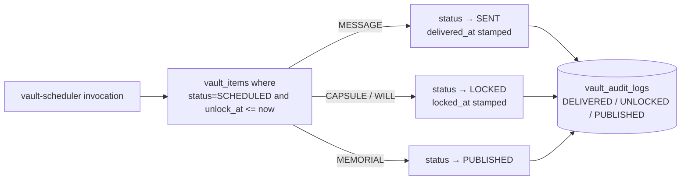

# Vault Edge Functions

Three functions operate on the [[Legacy Vault]]: `vault-export` (consent-gated export with watermark), `vault-integrity-check` (hash verification), and `vault-scheduler` (timed delivery/unlock of messages, capsules, wills, and memorials). All three use the service-role key and take `user_id` from the request body rather than a JWT.

## How It Works

### vault-export

For a given `item_id` + `user_id`, `supabase/functions/vault-export/index.ts`:

1. Loads the `vault_items` row (scoped to `user_id`).
2. Requires an active `vault_consents` row with `purpose='export'` and `revoked_at IS NULL` — otherwise 403 `Export consent required`.
3. Computes SHA-256 over the serialized item and builds a watermark `{ snapshot_id, consent_id, timestamp, sha256[:16] }`.
4. Writes a `vault_receipts` row (`receipt_type: 'EXPORT'`) and a `vault_audit_logs` row (`action: 'EXPORTED'`).
5. Increments `interaction_count` when the consent carries an `interaction_cap`.
6. Returns the item JSON with the watermark embedded.

> [!note] Despite the `format = 'pdf'` default parameter, no PDF is generated — the response is always JSON with a watermark object attached.

### vault-integrity-check

For every `vault_items` row of a user, recomputes SHA-256 of `payload` and compares it to the most recent hash recorded in `vault_audit_logs`. Items with no prior hash pass by default. Each check writes a new `INTEGRITY_CHECK` audit row (so the current hash becomes the next baseline), and the response summarizes `{ total, passed, failed, status }`. This is tamper *detection*, not prevention — a writer that also updates the audit log defeats it.

### vault-scheduler

The scheduler is a sweep over due items — [[Time Capsules]] and memorial pages (see [[Digital Legacy and Memorials]]) flip status when their `unlock_at` passes. "Delivery" of a MESSAGE is purely a status change; no email/notification dispatch exists in this function.

> [!warning] Like the health cron functions, nothing in the repo schedules `vault-scheduler` — `supabase/config.toml` has no cron entries. If it is not wired to pg_cron or an external scheduler, scheduled vault items never fire.

## Data Model

| Table | Role |
|---|---|
| `vault_items` | The items: `type` (MESSAGE/CAPSULE/WILL/MEMORIAL), `status`, `unlock_at`, `payload` |
| `vault_consents` | Purpose-scoped consents with optional `interaction_cap` and `revoked_at` |
| `vault_receipts` | Export receipts with `snapshot_id`, `sha256`, watermark data |
| `vault_audit_logs` | Append-only trail: EXPORTED, INTEGRITY_CHECK, DELIVERED, UNLOCKED, PUBLISHED |

## Key Files

- `supabase/functions/vault-export/index.ts` — consent check, watermark, receipt
- `supabase/functions/vault-integrity-check/index.ts` — hash comparison + audit
- `supabase/functions/vault-scheduler/index.ts` — due-item status sweep

## Gotchas

> [!warning] None of the three functions authenticate the caller. They use the service-role client and trust `user_id` from the request body, so any client that can reach the function URL can export another user's vault items (consent rows permitting) or trigger integrity sweeps. The consent check in `vault-export` is the only guard, and it is keyed to the supplied `user_id`, not the caller.

- `vault-export` hashes `JSON.stringify(item)` (the whole row) while `vault-integrity-check` hashes `JSON.stringify(item.payload)` — the two hashes are not comparable to each other.

## Related

- [[Legacy Vault]] — product feature these functions serve
- [[Time Capsules]] — scheduled CAPSULE items handled by the scheduler
- [[Digital Legacy and Memorials]] — MEMORIAL publishing path
- [[Security Overview]] — where the missing-auth caveat belongs in the threat model
- [[Key Tables]] — vault table schemas
- [[Edge Functions Overview]] — inventory and shared conventions
