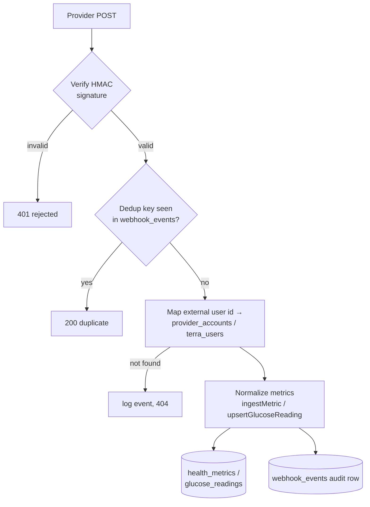

# Webhook Edge Functions

The nine functions that receive pushed device/provider data: two parallel Terra handlers, Fitbit, two stubs (Dexcom, Oura), a CGM glucose handler, a generic device handler, and two streaming endpoints. Together they form the [[Webhook Ingestion Pipeline]]: verify signature → dedup → normalize → store → audit.

## How It Works

### Terra — two competing handlers

- **`webhook-terra`** (`supabase/functions/webhook-terra/index.ts`) — the `_shared/connectors.ts` generation. `verifyTerraSignature()` HMAC-SHA256s the raw body with `TERRA_WEBHOOK_SECRET` against the `terra-signature` header and **rejects** when the header or secret is missing. Dedups via `webhook_events.dedup_key`, maps `payload.user.user_id` through `provider_accounts.external_user_id`, and ingests steps / resting HR / HRV (rmssd) / sleep efficiency from `daily` payloads into `health_metrics`.
- **`terra-webhook`** (`supabase/functions/terra-webhook/index.ts`) — the [[Terra Integration]] generation. Logs every event to `terra_webhook_events`, resolves the user via `terra_users`, stores the raw payload in `terra_metrics_raw`, and normalizes activity/sleep/body/daily into `terra_metrics_normalized` with an upsert on `(user_id, provider, metric_type, metric_name, timestamp)` — real DB-level idempotency.

> [!warning] `terra-webhook` **skips** signature verification when `TERRA_WEBHOOK_SECRET` or the header is absent — it sets `signatureValid = true` and processes the payload (`supabase/functions/terra-webhook/index.ts:380-383`). `webhook-terra` fails closed; `terra-webhook` fails open. Make sure the secret is set in production.

> [!warning] Broken dedup in `webhook-terra`: the dedup key is `generateDedupKey('terra', eventId, new Date().toISOString())` — the *processing time* is baked into the hash, so every delivery gets a unique key and the `webhook_events` check never fires (`supabase/functions/webhook-terra/index.ts:37`). Real protection comes from `ingestMetric()`'s 5-minute same-value window. Fitbit's key uses the notification `date`, so its dedup works.

### Fitbit

`webhook-fitbit` answers Fitbit's `GET ?verify=` subscription challenge by echoing the code, verifies `x-fitbit-signature` (HMAC-SHA1, base64, keyed by `FITBIT_SUBSCRIBER_VERIFICATION_CODE`), then — because Fitbit notifications carry no data — fetches the day's activity or sleep from the Fitbit API with the stored access token and ingests steps, resting HR, and sleep efficiency. Every notification is recorded in `webhook_events`. See [[Fitbit Integration]].

### Dexcom CGM

`cgm-dexcom-webhook` verifies `x-dexcom-signature` (HMAC-SHA256, `DEXCOM_WEBHOOK_SECRET`), then upserts each EGV into `glucose_readings` via `upsertGlucoseReading()` — mmol/L converted to mg/dL, conflict target `(user_id, engram_id, ts, src)`, so replays are truly idempotent. Readings attach to the auto-created St. Raphael engram (`getOrCreateRaphaelEngram`). Runs are logged in `glucose_job_audit`. See [[Dexcom CGM]].

> [!note] User resolution is naive: it selects the single `connector_tokens` row where `connector_id='dexcom'` with `.maybeSingle()` — fine for one connected user, wrong once two users connect Dexcom.

### Stubs and generic handlers

- **`webhook-dexcom`** and **`webhook-oura`** are stubs: they log the payload and return `{ status: 'stub_acknowledged' }` with no verification or storage. [[Oura Integration]] data actually arrives via Terra or `sync-health-now`.
- **`device-webhook-handler`** trusts its JSON body (`provider`, `user_id`, `event_type`, `data`) with **no signature check**, logs to `webhook_logs`, inserts `data.metrics` into `metrics_norm`, then runs `evaluateDeviceHealth()` — computing freshness/completeness/uptime into `device_health` and inserting `STALE_DATA` (>2h) or `LOW_COMPLETENESS` (<70%) rows into `alerts`. Backbone of [[Device Monitoring and Troubleshooting]].

### Streams

- **`device-stream`** — Server-Sent Events endpoint: subscribes to Postgres changes on `connections`, `alerts`, and `webhook_logs` for a user and forwards them as SSE with a 30s heartbeat. Takes `user_id` as a query param with no auth.
- **`device-stream-handler`** — JWT-authenticated; `GET` registers/returns an active `realtime_data_streams` row for a device connection, `POST` ingests individual stream data points.

## Signature Verification Summary

| Function | Header | Algorithm | Secret | Fails |
|---|---|---|---|---|
| `webhook-terra` | `terra-signature` | HMAC-SHA256 hex | `TERRA_WEBHOOK_SECRET` | closed |
| `terra-webhook` | `terra-signature` | HMAC-SHA256 hex | `TERRA_WEBHOOK_SECRET` | **open** |
| `webhook-fitbit` | `x-fitbit-signature` | HMAC-SHA1 base64 | `FITBIT_SUBSCRIBER_VERIFICATION_CODE` | closed |
| `cgm-dexcom-webhook` | `x-dexcom-signature` | HMAC-SHA256 hex | `DEXCOM_WEBHOOK_SECRET` | closed |
| `device-webhook-handler` | — | none | — | n/a |

All comparisons are simple string equality (not constant-time). Details in [[Webhook Signature Verification]].

## Key Files

- `supabase/functions/webhook-terra/index.ts` — Terra → `health_metrics`
- `supabase/functions/terra-webhook/index.ts` — Terra → `terra_metrics_raw`/`normalized`
- `supabase/functions/webhook-fitbit/index.ts` — Fitbit challenge + fetch-on-notify
- `supabase/functions/webhook-dexcom/index.ts`, `supabase/functions/webhook-oura/index.ts` — stubs
- `supabase/functions/cgm-dexcom-webhook/index.ts` — EGVs → `glucose_readings`
- `supabase/functions/device-webhook-handler/index.ts` — generic ingest + device health alerts
- `supabase/functions/device-stream/index.ts` — SSE fan-out of realtime changes
- `supabase/functions/device-stream-handler/index.ts` — stream registration/ingest
- `supabase/functions/_shared/connectors.ts` — signature helpers, `generateDedupKey`, `ingestMetric`

## Related

- [[Webhook Ingestion Pipeline]] — the end-to-end flow this implements
- [[Webhook Signature Verification]] — HMAC details per provider
- [[Shared Edge Function Utilities]] — where the verify/ingest helpers live
- [[Health Data Edge Functions]] — the pull/backfill half of ingestion
- [[Terra Integration]] — why there are two Terra handlers
- [[Dexcom CGM]] / [[Glucose Monitoring and Alerts]] — the CGM path downstream
- [[Device Monitoring and Troubleshooting]] — consumer of `device_health` and `alerts`
