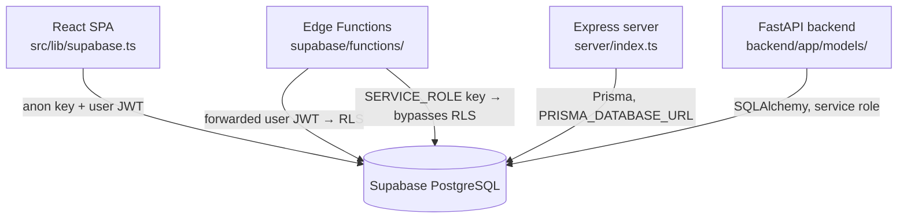

# Database Overview

EverAfter's single source of truth is a Supabase-hosted PostgreSQL database (project `sncvecvgxwkkxnxbvglv`), evolved through 130 SQL migration files in `supabase/migrations/`. Four different clients talk to it — the React frontend, Deno Edge Functions, the live FastAPI backend, and the legacy (undeployed) Express/Prisma server — with very different security properties.

## Overview

- **Engine**: PostgreSQL managed by Supabase (Auth, Storage, and Edge Functions live alongside it).
- **Schema management**: 130 timestamped SQL files under `supabase/migrations/` (see [[Migrations]]). A separate, much smaller Prisma migration exists in `prisma/migrations/` for the legacy Node server's tables (see [[Prisma Schema]]).
- **Security**: [[Row Level Security]] enabled on all 211 live tables (exhaustive replay audit 2026-07-12; hardening migration `20260712130000`), keyed off `auth.uid()` from Supabase Auth JWTs ([[Authentication and JWT Flow]]).
- **Extensions actually enabled by migrations**:
  - `vector` (pgvector) — `supabase/migrations/20251020021144_add_vector_embeddings_system.sql:53`, re-asserted in the agent-memories and AI-knowledge migrations. Powers `vector(1536)` columns with HNSW cosine indexes ([[Embeddings and Vector Search]]).
  - `pgcrypto` — `supabase/migrations/20251025135354_enable_pgcrypto_extension.sql` (bcrypt for the admin user function).
  - `pg_trgm` and `btree_gin` — `supabase/migrations/20251027020000_create_ai_knowledge_system.sql:37-38` (fuzzy/keyword search for the [[Knowledge Base System]]).

> [!warning] Doc drift: migration count and table names
> `CLAUDE.md` says "108+ migrations" — the directory actually contains 122. It also names a `vector_embeddings` table that does not exist anywhere in the migrations; the real vector tables are `engram_memory_embeddings`, `family_member_embeddings`, and `conversation_context_embeddings` (see [[Key Tables]]).

## How It Works

Four access paths hit the same database:

1. **Frontend** — `src/lib/supabase.ts` creates a supabase-js client from `VITE_SUPABASE_URL` / `VITE_SUPABASE_ANON_KEY`. Every query runs as the logged-in user, so [[Row Level Security]] is the only thing separating users' data.
2. **Edge Functions** — the primary API surface ([[Edge Functions Overview]]). User-facing functions like `supabase/functions/raphael-chat/index.ts` build a client that forwards the caller's JWT (RLS enforced); 32 of the functions also reference the `SERVICE_ROLE` key for webhook ingestion and cron work that must bypass RLS.
3. **Express server** — uses Prisma Client against `PRISMA_DATABASE_URL` (`server/index.ts:5-15`). Prisma connects as a database role, not a Supabase user, so RLS does not apply; see [[Prisma Schema]] and [[Dual Backend System]].
4. **FastAPI backend** — SQLAlchemy models in `backend/app/models/*.py` create additional tables outside the Supabase migration flow. This is the gap that `scripts/audit-rls-gap.mjs` and the RLS sweep migrations exist to close ([[Row Level Security]]).

## How the Schema Evolved

The migration history reads as a timeline of the product:

- **2025-10-06** — `20251006070133_create_everafter_schema.sql`: the legacy core (`profiles`, `questions`, `memories`, `family_members`, `saint_activities`) with RLS from day one.
- **2025-10-20** — [[Archetypal AIs]] and pgvector embeddings, the [[365-Day Personality Training]] question system, and the autonomous agent task queue ([[Autonomous Task System]]).
- **2025-10-25** — a big consolidation day: `engrams`, `saints_subscriptions`, health tracking, health connectors, the glucose/metabolic system, plus the six-part `optimize_rls_policies_part*` sweep introducing the `(select auth.uid())` idiom.
- **2025-10-26 → 11-06** — monetization, knowledge base, device integration, dashboards, Terra, legacy vault, marketplace, insurance/memorial systems, and repeated `fix_security_*` / `remove_unused_indexes_*` cleanup passes.
- **2026** — career agent, onboarding, `comprehensive_schema_fix`, DHT (Delphi Health Trajectory) tables, and the June 2026 RLS audit sweep + genealogy/genetic-storage additions.

## Key Files

- `supabase/migrations/` — 122 SQL migrations; the authoritative schema history.
- `prisma/schema.prisma` — Prisma models for the Node server (health-connector tables).
- `src/lib/supabase.ts` — frontend supabase-js client (anon key).
- `server/index.ts` — Express entry point instantiating `PrismaClient`.
- `scripts/audit-rls-gap.mjs` — CI check comparing backend SQLAlchemy tables to Supabase migrations.
- `supabase/migrations/20251006070133_create_everafter_schema.sql` — the original schema.

## Gotchas

> [!warning] Same database, different rulebooks
> Only supabase-js clients carrying a user JWT are constrained by RLS. Prisma, SQLAlchemy, and service-role Edge Function clients all bypass it. Any table written only by those paths must still get explicit RLS policies, or it is fully readable through the anon key — exactly the failure mode the June 2026 audit sweep patched.

> [!note] Two ORM worlds, one database
> Supabase migrations and Prisma both define tables in `public`. Don't mix clients in one file (per `CLAUDE.md`), and don't assume Prisma's `npm run migrate` knows anything about the 122 Supabase migrations — they are parallel systems (see [[Migrations]]).

## Related

- [[Key Tables]] — column-level detail on the load-bearing tables described here.
- [[Migrations]] — how the 122 migration files are organized and applied.
- [[Row Level Security]] — the policy patterns guarding every access path.
- [[Prisma Schema]] — the Node-server-only slice of the schema.
- [[Dual Backend System]] — why two backends share this database.
- [[Embeddings and Vector Search]] — what the pgvector extension is used for.
- [[Database MOC]] — hub for all database notes.
