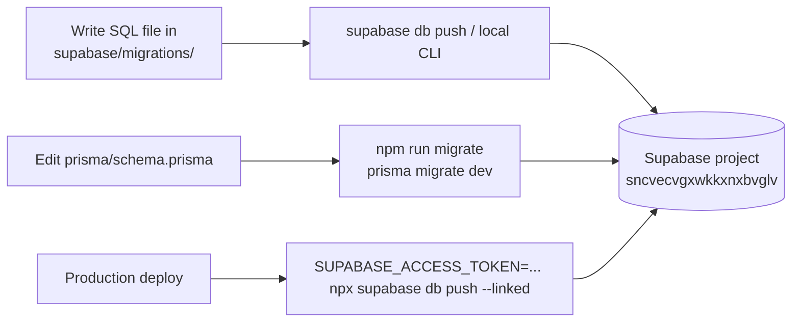

# Migrations

How schema changes reach the EverAfter database. There are two parallel migration systems: 122 SQL files in `supabase/migrations/` (the main database, applied with the Supabase CLI) and Prisma migrations for the Node server's tables (`npm run migrate`). Knowing which one to touch is half the battle.

## Overview

**Naming**: Supabase migrations are `YYYYMMDDHHMMSS_description.sql`, e.g. `20251025082740_create_unified_engram_task_system.sql`. Descriptions follow recognizable verb prefixes:

- `create_*_system` — new feature schemas (health connectors, glucose, marketplace, vault...).
- `seed_*` — data-only migrations (question banks, device registry, demo archetypes).
- `fix_*` — fix-forward repairs (signup triggers alone took four consecutive fixes on 2025-10-27).
- `optimize_rls_*` / `remove_unused_indexes_*` / `enable_rls_*` — performance and [[Row Level Security]] sweeps.

Most files open with a large `/* ... */` doc comment describing tables, security, and rationale — worth reading before the SQL itself.

## How It Works

- **Supabase path** (main schema): add a timestamped `.sql` file, then apply with `SUPABASE_ACCESS_TOKEN='...' npx supabase db push --linked` (the documented [[Deployment]] command). There is no `supabase migration new` convention enforced here — files are hand-authored.
- **Prisma path** (Node-server tables only): `npm run migrate` (`prisma migrate dev`) in dev, `npm run migrate:deploy` in production, `npm run db:seed` for seeds. See [[Prisma Schema]] for why this directory is currently non-standard.
- **Out-of-band path**: at least one migration was written to be pasted into the dashboard — `20260304_dht_tables.sql` literally says "Run this in Supabase SQL Editor" and is missing the time component of its timestamp.

## Gotchas

> [!warning] Duplicate timestamps exist
> `20251027000000_create_cognitive_insights_system.sql` and `20251027000000_create_unified_connections_system.sql` share a timestamp, as do `20251029190000_create_memorial_services_system.sql` and `20251029190000_fix_security_performance_issues.sql`. Ordering between same-timestamp files falls back to filename sort. When adding migrations, pick a unique, current timestamp.

> [!warning] `IF NOT EXISTS` means later definitions may never apply
> Several tables are declared more than once with different columns — `provider_accounts` in both `20251025110000` and `20251025160122`, `health_metrics` in `20251025065152` and `20251025110000`, `engrams` in `20251025060239` and `20260104100000`. Because every declaration uses `CREATE TABLE IF NOT EXISTS`, whichever ran first wins; the later file's extra columns silently do not exist unless a separate `ALTER TABLE` adds them. Verify live columns before coding against a migration file (see [[Key Tables]]).

> [!note] Fix-forward, never edit history
> The repo's style is to repair mistakes with new `fix_*` migrations (signup trigger saga: `20251027202018` → `202358` → `202929` → `203022`), and to make sweeps re-runnable with `DROP POLICY IF EXISTS` / `ALTER TABLE IF EXISTS` / `DO $$` existence checks. Follow that pattern; never edit an applied migration.

> [!note] Seed data lives in migrations
> Question banks, device registries, transformation rules, and demo marketplace archetypes are all seeded by migration files (`seed_*`), not by `prisma/seed.ts`. Re-running them is safe-ish because they mostly use `ON CONFLICT DO NOTHING`, but they make `db push` slower and the directory noisy.

> [!warning] Tables created outside migrations have no RLS
> The FastAPI backend (`backend/app/models/`) creates tables via SQLAlchemy that never appear in `supabase/migrations/`. `scripts/audit-rls-gap.mjs` exists to detect exactly this, and `20260620170000_enable_rls_audit_sweep.sql` is the template for patching the gaps — see [[Row Level Security]].

## Key Files

- `supabase/migrations/` — 122 SQL files; the authoritative history (CLAUDE.md's "108+" is stale).
- `supabase/migrations/20251006070133_create_everafter_schema.sql` — first migration.
- `supabase/migrations/20260620190000_create_genetic_storage.sql` — most recent (June 2026).
- `supabase/migrations/20260620170000_enable_rls_audit_sweep.sql` — canonical re-runnable sweep pattern.
- `prisma/schema.prisma` + `prisma/migrations/` — the separate Prisma flow.
- `package.json` — `migrate`, `migrate:deploy`, `db:seed`, `db:studio` scripts.
- `scripts/audit-rls-gap.mjs` — CI guard for tables missing from migrations.

## Related

- [[Database Overview]] — the schema these migrations build, and its evolution timeline.
- [[Key Tables]] — which migration created each load-bearing table.
- [[Row Level Security]] — the policy sweeps that dominate the migration history.
- [[Prisma Schema]] — the second migration system and its quirks.
- [[Deployment]] — where `supabase db push --linked` fits in the release flow.
- [[Commands Cheatsheet]] — quick reference for the npm/supabase commands above.
