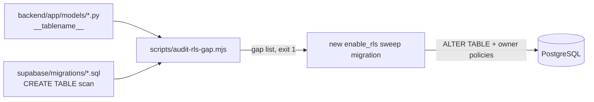

# Row Level Security

RLS is EverAfter's primary data-isolation mechanism: every request that reaches PostgreSQL with a user JWT is filtered by per-table policies keyed on `auth.uid()`. Because the frontend talks to the database directly with the anon key, a table without policies is a table anyone can read.

## How It Works

Supabase Auth issues the JWT ([[Authentication and JWT Flow]]); supabase-js forwards it; Postgres evaluates policies as role `authenticated` with `auth.uid()` returning the caller's user id. Recurring policy patterns in the migrations:

1. **Owner-only** (the default) — `USING (auth.uid() = user_id)` for SELECT/INSERT/UPDATE/DELETE, e.g. `profiles`, `memories`, `engrams`, `saints_subscriptions`.
2. **Family-member read access** — `EXISTS` subquery against `family_members` requiring `status = 'Active'` and an adequate `access_level`, e.g. the "Family members can view authorized memories" policy in `supabase/migrations/20251006070133_create_everafter_schema.sql:206` (also gated on `is_draft = false`). Powers [[Family Engrams]] / legacy sharing.
3. **Ownership via parent FK** — embedding rows have no `user_id`; policies join through the parent, e.g. `engram_memory_embeddings` checks `archetypal_ais.user_id = auth.uid()` (`20251020021144_add_vector_embeddings_system.sql:67`).
4. **Service-role-only tables** — `webhook_events` and `connector_tokens` get RLS enabled but no (or nearly no) `authenticated` policies; only service-role writers from the [[Webhook Ingestion Pipeline]] can touch them.
5. **Public read** — reference data like `questions`: `USING (true)` for authenticated SELECT.

## The `(select auth.uid())` Idiom

Writing `auth.uid()` bare in a policy makes Postgres call the function per row; wrapping it as `(select auth.uid())` turns it into an InitPlan evaluated once per query, keeping predicates index-friendly. The codebase converged on this the hard way:

- `20251025082208..082504_optimize_rls_policies_part1..6` — first six-part rewrite of existing policies.
- `20251029123941_fix_rls_performance_auth_uid_wrapping.sql` — a second sweep dropping and recreating policies across ~23 tables.
- New tables since then (e.g. `engram_ai_tasks` in `20251025082740`) use the wrapped form from the start, and `CLAUDE.md` mandates it.

> [!tip] When adding any policy, copy an existing wrapped one
> The sweep migrations are full of correct examples: `USING (user_id = (select auth.uid()))`. For text-typed owner columns (SQLAlchemy tables), cast: `(select auth.uid())::text = user_id`.

## Service-Role Bypass

RLS only constrains requests that arrive as `authenticated`/`anon`. Three paths skip it entirely:

- **Edge Functions using the service-role key** — 32 functions under `supabase/functions/` reference `SERVICE_ROLE`, mainly webhook ingestion and cron jobs ([[Edge Functions Overview]]).
- **The Express server via Prisma** — direct database role, no JWT at all ([[Prisma Schema]], [[Express Server]]).
- **The FastAPI backend** — SQLAlchemy with service credentials (`backend/app/models/`).

This is by design (backends must write cross-user data), but it means RLS is a floor for user-JWT paths, not a universal guarantee — see [[Security Overview]].

## The Audit Sweep and `audit-rls-gap.mjs`

The FastAPI backend created many tables with no Supabase migration and therefore no RLS — every row visible via the anon key. Two artifacts address this:

- `scripts/audit-rls-gap.mjs` — compares every SQLAlchemy `__tablename__` in `backend/app/models/*.py` against `CREATE TABLE` statements in `supabase/migrations/*.sql`. Exits 1 and lists offenders when a backend table has no migration. Used as a fast CI/pre-merge signal; it explicitly is *not* proof of RLS, only of coverage.
- `supabase/migrations/20260620170000_enable_rls_audit_sweep.sql` — the remediation template. `DO $$` loops over table arrays grouped by ownership pattern (`user_id` text/uuid, `owner_user_id`, camelCase `"userId"`, ownership via FK), each getting `ALTER TABLE IF EXISTS ... ENABLE ROW LEVEL SECURITY` plus four idempotent owner-only policies using `(select auth.uid())`. Its header lists tables deliberately deferred (`compliance_controls`, `restore_drills`, `metrics`, `devices`, `sources`, household-scoped tables) with reasons.
- `20260616120000_enable_rls_voice_tables.sql` — the earlier, narrower fix for voice tables flagged by the Supabase Security Advisor.

> [!warning] A passing audit is not a secured table
> The script only proves a `CREATE TABLE` exists somewhere in migrations. A table can be created without `ENABLE ROW LEVEL SECURITY`, or with RLS enabled but overly broad policies. Follow up gaps with the sweep pattern and check the Supabase Security Advisor.

## Key Files

- `scripts/audit-rls-gap.mjs` — RLS coverage gap finder (backend tables vs migrations).
- `supabase/migrations/20260620170000_enable_rls_audit_sweep.sql` — re-runnable sweep template with ownership-pattern loops.
- `supabase/migrations/20251029123941_fix_rls_performance_auth_uid_wrapping.sql` — the big `(select auth.uid())` rewrite.
- `supabase/migrations/20251025082208_optimize_rls_policies_part1_core_tables.sql` — first of the six-part optimization series.
- `supabase/migrations/20260616120000_enable_rls_voice_tables.sql` — voice-tables RLS fix.
- `supabase/migrations/20251006070133_create_everafter_schema.sql` — original owner + family-member policy examples.

## Related

- [[Database Overview]] — which access paths RLS does and does not cover.
- [[Authentication and JWT Flow]] — where `auth.uid()` comes from.
- [[Security Overview]] — RLS in the wider threat model.
- [[Key Tables]] — per-table policy notes for the load-bearing tables.
- [[Migrations]] — how RLS sweeps fit the fix-forward migration style.
- [[Edge Functions Overview]] — JWT-forwarding vs service-role clients.
- [[PHI Handling]] — why health tables demand the strictest policies.
