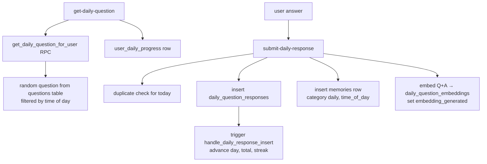

# 365-Day Personality Training

One question per day for a year: users answer personal questions, answers are stored as memories and embedded, and over time they become the personality behind [[Custom Engrams]]. The system spans a question pool, progress/streak tracking, and an embedding step that makes answers retrievable in chat.

## Overview

The intended loop: `get-daily-question` serves today's question → user answers in `DailyQuestionCard` → `submit-daily-response` stores the answer, creates a memory, and embeds it → a database trigger advances `user_daily_progress` (day counter, total, streak) → [[Embeddings and Vector Search|vector search]] surfaces those answers during engram chat.

In practice there are **two divergent paths** — the edge-function path and a direct-to-database path in the UI — and they disagree about where questions come from.

## How It Works

### Edge-function path

- `supabase/functions/get-daily-question/index.ts` calls the `get_daily_question_for_user(uuid)` RPC and returns `{ question, progress: { currentDay, totalResponses, streakDays, alreadyAnswered } }`.
- `supabase/functions/submit-daily-response/index.ts` rejects a second answer for the same day (409), inserts into `daily_question_responses` **and** `memories`, then (if `OPENAI_API_KEY` is set) embeds `"Question: …\nAnswer: …"` with text-embedding-3-small into `daily_question_embeddings`.
- `supabase/functions/daily-progress/index.ts` is a thin JWT-forwarding wrapper around the no-arg `get_or_create_user_progress()` RPC; [[St Raphael]]'s `raphael-chat` calls the same RPC after each chat to count activity.

### UI path (DailyQuestionCard)

`src/components/DailyQuestionCard.tsx` bypasses the edge functions entirely. It loads the user's `archetypal_ais`, reads `user_daily_progress` and `daily_question_pool` directly via the Supabase client, and inserts straight into `daily_question_responses` (with `ai_id`, `question_category`, and uploaded `attachment_file_ids`). Progress still advances because the insert trigger fires — but the **embedding step is skipped**, so answers submitted this way are never vectorized.

> [!warning] Question-source mismatch: the RPC picks a *random* question from the legacy `questions` table by time of day (`supabase/migrations/20251020022430_enhance_daily_question_system.sql:207-259`), not from `daily_question_pool`. Meanwhile `DailyQuestionCard` queries `daily_question_pool` with `.limit(1)` and no ordering or day filter — users can see the same question repeatedly. Neither path uses `day_range_start/day_range_end` or `usage_count` on the pool.

## Data Model

- `daily_question_pool` — question bank: `question_text`, `category_id`, `dimension_id`, `difficulty_level`, `requires_deep_thought`, `day_range_start/end`, `is_active`, `usage_count` (`supabase/migrations/20251020060000_multilayer_personality_system.sql:135`)
- `daily_question_responses` — answers: `user_id`, `question_text` snapshot, `response_text`, `day_number` (1-365 check), `mood`, `embedding_generated`
- `user_daily_progress` — `current_day`, `total_responses`, `streak_days`, `last_response_date`; unique per user
- `daily_question_embeddings` — `vector(1536)` embeddings of Q&A pairs with HNSW index
- `question_categories`, `personality_dimensions` — categorization used by `generate-personality-profile` and the multilayer personality system
- Seeds: `supabase/migrations/20251025160507_seed_initial_daily_questions.sql` and `20251025100000_complete_365_questions_and_features.sql` (fills toward 365 questions)

Progress mechanics live in the consolidated trigger `handle_daily_response_insert` (`supabase/migrations/20251025154554_fix_duplicate_progress_triggers.sql`), which replaced two earlier conflicting triggers; streaks reset unless the previous answer was yesterday, and `current_day` caps at 365.

## Gotchas

- Two overloads of `get_or_create_user_progress` exist: `(target_user_id uuid)` returns the full progress row (used by `submit-daily-response`), while the no-arg version from `20251025082759_create_daily_progress_rpc.sql` returns just a uuid keyed to `current_date` (used by `daily-progress` and `raphael-chat`).
- `apiClient.submitDailyResponse` (`src/lib/api-client.ts:545`) sends `{ userId, questionId, response, engramId }`, but the edge function expects `{ questionText, responseText, mood }` — this wrapper would always get a 400. The working UI path is the direct insert in `DailyQuestionCard`.
- `get-daily-question` and `submit-daily-response` build service-role clients and derive the user from the JWT — the `userId` the client sends is ignored.

## Related

- [[Custom Engrams]] — the personalities these answers train
- [[Embeddings and Vector Search]] — where embedded answers should become retrievable
- [[Archetypal AIs]] — the `archetypal_ais` rows the UI attaches answers to
- [[Shared Edge Function Utilities]] — function-catalog view of these endpoints
- [[Key Tables]] — schema context for the tables above
- [[Row Level Security]] — per-user isolation on responses and progress
