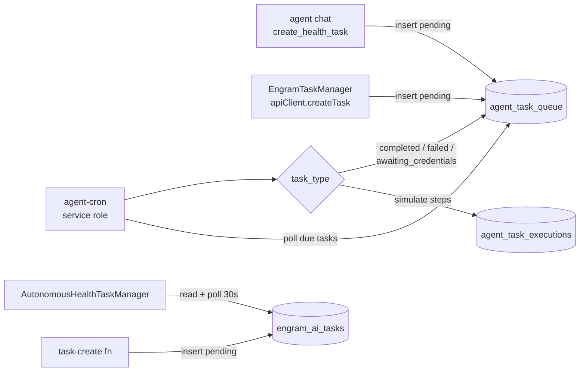

# Autonomous Task System

The subsystem that lets AI agents create and "execute" background tasks (appointments, refills, reminders) on the user's behalf. In reality it is three parallel task tables, four Edge Functions, and two UIs — with simulated execution and several wiring mismatches worth knowing before you touch it.

## Overview

Function-level detail lives in [[Agent and Task Edge Functions]]; this note covers the system end to end.

| Piece | Table | Role |
|---|---|---|
| `task-create` | `engram_ai_tasks` | Minimal authenticated insert (status `pending`), engram ownership checked via [[Row Level Security]] |
| `agent` | `agent_task_queue` | St. Raphael tool-calling chat; its `create_health_task` tool enqueues tasks (auto-creating a "St. Raphael" row in `engrams` if missing) |
| `agent-cron` | `agent_task_queue` → `agent_task_executions` | Service-role executor: polls up to 10 due `pending` tasks per run, ordered by priority then schedule |
| `manage-agent-tasks` | `agent_tasks` + `agent_task_logs` | REST-ish CRUD keyed by `saint_id` (default `raphael`) |

## How It Works

### Status flows

- `engram_ai_tasks` — CHECK constraint allows `pending → in_progress → done | failed | cancelled` (`supabase/migrations/20251025082740_create_unified_engram_task_system.sql:26`). A trigger stamps `completed_at` when a task reaches a terminal state.
- `agent_task_queue` — `pending → awaiting_credentials | in_progress → completed | failed | cancelled | requires_approval`, with `retry_count`/`max_retries`, `completion_percentage`, `scheduled_for`, and `requires_credentials` + `credential_ids` (credential-gated types: doctor_appointment, prescription_refill, lab_results) (`supabase/migrations/20251020050000_autonomous_task_execution.sql:48-85`).
- `agent_tasks` — free-text status (no CHECK); `manage-agent-tasks` stamps `completed_at` on `status === 'completed'` and logs every mutation to `agent_task_logs`.

> [!warning] CLAUDE.md calls `engram_ai_tasks` "the single source of truth for all health/personal tasks" and the migration comment calls it "the ONE task system" — but the code actively uses **three** unsynchronized task tables. The documented `pending → in_progress → done/failed` flow is only enforced on `engram_ai_tasks`; the queue that actually gets executed (`agent_task_queue`) uses `completed`, not `done`.

> [!warning] Execution is **simulated**. `agent-cron`'s `executeTask` returns hardcoded results ("Dr. Smith", "Main Health Center", `APPT-${Date.now()}` confirmations) without contacting any external service (`supabase/functions/agent-cron/index.ts:19,101-124`). Also, nothing in this repo schedules agent-cron — there is no pg_cron migration or `config.toml` schedule — so it only runs when invoked externally.

### The UIs

- **`src/components/AutonomousHealthTaskManager.tsx`** — read-only dashboard over `engram_ai_tasks`, polling every 30s with pending/completed/failed stat tiles.
  > [!warning] Two problems: it counts `status === 'completed'`, but the `engram_ai_tasks` CHECK constraint only allows `done` — so the "completed" stat is permanently 0. And a repo-wide search shows the component is **not imported anywhere**; it is dead UI as of this writing.
- **`src/components/EngramTaskManager.tsx`** — mounted in `UnifiedChatInterface.tsx:407`. Loads its engram list from `archetypal_ais` (where `training_status === 'ready'`; see [[Archetypal AIs]]), then lists/creates tasks directly against `agent_task_queue` via `apiClient.listTasks/createTask` (`src/lib/api-client.ts:562-603`).
  > [!warning] Its "Run now" button calls `apiClient.executeTask`, which POSTs `{ action: 'execute', taskId }` to `manage-agent-tasks` — but that function's POST handler expects `task_type` and `title` and operates on the *other* table (`agent_tasks`), so manual execution returns a 400. The only thing that actually executes queue tasks is `agent-cron`.

### Approval surface

Saint-initiated actions that need consent show up as "intercessions" in `CouncilAlerts` (approve/deny; see [[Trinity and Council]]) — a separate, backend-API-based mechanism from the `requires_approval` status in `agent_task_queue`.

## Key Files

- `supabase/functions/task-create/index.ts` — insert into `engram_ai_tasks` with `{code,message,hint}` errors
- `supabase/functions/agent/index.ts` — tool-calling chat; `create_health_task` → `agent_task_queue`
- `supabase/functions/agent-cron/index.ts` — queue executor with per-step `agent_task_executions` logging
- `supabase/functions/manage-agent-tasks/index.ts` — CRUD over `agent_tasks` by `saint_id`
- `src/components/EngramTaskManager.tsx` — task UI wired to `agent_task_queue`
- `src/components/AutonomousHealthTaskManager.tsx` — orphaned `engram_ai_tasks` dashboard
- `supabase/migrations/20251025082740_create_unified_engram_task_system.sql` — `engram_ai_tasks` schema
- `supabase/migrations/20251020050000_autonomous_task_execution.sql` — queue, credentials, executions, notifications
- `supabase/migrations/20251020031838_create_agent_tasks_system.sql` — `agent_tasks` + logs

## Related

- [[Agent and Task Edge Functions]] — function-by-function detail of the same pipeline
- [[St Raphael]] — the persona whose chat creates most tasks
- [[Archetypal AIs]] — where EngramTaskManager gets its engram list
- [[Row Level Security]] — ownership enforcement on task tables
- [[Trinity and Council]] — the intercession approval UI
- [[Common Gotchas]] — the done-vs-completed class of mismatch
- [[Key Tables]] — task tables in the wider schema
