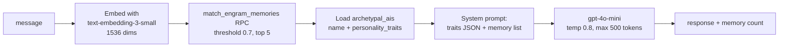

# Custom Engrams

Custom engrams are user-created AI personalities trained from the user's own answers and memories. The `engram-chat` edge function answers as the engram using retrieval-augmented generation: personality traits from `archetypal_ais` plus semantically-matched memories from `engram_memory_embeddings`.

## Overview

An engram starts as a named shell (archetype: Companion, Creative, Mentor, or Custom), accumulates training data through [[365-Day Personality Training]] and the training wizard, and becomes chattable once activated. Two parallel tables both represent engrams: `engrams` (used by [[St Raphael]]'s ownership check and the local backend) and `archetypal_ais` (used by `engram-chat` for personality and by the daily-question UI). Treat them as the same concept with an unconsolidated schema.

## How It Works

### engram-chat pipeline

`supabase/functions/engram-chat/index.ts` requires `{ engramId, message, conversationId }` and a JWT (validated with a **service-role** client via `auth.getUser(token)`):

The system prompt literally interpolates `JSON.stringify(personality_traits)` and the matched memory contents with similarity scores, then instructs the model to "respond naturally and authentically based on this personality and these memories." If `OPENAI_API_KEY` is unset the function returns a graceful "basic mode" fallback instead of erroring.

### How personality data gets in

- **Daily questions**: answering via `submit-daily-response` embeds Q&A pairs into `daily_question_embeddings` (see [[365-Day Personality Training]]).
- **Training wizard**: `src/components/personality/EngramTrainingWizard.tsx` upserts `engram_personality_profiles`, links family members via `engram_family_links`, and posts answers to the local backend (`apiClient.submitEngramResponse` → `POST /api/v1/engrams/{id}/responses`).
- **Direct embedding ingestion**: the `generate-embeddings` function writes `engram_memory_embeddings` rows — the only table `match_engram_memories` searches.

> [!warning] Nothing in `src/` calls `generate-embeddings`, and `submit-daily-response` writes to `daily_question_embeddings`, which `match_engram_memories` does **not** search. Unless embeddings are ingested by an external process, engram-chat's memory retrieval returns "No specific memories found" and the engram answers from `personality_traits` alone.

### CustomEngramsDashboard

`src/components/CustomEngramsDashboard.tsx` ("Engram Training Center") is the management UI:

- Three-step create flow (archetype → details → confirm) with name validation (2-50 chars, charset check) and a debounced duplicate-name check via `apiClient.checkEngramNameExists`.
- Creation goes to the local Express-style backend (`apiClient.createEngram` → `POST /api/v1/engrams/create`), not an edge function.
- Stat chips computed from `archetypal_ais`-shaped rows: `is_ai_active`, `voice_enabled`, `ai_readiness_score`, `total_questions_answered`.
- A "fast-track" upgrade launches `stripe-checkout` (see [[Payments and Subscriptions]]).
- Selecting an engram opens `EngramTrainingWizard` for guided training.

## Data Model

- `archetypal_ais` — engram identity: `name`, `description`, `personality_traits` (jsonb), `total_memories`, `training_status`, activation/readiness fields
- `engram_memory_embeddings` — `engram_id` FK to `archetypal_ais`, `content`, `embedding vector(1536)`, `metadata` (HNSW cosine index); RLS via owning user (see [[Row Level Security]])
- `engrams` — parallel table used by the local backend and `raphael-chat` ownership checks
- `engram_personality_profiles`, `engram_family_links` — wizard outputs

## Gotchas

- `engram-chat` uses the service-role key and never verifies that `engramId` belongs to the caller — any authenticated user can chat with any engram id they can guess ([[Security Overview]] concern).
- `conversationId` is required by the request contract but never persisted — no server-side conversation history exists for engram chat.
- The dashboard defensively normalizes `getEngrams()` results because demo/proxy layers have returned object payloads where arrays were expected (`CustomEngramsDashboard.tsx:187-198`).

## Related

- [[Archetypal AIs]] — the `archetypal_ais` table and archetype concept in depth
- [[365-Day Personality Training]] — the main training-data pipeline
- [[Embeddings and Vector Search]] — the retrieval layer engram-chat depends on
- [[St Raphael]] — a system-created engram that reuses this machinery
- [[AI Chat Edge Functions]] — engram-chat alongside its sibling chat functions
- [[Family Engrams]] — family-member variant of the same idea
- [[Marketplace and Creator Dashboard]] — where trained engrams can be shared/sold
