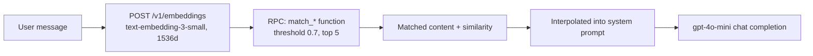

# Embeddings and Vector Search

EverAfter's retrieval layer: OpenAI `text-embedding-3-small` vectors (1536 dims) stored in pgvector columns with HNSW cosine indexes, searched through SQL RPCs at chat time. Five embedding tables serve different memory domains; there is no single `vector_embeddings` table.

> [!warning] CLAUDE.md describes chat as "Search `vector_embeddings` for context" — no table by that name exists in `supabase/migrations/`. The real tables are listed below. Trust the code.

## Overview

| Table | Domain | Searched by | Created in |
|---|---|---|---|
| `engram_memory_embeddings` | [[Custom Engrams]] training memories | `match_engram_memories` (engram-chat) | `20251020021144` |
| `family_member_embeddings` | [[Family Engrams|family member]] memories | `match_family_member_memories` | `20251020021144` |
| `conversation_context_embeddings` | chat history recall | `match_conversation_context` | `20251020021144` |
| `daily_question_embeddings` | [[365-Day Personality Training]] answers | (no RPC consumer found) | `20251020022430` |
| `agent_memories` | [[St Raphael]] agent memory | `search_agent_memories` (agent fn) | `20251025093736` |

All use `embedding vector(1536)` with HNSW indexes (`vector_cosine_ops`, `m = 16`, `ef_construction = 64`) and RLS scoping rows to the owning user. The [[Knowledge Base System]] keeps a separate `knowledge_embeddings` table that `knowledge-query` embeds with `text-embedding-3-large` and scores with cosine similarity computed in TypeScript rather than a pgvector operator.

## How It Works

### Similarity search RPCs

`match_engram_memories(query_embedding, target_engram_id, match_threshold, match_count)` (`supabase/migrations/20251020021144_add_vector_embeddings_system.sql:238`) returns rows where `1 - (embedding <=> query) > threshold`, ordered by distance. The family-member and conversation variants are structurally identical; `search_agent_memories` adds a `memory_type_filter`.

### In chat context building

- `engram-chat` embeds each incoming message and calls `match_engram_memories` before prompting (`supabase/functions/engram-chat/index.ts:67-97`).
- The `agent` function exposes retrieval as a model-invoked tool: `retrieve_memory` → `search_agent_memories`, `store_memory` → embed + insert into `agent_memories` with an `importance_score` (`supabase/functions/agent/index.ts:146-207`). See [[Agent and Task Edge Functions]].
- `submit-daily-response` embeds `Question + Answer` pairs into `daily_question_embeddings` at write time.

### generate-embeddings (ingestion endpoint)

`supabase/functions/generate-embeddings/index.ts` accepts `{ text, type, engramId | familyMemberId, metadata }` and inserts into `engram_memory_embeddings` or `family_member_embeddings`. Its declared `conversation` type has no insert branch — the row is silently dropped.

> [!warning] If `OPENAI_API_KEY` is missing, the function inserts **mock embeddings** (`Array(1536)` of random values, `index.ts:56-96`) with only a `mock: true` flag in the response. Random vectors permanently pollute similarity search — check for these rows if retrieval quality looks wrong. Also note: no frontend code calls `generate-embeddings` at all, so `engram_memory_embeddings` may simply be empty (see [[Custom Engrams]] gotcha).

### generate-personality-profile (LLM analysis, not vectors)

Despite sitting next to the embedding functions, `supabase/functions/generate-personality-profile/index.ts` does no vector work. For a `family_member_id` with ≥3 answered `family_personality_questions`, it loops over active `personality_dimensions`, prompts gpt-4o-mini (temperature 0.3) to extract 2-4 traits per dimension as JSON (`trait_name`, `trait_value`, `confidence`, `evidence`), and persists:

- `family_personality_profiles` — `profile_data` jsonb, `completeness_score` (responses/20 × 40 + traits/16 × 60, capped at 100), average `confidence_score`, `profile_version`
- `personality_traits` — one row per extracted trait with supporting response ids
- `profile_generation_log` — audit row (model, counts, processing time)

It also computes heuristic `behavioral_patterns` locally (response depth by average length, response timing, emotional expression by emotion-word counts). Triggered from `src/components/PersonalityProfileViewer.tsx:195`.

## Key Files

- `supabase/migrations/20251020021144_add_vector_embeddings_system.sql` — pgvector extension, three embedding tables, match RPCs, HNSW indexes
- `supabase/migrations/20251025093736_create_agent_memories_vector_system.sql` — `agent_memories` + `search_agent_memories`
- `supabase/migrations/20251020022430_enhance_daily_question_system.sql` — `daily_question_embeddings`
- `supabase/functions/generate-embeddings/index.ts` — embedding ingestion endpoint (mock fallback hazard)
- `supabase/functions/engram-chat/index.ts` — retrieval-augmented chat consumer
- `supabase/functions/agent/index.ts` — tool-based memory store/retrieve
- `supabase/functions/generate-personality-profile/index.ts` — GPT trait extraction for family profiles
- `supabase/functions/knowledge-query/index.ts` — knowledge search with `text-embedding-3-large`, JS-side cosine

## Gotchas

- Thresholds are hardcoded at 0.7 with top-5 across consumers; the match RPCs default the same way.
- Two embedding models are in play: `-small` (1536d) for personal memory tables, `-large` for knowledge — vectors are not interchangeable.
- `daily_question_embeddings` is written but nothing reads it via RPC — a dead end between training and chat today.

## Related

- [[Custom Engrams]] — main consumer of engram memory search
- [[St Raphael]] — agent memory via `search_agent_memories`
- [[365-Day Personality Training]] — produces daily-answer embeddings
- [[Knowledge Base System]] — the parallel `knowledge_embeddings` store
- [[Database Overview]] — where pgvector fits in the schema
- [[Row Level Security]] — per-user policies on every embedding table
- [[Family Engrams]] — family-member profile generation consumer
