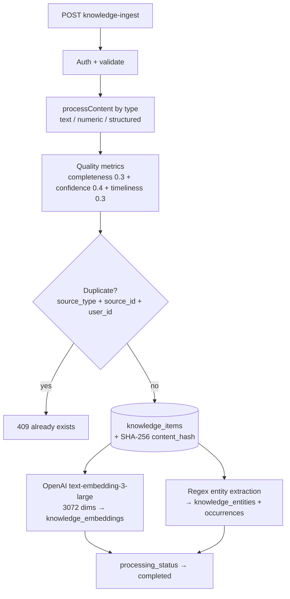

# Knowledge Base System

A standalone knowledge-management subsystem: the `knowledge-ingest` and `knowledge-query` Edge Functions plus nine `knowledge_*` tables designed to feed context to every AI in the platform. As of this writing it is built but **not wired into any chat pipeline**.

## How It Works

### Ingestion — `knowledge-ingest`

`supabase/functions/knowledge-ingest/index.ts` accepts `{ source_type, source_id, content, processing_options }` from an authenticated user (service-role client with the JWT forwarded; a caller may only write for their own `user_id` unless using the service key).

Details worth remembering:
- Quality scoring is heuristic (`calculateQualityMetrics`): timeliness decays over 365 days to a 0.3 floor; confidence is a hardcoded 0.8.
- Embeddings default **on** (`generate_embeddings !== false`); entity extraction defaults **off** and is a toy — two regexes over five medication names and six symptom words (`extractSimpleEntities`, `index.ts:388-423`).
- Dedup is two-layered: a lookup on `(source_type, source_id, user_id)` returns 409, and a SHA-256 `content_hash` is stored for content-level dedup.

### Query — `knowledge-query`

`supabase/functions/knowledge-query/index.ts` supports three query types with optional filters (`engram_id`, categories, date range, min quality):

- **text** — embeds the query with `text-embedding-3-large`, then runs the vector path; without an `OPENAI_API_KEY` it falls back to Postgres full-text search (`textSearch(..., { type: "websearch" })`).
- **vector** — fetches `knowledge_embeddings` joined to `knowledge_items`, computes cosine similarity **in the function** (`cosineSimilarity`, `index.ts:491`), filters by `similarity_threshold` (default 0.5), sorts descending.
- **structured** — plain filtered select over `knowledge_items` ordered by quality and recency.

Results can be enriched with `knowledge_relationships` (`include_relationships`) and entity occurrences (`include_context`). Every query writes a row to `knowledge_access_log` with requester type (`user | ai_agent | system`), query text, and user agent.

> [!warning] The vector path is broken as written: `queryByVector` never selects the `embedding` column, then calls `cosineSimilarity(vector, item.embedding)` on `undefined`, which throws (`knowledge-query/index.ts:187-247`). It also "orders" by the raw embedding column and applies `limit` **before** any similarity ranking, so even with the column selected this is not a nearest-neighbor search — the ivfflat index created in the migration is never used. Only the structured and full-text paths behave as documented.

## Data Model

All in `supabase/migrations/20251027020000_create_ai_knowledge_system.sql`:

| Table | Purpose |
|---|---|
| `knowledge_items` | Core store: content text/structured, quality/confidence scores, categories, tags, `content_hash`, `processing_status` |
| `knowledge_embeddings` | `vector(3072)` per item, ivfflat cosine index, chunk text |
| `knowledge_relationships` | Typed item→item edges with strength/confidence |
| `knowledge_entities` / `knowledge_entity_occurrences` | Extracted entities and their positions in items |
| `knowledge_aggregations` | Precomputed rollups |
| `knowledge_access_log` | Audit of every query (includes optional `query_vector`) |
| `research_consent` / `anonymized_knowledge_pool` | Opt-in anonymized research sharing (own 3072-dim embedding + ivfflat index) |

## How ingested knowledge reaches chat context

Per the design doc `AI_KNOWLEDGE_SYSTEM_ARCHITECTURE.md`, agents were meant to pull context through a `knowledge-context` endpoint feeding [[St Raphael]], [[Custom Engrams]], and [[Archetypal AIs]].

> [!warning] That endpoint does not exist, and a repo-wide search finds **no caller** of `knowledge-ingest` or `knowledge-query` in `src/`, `server/`, or other Edge Functions. The actual chat context paths are separate stores: `raphael-chat` uses no retrieval at all, `engram-chat` uses the `match_engram_memories` RPC over engram memories, and `agent` uses `agent_memories` via `search_agent_memories` (see [[Agent and Task Edge Functions]] and [[Embeddings and Vector Search]]). Treat the knowledge base as scaffolding for a future integration, not a live dependency.

> [!note] `SUPABASE_SERVICE_ROLE_KEY` is used for the client in both functions, so [[Row Level Security]] is bypassed; isolation relies on the functions' own `user_id` checks. `knowledge-ingest` explicitly rejects a mismatched `user_id` unless the service key itself is in the auth header.

## Key Files

- `supabase/functions/knowledge-ingest/index.ts` — ingestion, quality scoring, embedding + entity fan-out (424 lines)
- `supabase/functions/knowledge-query/index.ts` — text/vector/structured query with enrichment and access logging (531 lines)
- `supabase/migrations/20251027020000_create_ai_knowledge_system.sql` — all nine `knowledge_*` / research tables
- `AI_KNOWLEDGE_SYSTEM_ARCHITECTURE.md` — 923-line design doc (aspirational in places; trust the code)

## Related

- [[Embeddings and Vector Search]] — the vector stores that chat actually uses today
- [[Agent and Task Edge Functions]] — the `agent` function's separate `agent_memories` system
- [[AI Chat Edge Functions]] — raphael-chat / engram-chat context building
- [[Archetypal AIs]] — intended downstream consumer of this knowledge
- [[Row Level Security]] — bypassed here via service-role client
- [[Key Tables]] — where knowledge tables fit in the broader schema
