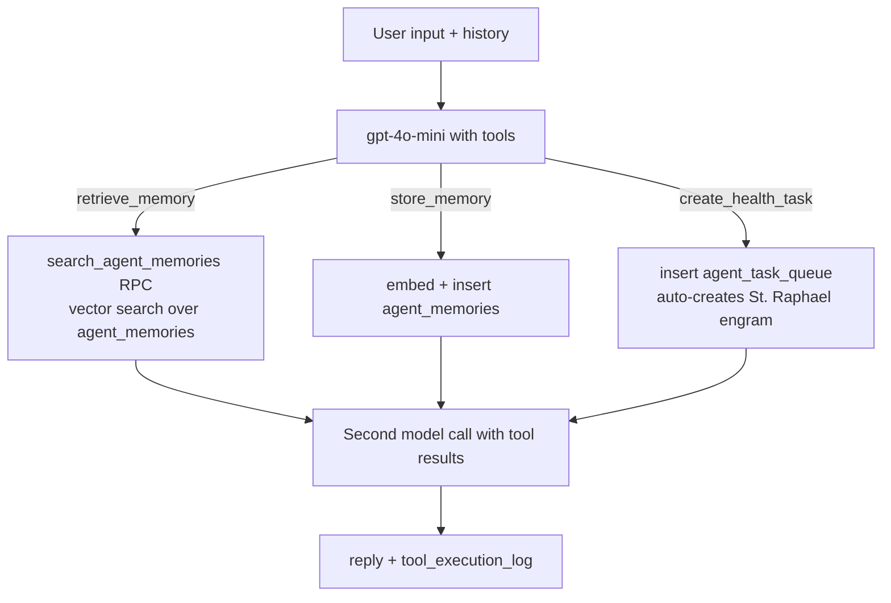

# St Raphael

St. Raphael ("The Healer") is EverAfter's health AI companion persona. It is not one system but at least three overlapping implementations: a simple prompt-only edge function (`raphael-chat`), a tool-calling agent edge function (`agent`), and an autonomous Prisma/Express-side runner (`agents/raphael/`) scheduled every morning at 9 AM.

## Overview

Raphael is one of [[The Saints]] and the flagship health persona. Every implementation shares the same persona contract: warm health companion, never diagnose, never prescribe, escalate emergencies — see [[Safety Guardrails]]. What differs is context depth:

| Implementation | Where | Model | Context |
|---|---|---|---|
| `raphael-chat` (legacy) | `supabase/functions/raphael-chat/index.ts` | gpt-4o-mini | none — system prompt only |
| `agent` (v2) | `supabase/functions/agent/index.ts` | gpt-4o-mini + tools | `agent_memories` vector recall, task creation |
| Saints local backend | external `/api/v1/saints/raphael/chat` | unknown (not in repo) | server-side |
| Autonomous runner | `agents/raphael/runner.ts` via [[BullMQ Scheduler]] | gpt-4 | last N days of Prisma `Metric` rows |

> [!warning] CLAUDE.md says `GROQ_API_KEY` is the secret backing `raphael-chat`. The actual code reads `OPENAI_API_KEY` and calls OpenAI's Chat Completions API (`supabase/functions/raphael-chat/index.ts:91-116`). No Groq usage exists under `supabase/functions/`.

## How It Works

### raphael-chat (edge function)

The reference "clean" chat function (see [[AI Chat Edge Functions]]): validates the `Authorization` header, builds an anon-key Supabase client that forwards the JWT so [[Row Level Security]] applies, calls `auth.getUser()`, optionally verifies `engramId` ownership against the `engrams` table, then sends `{system prompt + user input}` to gpt-4o-mini (temperature 0.7, max 600 tokens). On success it fire-and-forgets the `get_or_create_user_progress` RPC (same one [[365-Day Personality Training]] uses) and returns `{ reply, user_id }`. There is **no retrieval** — no embeddings, no health data in context.

> [!note] Callers may pass a `system` field that *replaces* the built-in safety prompt entirely (`index.ts:97`). The frontend wrapper is `chatWithRaphael()` in `src/lib/edge-functions.ts:131`, labeled "Legacy".

### agent (tool-calling Raphael)

`supabase/functions/agent/index.ts` is Raphael v2, reached via `chatWithAgent()` in `src/lib/edge-functions.ts:113`. It gives gpt-4o-mini three OpenAI tools:

`create_health_task` feeds the [[Autonomous Task System]]: it inserts into `agent_task_queue` and, if the user has no engram named "St. Raphael", creates one on the fly. Memory recall/storage rides on [[Embeddings and Vector Search]].

### Frontend: RaphaelChat and RaphaelHealthInterface

`src/components/RaphaelHealthInterface.tsx` is the tabbed shell (Chat, Overview, Insights, Predictions, Analytics, Medications, Appointments, Goals, Connections, Emergency — see [[Health UI Components]]). It looks up the user's "St. Raphael" engram and passes its id to `src/components/RaphaelChat.tsx`.

`RaphaelChat.tsx` does **not** call the edge functions. Its send path (`handleSend`, line 134) goes through `src/lib/api-client.ts` to a local Express-style backend: `sendChatMessage()` → `POST /api/v1/chat/{engramId}/message`, or `chatWithSaint('raphael', …)` → `POST /api/v1/saints/raphael/chat`, with `bootstrapSaint('raphael')` resolving the engram id. Before sending, it runs regex extraction over the user's message (`src/lib/raphael/healthDataService.ts` — blood pressure, heart rate, glucose, A1C, weight, temperature, sleep, steps) and writes matches to `health_metrics` with source `raphael_chat`.

> [!warning] The `/api/v1/...` saints/chat endpoints are not implemented in this repo. `server/index.ts` mounts routes under `/api` on port 3001 (`/api/me/raphael/summary`, `/api/me/raphael/run`, …), while `src/lib/backend-request.ts` probes `http://localhost:8010`. The chat path in `RaphaelChat.tsx` therefore depends on an external "local backend" process; when it fails, the UI shows an error message rather than falling back to `raphael-chat`.

### Autonomous morning run (agent mode)

`agents/raphael/manifest.json` defines agent `raphael.healer.v1`: model `gpt-4`, cron `0 9 * * *`, tools `metrics.fetchWindow` / `insights.generate` / `vault.writeEngram` / `alerts.notify`, and guardrails (`maxTokens: 1800`, `timeoutMs: 25000`, `allowWeb: false`, `medicalDisclaimer: true`). The [[BullMQ Scheduler]] (`server/workers/scheduler.ts`) enqueues it daily; `runRaphael()` in `agents/raphael/runner.ts` records an `AgentRun` via [[Prisma Schema|Prisma]], analyzes recent metrics, and writes insight engrams. `server/api/raphael.ts` exposes `/me/raphael/summary` and a manual `/me/raphael/run`. This is why the chat greeting says "I run autonomously each morning at 9 AM."

Separately, `src/components/RaphaelAgentMode.tsx` is a UI over `agent_task_queue` (create task, poll status every 5 s) — task *execution* is handled by the [[Autonomous Task System]].

## Key Files

- `supabase/functions/raphael-chat/index.ts` — legacy prompt-only chat, safety prompt at lines 97-106
- `supabase/functions/agent/index.ts` — tool-calling Raphael with memory + task tools
- `src/lib/edge-functions.ts` — `chatWithRaphael()` / `chatWithAgent()` wrappers with JWT forwarding
- `src/components/RaphaelChat.tsx` — chat UI; routes to local backend, extracts health metrics from messages
- `src/components/RaphaelHealthInterface.tsx` — tabbed health hub shell
- `src/components/RaphaelAgentMode.tsx` — agent task queue UI (`agent_task_queue`)
- `src/components/raphael/Today.tsx` — "Today" overview cards (alerts, vitals, trends, reports, tasks)
- `src/lib/raphael/healthDataService.ts` — regex health-data extraction from chat messages
- `agents/raphael/manifest.json` — autonomous agent definition (gpt-4, 9 AM cron, guardrails)
- `agents/raphael/runner.ts` — Prisma-side autonomous run implementation
- `ST_RAPHAEL_CONNECTIVITY_ARCHITECTURE.md` — 1,500-line connectivity doc (health-data centric)

## Gotchas

- Three different models answer as "Raphael" depending on entry point (gpt-4o-mini, gpt-4, or whatever the external backend uses) — tone and capability differ.
- `RaphaelChat.tsx` has a hardcoded "Production AI" button linking to an external bolt.host prototype URL (line 250).
- The engram ownership check in `raphael-chat` queries `engrams`, while `engram-chat` reads personalities from `archetypal_ais` — two parallel engram tables (see [[Custom Engrams]]).

## Related

- [[Safety Guardrails]] — where the no-diagnosis rules live and their limits
- [[AI Chat Edge Functions]] — function-level detail on raphael-chat and siblings
- [[Autonomous Task System]] — executes the tasks Raphael creates
- [[Custom Engrams]] — the engram machinery Raphael piggybacks on
- [[Embeddings and Vector Search]] — agent memory retrieval layer
- [[The Saints]] — Raphael's sibling personas
- [[Saints Dashboard UI]] — where users reach Raphael
- [[Health UI Components]] — the non-chat tabs of the health interface
