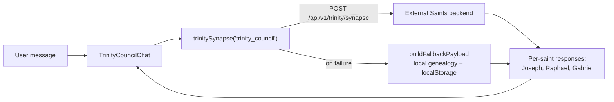

# Trinity and Council

Trinity is the cross-saint layer that fuses Joseph, Raphael, and Gabriel into combined features (family goals, alert chains, chronicles, what-if simulations). Council features let multiple saints "deliberate" on one question and let the user approve or reject actions saints want to take.

## Overview

- **TrinityDashboard** (`src/pages/TrinityDashboard.tsx`, route `/trinity`) — 10 tabs: Overview, Council, Goals, Alerts, Calendar, Chronicle, Elder Care, Nudges, Inheritance, What-If. Header reads "Joseph · Raphael · Gabriel — Unified Intelligence". The Overview tab also embeds the DHT and OCEAN panels (below).
- **CouncilOracle** (`src/components/council/CouncilOracle.tsx`, route `/council`) — "The Council of Saints": all five [[The Saints|saints]] deliberate on a user dilemma via `POST /api/v1/saints/council/deliberate`, returning a transcript, consensus, and action items. The per-saint "thinking" animation is a hardcoded 600ms-per-saint delay, not streaming.
- **CouncilRoom** (`src/components/saints/CouncilRoom.tsx`) — a second deliberation UI with the same five-member roster plus a `MissionBoard` of multi-step missions.
- **CouncilAlerts** (`src/components/CouncilAlerts.tsx`) — the human-in-the-loop gate: it polls `apiClient.getPendingIntercessions()` every 30s and renders "Pending Intercessions" — tool calls a saint wants to execute (calendar, email, health actions) that the user must Approve or Reject (`/api/v1/saints/intercessions/{id}/{approve|deny}`). Mounted inside St. Joseph's dashboard.

## How It Works

All Trinity features go through one helper, `trinitySynapse(action, body)` in `src/components/trinity/trinityApi.ts:1401`, which POSTs `{ action, ...body }` to `/api/v1/trinity/synapse`. When the backend is unreachable it silently builds a **wire-compatible local fallback** from the local genealogy store and localStorage (`everafter_trinity_goals`, `everafter_trinity_whatif_history`), so the dashboard always renders something.

Trinity components (`src/components/trinity/`): `TrinityCouncilChat` (all three saints answer one message), `CrossSaintGoalEngine` (goals with a raphael/gabriel/joseph progress axis each), `FamilyVitalityScore`, `EmergencyAlertChain`, `SeasonalHealthCalendar`, `FamilyChronicle`, `ElderCareCoordination`, `BehavioralNudgeEngine`, `InheritanceDirective`, `CrossSaintWhatIf`.

### Causal Twin (`src/components/causal-twin/`)

A predictive "digital twin" dashboard: `CausalTwinDashboard` fetches `/api/v1/causal-twin/predictions`, `/model-health`, and `/next-measurements`, rendering scenario projections with a `ConfidenceBadge`, a model-status header (stable/learning/degraded/recalibrating), and ranked measurement recommendations. Supporting panels: `WhatIfSimulator`, `ExperimentLab`, `EvidenceLedgerView`, `GovernanceView`, `CausalAncestryPanel`, `ModelHealthPanel`, and a mandatory `SafetyDisclaimer` (predictions are not medical advice — see [[Safety Guardrails]]).

### DHT — Delphi Health Trajectory (`src/components/dht/`)

`DHTPanel` renders per-person health-trajectory windows over three horizons (7-30 days, 3-12 months, 1-5 years) with direction (improving/stable/declining/critical), confidence bars, narratives, and key drivers. Data comes from `src/lib/dhtApi.ts` (`/api/v1/dht/*` plus a WebSocket stream at `/api/v1/dht/stream/{personId}`). Companions: `DelphiView`, `DHTScorePanel`, `OceanBehavioralLayer` (OCEAN personality × behavior fusion), `RiskCards`, `LeadingIndicators`, `NextBestMeasurement`. DHT surfaces in the Trinity overview, Joseph's Delphi tab, Gabriel's `GabrielDHTSummary`, and Michael's `DHTAnomalyAlertChain`.

### Rituals (`src/components/rituals/`)

The most esoteric corner: `RitualAltar` (route `/rituals`) generates ritual "scripts" (steps with actor/action/dialogue) for participants drawn from saints, family members, and the user's [[Archetypal AIs|archetypal AIs]] as "ancestors" (it reads `archetypal_ais` directly). It tracks sacred state (`/api/v1/sacred/state`, candle lit, glow intensity) and a biometric BPM. `AkashicStream` is a memory-search overlay (`/api/v1/saints/memory/search` and `/memory/dump`); `SacredOverlay` listens to a Supabase realtime channel and `/api/v1/sacred/shroud`.

> [!warning] Nearly everything on this page calls `/api/v1/...` endpoints (`trinity/synapse`, `saints/council/deliberate`, `saints/intercessions`, `causal-twin/*`, `dht/*`, `sacred/*`) that have **no implementation in this repo** — the in-repo [[Express Server]] only serves terra/webhook/raphael routes. Trinity has explicit local fallbacks; CouncilOracle and CausalTwinDashboard just log errors and render empty states.

## Key Files

- `src/pages/TrinityDashboard.tsx` — the `/trinity` hub wiring all 10 tabs
- `src/components/trinity/trinityApi.ts` — `trinitySynapse` fetch wrapper + full local fallback data model (1428 lines)
- `src/components/trinity/TrinityCouncilChat.tsx` — three-saint council chat
- `src/components/council/CouncilOracle.tsx` — five-saint deliberation page at `/council`
- `src/components/CouncilAlerts.tsx` — approve/deny pending saint intercessions
- `src/components/saints/CouncilRoom.tsx` — alternate deliberation UI + `MissionBoard`
- `src/components/causal-twin/CausalTwinDashboard.tsx` — predictions / model health / next measurements
- `src/components/dht/DHTPanel.tsx` — trajectory windows; `src/lib/dhtApi.ts` — REST + WebSocket client
- `src/components/rituals/RitualAltar.tsx` — ritual scripts, sacred state, Akashic stream

## Related

- [[The Saints]] — the personas that sit on these councils
- [[St Raphael]] — the health axis of every Trinity goal
- [[Archetypal AIs]] — trained personalities used as ritual "ancestors"
- [[Saints Dashboard UI]] — main navigation into Trinity and saints
- [[Safety Guardrails]] — the disclaimer posture Causal Twin follows
- [[Express Server]] — confirms these APIs are not served in-repo
- [[Autonomous Task System]] — intercessions are the approval side of saint-initiated actions
