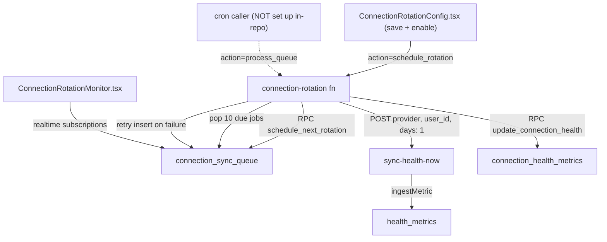

# Connection Rotation

Connection rotation is a priority queue that cycles through a user's connected health providers, re-syncing each on a schedule, scoring connection health 0–100, and retrying failures with backoff. It spans a service-role edge function (`connection-rotation`), four Postgres tables with five SECURITY DEFINER helper functions, and config/monitor panels on the `/health-dashboard` page — but the chain has two broken links: its delegated sync call cannot authenticate, and nothing in the repo schedules the queue processor.

## Overview

Why it exists: webhook-driven providers push data on their own, but pull-based connections ([[Fitbit Integration]], [[Oura Integration]]) go stale unless someone re-syncs them. Rotation is that someone — per-user config (interval, priority order, quiet hours, failover) drives a queue of sync jobs, and every outcome updates a per-provider health score so flaky connections surface early.

`supabase/functions/connection-rotation/index.ts` routes on `?action=`:

- **`process_queue`** — pops up to 10 due `connection_sync_queue` rows (priority, then schedule order), marks each `processing`, executes the sync, records the result, and calls the `update_connection_health` RPC. Failures enqueue a retry when `connection_rotation_config.failover_enabled` allows (`retry_count < max_retry_attempts`, delayed by `retry_delay_minutes`, priority nudged +1 toward 10/lowest).
- **`schedule_rotation`** — RPC `schedule_next_rotation(user_id)`; returns the new schedule id or a "rotation may be disabled" message.
- **`execute_sync`** — RPC `enqueue_sync_with_failover(user_id, provider, 'manual')` for an immediate one-off.
- **`check_health`** — returns `connection_health_metrics` rows for a caller-supplied `user_id`.

## How It Works

> [!warning] The delegated sync cannot authenticate as written
> `syncProvider` POSTs to `sync-health-now` with `Authorization: Bearer ${SUPABASE_SERVICE_ROLE_KEY}` and a `user_id` in the body (`supabase/functions/connection-rotation/index.ts:395`). But `sync-health-now` authenticates with `supabase.auth.getUser()` on the incoming bearer and uses `user.id` **from the JWT**, ignoring the body's `user_id` (`supabase/functions/sync-health-now/index.ts:24`). The service-role key resolves to no user, so every queued sync should come back 401 and be recorded as a failure — rotation can queue, retry, and score, but the sync it delegates never succeeds by this path.

> [!warning] No scheduler triggers process_queue
> The archived design doc (`docs/archive/CONNECTION_ROTATION_SYSTEM.md`) instructs setting up a pg_cron job by hand, with `YOUR_PROJECT` placeholders. The only `cron.schedule` in any migration is the household-oversight daily job (`supabase/migrations/20260815170000_schedule_oversight_daily_cron.sql`) — nothing in-repo schedules `process_queue`. Unless the owner created the job in the dashboard, the queue only drains when something calls the function manually. Live scheduled work otherwise runs as scheduled functions like `glucose-aggregate-cron` (see [[Glucose Monitoring and Alerts]]).

> [!warning] Caller-supplied user_id on a service-role function
> The function performs no caller check of its own and does every read/write with the service-role client, so any request that clears the platform JWT gate can pass **any** `user_id`: schedule rotations for another user, enqueue syncs, and read their `connection_health_metrics` via `check_health` — a cross-user metadata leak that bypasses [[Row Level Security]]. The five helper RPCs are SECURITY DEFINER and granted to `authenticated` (`supabase/migrations/20251027010000_create_connection_rotation_system.sql:502`), the exact grant pattern [[Common Gotchas]] warns about.

### Frontend

Both panels render inside the `/health-dashboard` route (`src/pages/StRaphaelHealthHub.tsx:553`, under the analytics view; also `src/components/StRaphaelHealthHub.tsx:280`) — part of the [[Saints Dashboard UI|St Raphael health hub]]:

- `ConnectionRotationConfig.tsx` — reads/writes `connection_rotation_config` directly through the Supabase client (RLS-scoped), lists active `provider_accounts`, shows health scores, and on save-with-enabled calls `?action=schedule_rotation` with the user's JWT.
- `ConnectionRotationMonitor.tsx` — realtime channels on `connection_sync_queue` and `connection_rotation_schedule`, plus reads of `connection_events`.
- `ConnectionRotationOverview.tsx` — imported only by `src/test/orientation-rotation.test.tsx`; no live surface renders it.

## Data Model

Migration `supabase/migrations/20251027010000_create_connection_rotation_system.sql` creates `connection_rotation_config` (interval, priority order, quiet hours, failover knobs), `connection_rotation_schedule`, `connection_sync_queue` (priority 1–10, `sync_type` scheduled/manual/retry/failover), and `connection_health_metrics` (health score, success/failure counters, consecutive failures) — all with RLS — plus RPCs `calculate_connection_health_score`, `get_next_rotation_provider`, `schedule_next_rotation`, `update_connection_health`, and `enqueue_sync_with_failover`. `connection_events` comes from the sibling migration `20251027000000_create_unified_connections_system.sql`. Successful syncs also stamp `provider_accounts.last_sync_at` ([[Key Tables]]).

## Key Files

- `supabase/functions/connection-rotation/index.ts` — queue processor, scheduler, manual sync, health check
- `supabase/functions/sync-health-now/index.ts` — the per-provider pull sync rotation delegates to
- `supabase/migrations/20251027010000_create_connection_rotation_system.sql` — tables + SECURITY DEFINER RPCs
- `supabase/migrations/20251027000000_create_unified_connections_system.sql` — `connection_events`
- `src/components/ConnectionRotationConfig.tsx` — settings panel, first-rotation trigger
- `src/components/ConnectionRotationMonitor.tsx` — realtime queue/schedule/event dashboard
- `src/components/ConnectionRotationOverview.tsx` — test-only summary widget
- `docs/archive/CONNECTION_ROTATION_SYSTEM.md` — original design doc (archived; do not trust as current)

## Related

- [[Health Integrations MOC]] — hub for all provider notes
- [[Fitbit Integration]] / [[Oura Integration]] — the pull-synced providers rotation is meant to keep fresh
- [[Health OAuth Flow]] — how the `provider_accounts` rows rotation iterates get created
- [[Device Monitoring and Troubleshooting]] — the adjacent device-health view rendered beside these panels
- [[Health Data Normalization]] — what `sync-health-now` does with fetched data
- [[Row Level Security]] — the isolation model the service-role path sidesteps
- [[Common Gotchas]] — the PUBLIC-EXECUTE-on-new-functions hazard these RPCs illustrate
