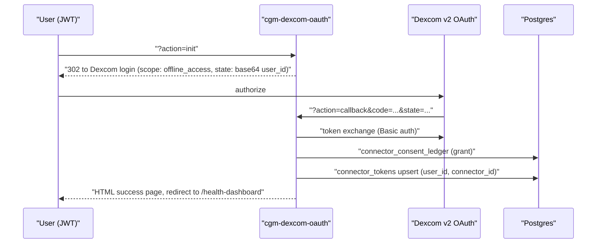

# Dexcom CGM

Direct Dexcom continuous-glucose-monitor integration: a dedicated OAuth flow (`cgm-dexcom-oauth`), a signature-verified webhook that ingests EGV (estimated glucose value) batches (`cgm-dexcom-webhook`), and a manual CSV/JSON upload fallback (`cgm-manual-upload`). Readings land in `glucose_readings` attached to the user's [[St Raphael]] engram, always normalized to mg/dL.

## Overview

Dexcom is the only CGM with a first-party integration; Abbott Libre and other CGMs arrive through [[Terra Integration]]. `CLAUDE.md` and `GLUCOSE_CONNECTORS_COMPLETE.md` describe support for G6/G7 in both sandbox and production — in code the hardware generation is irrelevant, since Dexcom's v2 API abstracts the device; what matters is the `DEXCOM_ENVIRONMENT` secret that switches between `sandbox-api.dexcom.com` and `api.dexcom.com` (production access requires a Dexcom partnership agreement).

## How It Works

### OAuth (`cgm-dexcom-oauth`)

`init` requires a Supabase JWT and encodes `{user_id, connector: 'dexcom', timestamp}` into the `state` parameter. `callback` exchanges the code using HTTP Basic auth (`DEXCOM_CLIENT_ID:DEXCOM_CLIENT_SECRET`) and stores tokens in `connector_tokens` with the environment recorded in `meta`. Every grant is appended to `connector_consent_ledger`.

### Webhook (`cgm-dexcom-webhook`)

1. Verifies `x-dexcom-signature` (HMAC-SHA256 with `DEXCOM_WEBHOOK_SECRET`) via `verifyDexcomSignature` in `supabase/functions/_shared/glucose.ts` — see [[Webhook Signature Verification]].
2. Resolves the target engram with `getOrCreateRaphaelEngram` (creates a "St. Raphael" row in `engrams` on first contact).
3. Iterates `payload.egvs[]`, upserting each reading with `upsertGlucoseReading` — converted to mg/dL (`mmol/L × 18.0182`), conflict key `(user_id, engram_id, ts, src)`, trend and quality preserved, raw payload kept in `raw`.
4. Logs run status to `glucose_job_audit`.

> [!warning] Single-user assumption in the webhook
> `cgm-dexcom-webhook` finds the user with `connector_tokens.select('user_id').eq('connector_id','dexcom').maybeSingle()` — no per-user filter and nothing from the payload identifies the account. With more than one connected Dexcom user, `maybeSingle()` fails and every webhook errors. This works for a single-tenant pilot only.

> [!warning] Two competing Dexcom paths
> - `cgm-dexcom-oauth` stores tokens in `connector_tokens`; this is what `src/components/RaphaelConnectors.tsx` calls (`?action=init`).
> - The generic `connect-start?provider=dexcom` route stores tokens in `provider_accounts` instead, and its `getProviderConfig` hardcodes the **sandbox** URLs regardless of environment (`supabase/functions/_shared/connectors.ts:316`).
> - `supabase/functions/webhook-dexcom/index.ts` is a **stub** that only logs and returns `stub_acknowledged` — the real handler is `cgm-dexcom-webhook`.

### Manual upload (`cgm-manual-upload`)

Authenticated users can POST a Dexcom Clarity CSV or a JSON file (`readings`/`points` array) as multipart form-data or JSON. `parseDexcomCsv` detects the timestamp/glucose/unit columns from headers, skips the sentinel `Low`/`High` rows, converts units, and upserts through the same `upsertGlucoseReading` path with `src: 'manual'`. A `connector_consent_ledger` entry is written per upload.

## Data Model

- `glucose_readings` — one row per EGV (~288/day at 5-minute cadence), unique on `(user_id, engram_id, ts, src)`
- `connector_tokens` / `connector_consent_ledger` — OAuth vault and append-only consent audit
- `glucose_job_audit` — per-run job log (webhook, manual upload, cron)
- `glucose_daily_agg` — daily TIR/GMI statistics computed by `glucose-aggregate-cron`; alerting thresholds live in [[Glucose Monitoring and Alerts]]

All created by `supabase/migrations/20251025120000_create_glucose_metabolic_system.sql` with [[Row Level Security]] on every table.

## Key Files

- `supabase/functions/cgm-dexcom-oauth/index.ts` — init + callback OAuth flow, sandbox/production switch
- `supabase/functions/cgm-dexcom-webhook/index.ts` — signature-verified EGV ingestion
- `supabase/functions/cgm-manual-upload/index.ts` — CSV/JSON upload parser
- `supabase/functions/webhook-dexcom/index.ts` — unimplemented stub handler
- `supabase/functions/_shared/glucose.ts` — `toMgDl`, `upsertGlucoseReading`, `parseDexcomCsv`, `computeTIR`, `verifyDexcomSignature`
- `src/components/RaphaelConnectors.tsx` — routes the Dexcom card to `cgm-dexcom-oauth` and the manual card to `cgm-manual-upload`
- `GLUCOSE_CONNECTORS_COMPLETE.md` — schema, thresholds, and deployment checklist

## Related

- [[Glucose Monitoring and Alerts]] — TIR aggregation and the <55/<70/>180 mg/dL alert thresholds downstream of this data
- [[Health Data Normalization]] — the mg/dL convention and raw-payload preservation
- [[Terra Integration]] — alternative route for Dexcom and the only route for Abbott Libre
- [[St Raphael]] — the health companion engram every reading is attached to
- [[Webhook Signature Verification]] — HMAC pattern shared with Terra and Fitbit
- [[Health OAuth Flow]] — the generic connect flow this specializes
- [[Health Integrations MOC]] — hub for all provider notes
