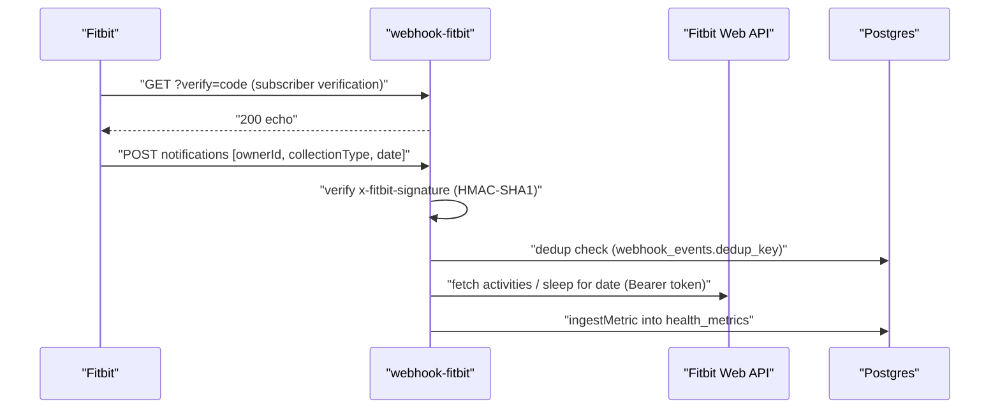

# Fitbit Integration

Fitbit connects through the generic `connect-start`/`connect-callback` OAuth pair and delivers data via `webhook-fitbit`, which is notification-driven: Fitbit tells EverAfter *what changed*, and the function fetches the actual data from the Fitbit API before ingesting it into `health_metrics`. Fitbit is also reachable indirectly through [[Terra Integration]] (it is the hardcoded `resource` in `connect-start`'s Terra branch and first in `terra-widget`'s default provider list).

## How It Works

### OAuth

The [[Health OAuth Flow]] applies unchanged: `connect-start?provider=fitbit` (JWT required) redirects to `https://www.fitbit.com/oauth2/authorize` with scopes `activity heartrate sleep weight` and a base64 `state` carrying `{user_id, provider, timestamp}`. `connect-callback` exchanges the code at `https://api.fitbit.com/oauth2/token` via `exchangeCodeForTokens` and upserts `provider_accounts` on `(user_id, provider)` with `external_user_id` from the token response. `token-refresh` can later renew tokens for any `provider_accounts` row with a `refresh_token`.

> [!warning] Token-exchange details worth checking when debugging
> `exchangeCodeForTokens` (`supabase/functions/_shared/connectors.ts:331`) sends `client_id`/`client_secret` in the form body, while Fitbit's server-app flow officially expects HTTP Basic auth. Also, `connect-callback` always stores `scopes: []`, so the granted scopes are never recorded.

### Webhook (`webhook-fitbit`)

- **Verification GET**: echoes the `verify` query param back with HTTP 200. Fitbit's actual protocol expects 204 when the code matches your subscriber verification code and 404 otherwise — this handler never compares, it just echoes, so strict Fitbit endpoint verification may not pass as written.
- **Signature**: `verifyFitbitSignature` computes base64 HMAC-SHA1 over the body keyed with `FITBIT_SUBSCRIBER_VERIFICATION_CODE` and compares to `x-fitbit-signature` (see [[Webhook Signature Verification]]).
- **Dedup**: SHA-256 `dedup_key` of `fitbit:{ownerId}-{collectionType}-{date}` checked against `webhook_events` before processing ([[Webhook Ingestion Pipeline]]).
- **Fetch-on-notify**: for `collectionType === 'activities'` it pulls `/1/user/{ownerId}/activities/date/{date}.json` and ingests `steps` and `resting_hr`; for `sleep` it pulls `/1.2/user/{ownerId}/sleep/date/{date}.json` and ingests `sleep_efficiency`. All go through `ingestMetric`, which range-validates values (steps 0–100k, resting HR 30–120, etc.), flags anomalies to `data_quality_issues`, and skips near-duplicate points — see [[Health Data Normalization]].

### Pull sync

`sync-health-now` has a `fitbit` branch that iterates each day of the requested window and ingests daily steps + resting HR, updating `provider_accounts.last_sync_at`. This is the path [[Connection Rotation]] intends to reuse for scheduled re-syncs.

## Data Types

Ingested today: `steps` (count), `resting_hr` (bpm), `sleep_efficiency` (%). The provider registry row for Fitbit (`supabase/migrations/20251105010000_create_comprehensive_health_connections_expansion.sql:551`) advertises a broader set — `steps, distance, heart_rate, hrv, sleep_stages, spo2, active_minutes` — which is aspirational relative to the webhook code.

## Key Files

- `supabase/functions/webhook-fitbit/index.ts` — verification GET, HMAC check, fetch-on-notify ingestion
- `supabase/functions/connect-start/index.ts` — builds the Fitbit authorize URL (scopes, state)
- `supabase/functions/connect-callback/index.ts` — token exchange and `provider_accounts` upsert
- `supabase/functions/_shared/connectors.ts` — `getProviderConfig('fitbit')`, `verifyFitbitSignature`, `ingestMetric`
- `supabase/functions/sync-health-now/index.ts` — on-demand pull sync (fitbit branch)
- `supabase/functions/token-refresh/index.ts` — refresh-token rotation for `provider_accounts`

## Related

- [[Health OAuth Flow]] — the connect-start/connect-callback pattern Fitbit uses verbatim
- [[Webhook Ingestion Pipeline]] — dedup and event logging shared with Terra/Dexcom
- [[Health Data Normalization]] — metric names, units, and quality scoring applied at ingest
- [[Terra Integration]] — alternate aggregator route to the same Fitbit data
- [[Oura Integration]] — sibling wearable using the same OAuth plumbing
- [[Connection Rotation]] — scheduled re-sync layer that targets `sync-health-now`
- [[Health Integrations MOC]] — hub for all provider notes
