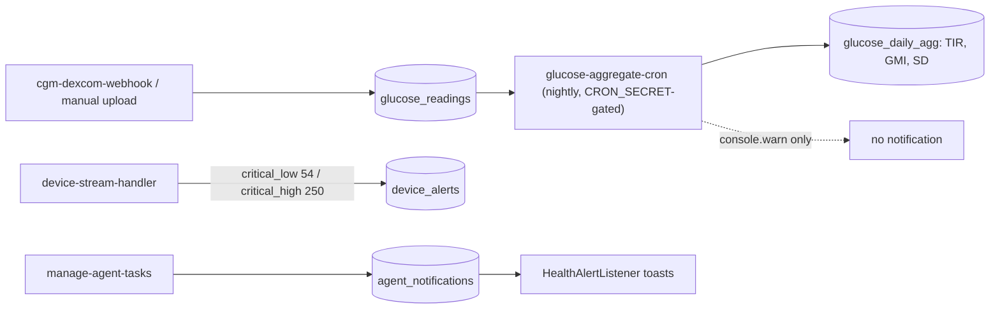

# Glucose Monitoring and Alerts

The glucose subsystem: CGM readings land in `glucose_readings` (always mg/dL, attached to the user's [[St Raphael]] engram), a nightly `glucose-aggregate-cron` computes daily time-in-range and GMI into `glucose_daily_agg`, and `HealthAlertListener` surfaces alert notifications in the UI. The clinically documented alert thresholds are only partially implemented — see the warning below.

## Data Model

All created by `supabase/migrations/20251025120000_create_glucose_metabolic_system.sql` with [[Row Level Security]]:

- `glucose_readings` — one row per EGV (~288/day at 5-min cadence); unique `(user_id, engram_id, ts, src)`; columns `value` (mg/dL), `unit`, `trend`, `quality`, `raw`
- `glucose_daily_agg` — per-day `tir_70_180_pct`, `hypo_events`, `hyper_events`, `mean_glucose`, `gmi`, `sd_glucose`, `readings_count`; upserted on `(day, user_id, engram_id)`
- `glucose_job_audit` — per-run job log written by `logJobAudit`
- `lab_results`, `metabolic_events` — companions for labs and meal/insulin/exercise annotations

Writers: `cgm-dexcom-webhook` (live CGM), `cgm-manual-upload` (`src: 'manual'`) — both via `upsertGlucoseReading`, which converts through `toMgDl` ([[Health Data Normalization]], [[Dexcom CGM]]).

## How It Works

### Nightly aggregation

`glucose-aggregate-cron` is a scheduler-only endpoint: it accepts only the service-role key or `CRON_SECRET` as bearer (anything else gets 401, to prevent recompute storms). Each run takes **yesterday's** readings, excluding `src = 'manual'`, groups by `(user_id, engram_id)`, and computes:

- TIR against 70–180 mg/dL via `computeTIR` (per-reading percentage, not time-weighted)
- mean/median/SD and **GMI = 3.31 + 0.02392 × mean** via `computeGlucoseStats`
- `hypo_events` / `hyper_events` — a 0/1 flag for whether *any* reading was <70 / >180 that day, not an event count

Results upsert into `glucose_daily_agg`; every run logs to `glucose_job_audit`. When TIR < 70 % or below-range > 4 % it emits `console.warn` lines only — no notification row is written.

### Alert surfacing

`src/components/HealthAlertListener.tsx` is a headless component mounted globally in `src/App.tsx`. It fetches unread `agent_notifications`, subscribes to realtime INSERTs for the user, maps priority to toast severity (`urgent`/`critical` → error, `high` → warning), shows them via the notification context, and marks them read server-side. The rows it listens for are written by `manage-agent-tasks` (the [[Autonomous Task System]]) — not by any glucose function.

The one implemented code path from a glucose *value* to an alert row is `device-stream-handler`: seeded `data_transformation_rules` give glucose `{min: 40, max: 400, critical_low: 54, critical_high: 250}`, and a breach inserts a `device_alerts` row (emergency severity for critical breaches; the emergency-contact notification is log-only — see [[Safety Guardrails]]).

> [!warning] The documented thresholds are policy, not code
> `CLAUDE.md` and the archived `docs/archive/GLUCOSE_CONNECTORS_COMPLETE.md` specify: urgent low <55 mg/dL → immediate notification, low <70 sustained 20+ min, high >180 sustained 60+ min, weekly TIR <70 % → insight. Verified 2026-08-16: **no sustained-duration alert engine exists anywhere in the codebase.** What is implemented: the cron's TIR<70 % `console.warn`, and the instantaneous `critical_low: 54` (not 55) / `critical_high: 250` checks in `device-stream-handler`. Nothing pushes a glucose alert to the user or an emergency contact end-to-end. Treat the threshold table as a spec for future work, not a description of behavior.

> [!note] Manual data is deliberately second-class
> The cron's `.neq('src', 'manual')` filter means uploaded Clarity CSVs never contribute to `glucose_daily_agg` — daily TIR/GMI reflect only live connector data.

## Key Files

- `supabase/functions/glucose-aggregate-cron/index.ts` — nightly aggregation, scheduler-gated
- `supabase/functions/_shared/glucose.ts` — `toMgDl`, `upsertGlucoseReading`, `computeTIR`, `computeGlucoseStats`, `logJobAudit`
- `supabase/functions/cgm-dexcom-webhook/index.ts` — live EGV ingestion (signature-verified)
- `supabase/functions/cgm-manual-upload/index.ts` — CSV/JSON fallback, `src: 'manual'`
- `supabase/functions/device-stream-handler/index.ts` — the only value-threshold alert writer (`device_alerts`)
- `supabase/migrations/20251025120000_create_glucose_metabolic_system.sql` — schema and constraints
- `supabase/migrations/20251027032000_seed_transformation_rules.sql` — glucose validation rules (critical_low 54)
- `src/components/HealthAlertListener.tsx` — global toast surfacing of `agent_notifications`

## Related

- [[Dexcom CGM]] — where the readings come from, including the manual upload path
- [[Health Data Normalization]] — the mg/dL convention and conversion helper
- [[Webhook Ingestion Pipeline]] — the wider ingestion picture beside this dedicated path
- [[Health Insights and Analytics]] — downstream analysis over glucose and other metrics
- [[Autonomous Task System]] — writes the `agent_notifications` the listener surfaces
- [[Safety Guardrails]] — the log-only emergency-contact escalation gap
- [[Health Integrations MOC]] — hub for all provider notes
