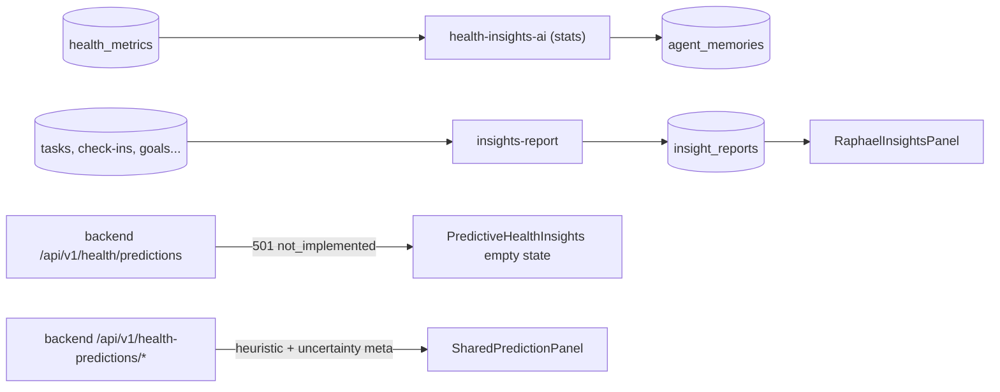

# Health Insights and Analytics

The analysis layer over stored health data: `insights-report` (engram-scoped KPI reports with an optional AI narrative), `health-insights-ai` and `predictive-health-analytics` (statistical Edge Functions over `health_metrics`), and the analytics tabs of the health hub. This area went through a truthfulness cleanup — what remains is deterministic statistics over real data, an honest heuristic predictor, and one endpoint that now refuses instead of inventing.

> [!warning] Invented predictions were removed — verify before re-adding anything here
> PR #126 (2026-08-15, commit `1ed9592`) found that `GET /api/v1/health/predictions` in `backend/app/api/health.py` built its entire response from Python's `random` — diabetes/hypertension risk percentages, 80–95 % confidence figures, correlations, and prescriptive advice — rendered to signed-in users as "Predictive Health Analytics" about their own bodies. The endpoint now raises **501** with an explicit "no prediction model is running" message, and `src/components/PredictiveHealthInsights.tsx` renders that as an explanation with no Retry button (retrying cannot produce a model). Earlier PRs #110–#117 and #120 removed the rest of the fabricated-data layer (see `CURRENT_STATE.md`). Anything that reintroduces generated numbers presented as personal health analysis violates both this history and the [[Safety Guardrails]] non-diagnostic rule.

## How It Works

### insights-report (live, UI-wired)

`supabase/functions/insights-report/index.ts` — POST with JWT, `{engramId, period}` (7d/30d/custom); verifies the caller owns the engram. It computes KPIs by counting real rows: `agent_task_queue` task states, `user_daily_progress` check-in days, `appointments`, active `prescriptions`, `health_goals` achieved, and `agent_memories` interaction volume, deriving rule-based findings ("Strong check-in consistency", "Several pending tasks need attention"). If an OpenAI key resolves (platform secret or the user's own via `resolveApiKey` — the BYOAPI path), it asks `gpt-4o-mini` for a <150-word St. Raphael narrative constrained to "no medical diagnosis". The report is inserted into `insight_reports` and returned using the `{code, message}` error convention. UI: `src/components/RaphaelInsightsPanel.tsx` on the hub's **Insights** tab lists past reports and generates new ones.

### health-insights-ai (statistical, no UI caller)

`supabase/functions/health-insights-ai/index.ts` — despite the name, no LLM is involved. It reads up to N days of `health_metrics` (filtered to `quality_score >= 0.5`, see [[Health Data Normalization]]), then computes: linear-regression trend slopes per metric, anomaly clusters from the `is_anomaly` flags set at ingestion, Pearson correlations for glucose↔steps and sleep↔resting-HR pairs, and threshold-rule recommendations (<5,000 avg steps, <7 h avg sleep). Each insight is stored in `agent_memories` as `memory_type: 'health_insight'` so [[St Raphael]] chat can retrieve it. Verified 2026-08-16: nothing in `src/` invokes it.

### predictive-health-analytics (statistical, orphaned)

`supabase/functions/predictive-health-analytics/index.ts` — real data, honest math: 7-day vs prior-7-day averages for trend, an "expected range" that is just `mean ± 1.5 × SD`, risk level from coefficient of variation, and Pearson correlations. Its "confidence" is a deterministic function of sample count (`min(95, 60 + n/10 × 10)`), not a model output. Only `scripts/verify-device-integration.sh` references it; no frontend calls it.

### The frontend surfaces

All tabs of `src/components/StRaphaelHealthHub.tsx` at `/health-dashboard`:

- **Analytics** — `src/components/HealthAnalytics.tsx` reads `health_metrics` directly and renders week-over-week aggregates. Pure retrieval and arithmetic.
- **Insights** — `RaphaelInsightsPanel` (above).
- **Predictions** — two components: `PredictiveHealthInsights` (hits the 501 endpoint, shows the honest empty state) and `src/components/shared/SharedPredictionPanel.tsx`, which calls the *other* backend router `/api/v1/health-predictions/*` (`backend/app/api/health_predictions.py`). That one is real: `backend/app/services/shared_health_predictor.py` is a heuristic over stored observations with no `random` calls, and every response carries an `UncertaintyMeta` block (confidence level, evidence type, data-days, completeness, plain-language explanation) so the UI can label how weak the evidence is. The causal-twin sub-services (background simulator, behavioral forecaster, contagion, epigenetic, environmental) hang off the same router.

> [!note] Naming trap: two prediction routers
> `/api/v1/health/predictions` (singular resource under `health`) is the retired fabricator, now 501. `/api/v1/health-predictions/...` (hyphenated prefix) is the live heuristic predictor. They differ by three characters and opposite honesty histories.

## Key Files

- `supabase/functions/insights-report/index.ts` — KPI report generator with optional AI narrative
- `supabase/functions/health-insights-ai/index.ts` — statistical trend/anomaly/correlation engine (uncalled)
- `supabase/functions/predictive-health-analytics/index.ts` — statistical pattern function (orphaned)
- `backend/app/api/health.py` — the 501 `predictions` endpoint with its removal rationale in the docstring
- `backend/app/api/health_predictions.py` + `backend/app/services/shared_health_predictor.py` — the honest predictor
- `src/components/RaphaelInsightsPanel.tsx` — Insights tab UI over `insight_reports`
- `src/components/PredictiveHealthInsights.tsx` — renders data or the not-implemented state, never a fabrication
- `src/components/shared/SharedPredictionPanel.tsx` — uncertainty-labeled predictions for Raphael/Joseph
- `src/components/HealthAnalytics.tsx` — direct `health_metrics` aggregates

## Related

- [[Health Data Normalization]] — the quality filters and metric names analysis depends on
- [[Glucose Monitoring and Alerts]] — the TIR/GMI aggregates computed separately by cron
- [[St Raphael]] — consumer of `agent_memories` health insights and voice of the narratives
- [[Safety Guardrails]] — the non-diagnostic constraints these functions must respect
- [[Dual Backend System]] — why insight endpoints span Edge Functions and the FastAPI backend
- [[Payments and Subscriptions]] — BYOAPI key resolution used by the narrative step
- [[Health Integrations MOC]] — hub for all provider notes
