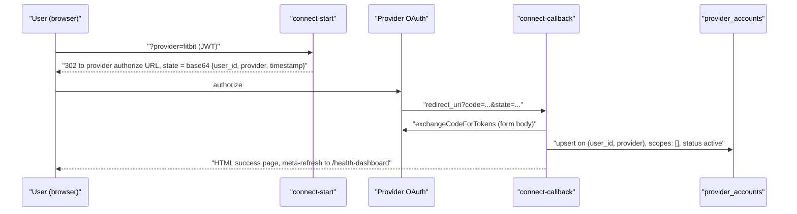

# Health OAuth Flow

How EverAfter connects a user's account to a health provider: two parallel OAuth systems in Supabase Edge Functions — the hardcoded `connect-start`/`connect-callback` pair and the registry-driven `health-oauth-initiate`/`health-oauth-callback` pair — plus `token-refresh` for renewal. Dexcom additionally has its own dedicated flow (see [[Dexcom CGM]]).

## Overview

Both systems follow the same shape: authenticated init builds an authorization URL with a base64 `state` carrying the user id, the provider redirects back with a code, a callback exchanges it and stores tokens. They differ in where provider config lives and where tokens land:

| | Generic pair | Registry pair |
| --- | --- | --- |
| Provider config | Hardcoded in `getProviderConfig` (`supabase/functions/_shared/connectors.ts:281`) | `health_providers_registry` table rows |
| Providers | terra, fitbit, oura, dexcom | Whatever is seeded + `is_enabled` |
| Token store | `provider_accounts` (unique `user_id, provider`) | `health_connections` |
| Gating | JWT only | JWT + `user_has_provider_access` feature-flag RPC |
| UI caller | `src/components/RaphaelConnectors.tsx:328` (Quick Connect tab), `src/components/ConnectionSetupWizard.tsx:91` | `src/components/ExpandedHealthConnections.tsx:107` |

## How It Works

`connect-start` requires a Supabase JWT, validates the provider, and 302s to the provider with `state = btoa(JSON.stringify({user_id, provider, timestamp}))`. Terra is special-cased: it hits Terra's `authenticateUser` widget URL with `resource: 'FITBIT'` hardcoded and `reference_id = user.id` (the live Terra path actually runs through `terra-widget`, see [[Terra Integration]]). `connect-callback` takes no auth of its own — it decodes the state, exchanges the code via `exchangeCodeForTokens`, and upserts `provider_accounts` with the service role.

The registry pair is stricter: `health-oauth-initiate` (POST, JSON) checks the feature-flag RPC, adds a `nonce` to the state, writes a `health_connection_audit` row, and returns the `authorization_url` as JSON for the client to navigate. `health-oauth-callback` enforces a 15-minute state expiry, stores tokens with `token_expires_at` in `health_connections`, audits the connect, and seeds a `health_sync_jobs` row (`sync_type: 'initial'`) that `health-sync-processor` is meant to drain.

### Token refresh

`token-refresh` (POST, JWT) renews `provider_accounts` rows — one account by id, all accounts of a provider, or every account whose `expires_at` is within 10 minutes. Each attempt is logged to `token_refresh_log`; failures set `status: 'token_expired'`. It only knows the four `getProviderConfig` providers and only touches `provider_accounts` — `health_connections` tokens have no refresher; `health-sync-processor` just throws "Token expired - refresh needed". No UI or scheduler calls `token-refresh` today (verified 2026-08-16: zero references in `src/`).

> [!warning] The generic callback is not reachable as wired
> `getProviderConfig` sets every redirect URI to `${APP_BASE_URL}/api/connect-callback` (`supabase/functions/_shared/connectors.ts:283`), i.e. a path on the Netlify site — but `netlify.toml` only proxies `/api/v1/*`, and no SPA route matches `/api/connect-callback`, so the provider's redirect falls through to `index.html` and the code is never exchanged. Separately, the UI reaches `connect-start` by plain `window.location.href` navigation, which sends no `Authorization` header, while the function 401s without one. The Fitbit/Oura "Quick Connect" cards therefore cannot complete a real OAuth round-trip as currently wired. See also [[Common Gotchas]].

> [!warning] Unauthenticated, unsigned state
> Both callbacks trust the `user_id` inside base64 state; the generic pair adds no nonce and never checks the timestamp. `health-oauth-callback` at least expires state after 15 minutes. Neither signs it.

> [!note] Three token stores
> `provider_accounts` (generic pair), `health_connections` (registry pair), and `connector_tokens` ([[Dexcom CGM]]'s dedicated flow). Code reading "the user's tokens" must know which flow wrote them.

## Key Files

- `supabase/functions/connect-start/index.ts` — JWT-gated authorize-URL builder for terra/fitbit/oura/dexcom
- `supabase/functions/connect-callback/index.ts` — code exchange + `provider_accounts` upsert, HTML success page
- `supabase/functions/_shared/connectors.ts` — `getProviderConfig`, `exchangeCodeForTokens`, shared helpers
- `supabase/functions/health-oauth-initiate/index.ts` — registry-driven init with feature flags and audit
- `supabase/functions/health-oauth-callback/index.ts` — state expiry, `health_connections` storage, initial sync job
- `supabase/functions/token-refresh/index.ts` — refresh for `provider_accounts`, logged to `token_refresh_log`
- `supabase/functions/health-sync-processor/index.ts` — drains `health_sync_jobs` (currently broken, see [[Webhook Ingestion Pipeline]])
- `supabase/migrations/20251105010000_create_comprehensive_health_connections_expansion.sql` — `health_providers_registry`, `health_sync_jobs`, audit tables
- `src/components/RaphaelConnectors.tsx` — the routed connectors UI (Quick Connect tab of the health hub)

> [!note] `src/components/ExpandedHealthConnections.tsx` (the only `health-oauth-initiate` caller) and `src/components/ConnectionSetupWizard.tsx` are imported by nothing (verified 2026-08-16), so the registry pair currently has no live UI entry point.

## Related

- [[Webhook Ingestion Pipeline]] — how data flows in once a provider is connected
- [[Terra Integration]] — the aggregator path that actually runs in production
- [[Dexcom CGM]] — the third, dedicated OAuth flow with its own token table
- [[Fitbit Integration]] — uses this generic pair verbatim
- [[OAuth Edge Functions]] — sibling overview of all OAuth-related functions
- [[Secrets Management]] — where `*_CLIENT_ID`/`*_CLIENT_SECRET` live
- [[Health Integrations MOC]] — hub for all provider notes
