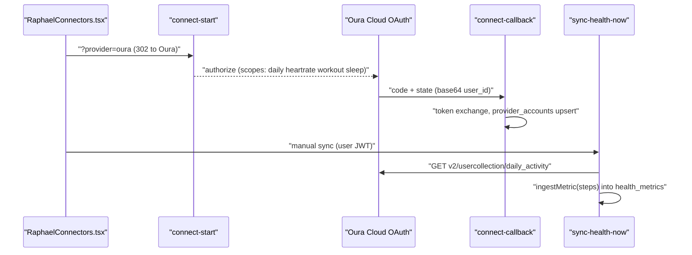

# Oura Integration

Oura Ring support is three-quarters plumbing and one honest stub: a direct OAuth path through the generic `connect-start`/`connect-callback` pair, a pull sync in `sync-health-now` that today ingests only steps, and a `webhook-oura` function that deliberately returns 501. The comment inside the stub states the intended live route for Oura data: the [[Terra Integration|Terra aggregator]].

## Overview

There are three ways Oura data could reach EverAfter, in descending order of reality:

1. **Terra aggregator** — Oura is in `terra-widget`'s default provider list and `src/pages/TerraCallback.tsx` renders an "Oura Ring" success screen. Terra events land through the Terra webhook pipeline, not anything Oura-specific.
2. **Direct pull** — the [[Health OAuth Flow]] (`connect-start?provider=oura` → Oura consent → `connect-callback` → `provider_accounts`), then `sync-health-now`'s `oura` branch pulls the Oura v2 API.
3. **Direct webhook** — `webhook-oura` exists but is a 501 stub by design.

> [!note] The stub is deliberate, and it is careful about PHI
> `supabase/functions/webhook-oura/index.ts` reads and discards the body without logging it (an unauthenticated endpoint must not log potential PHI), then returns `{status: 'not_implemented'}` with HTTP 501. `CURRENT_STATE.md` (2026-07-12 security sweep) confirms `webhook-oura` and `webhook-dexcom` are "honest 501 stubs that no longer log payloads."

## How It Works

### Direct OAuth path

`connect-start?provider=oura` (JWT required) builds the authorize URL from `getProviderConfig('oura')` in [[Shared Edge Function Utilities|_shared/connectors.ts]] (`supabase/functions/_shared/connectors.ts:306`): `https://cloud.ouraring.com/oauth/authorize`, scopes `daily heartrate workout sleep`, credentials from the `OURA_CLIENT_ID`/`OURA_CLIENT_SECRET` secrets, and a base64 `state` carrying `{user_id, provider, timestamp}`. `connect-callback` exchanges the code at `https://api.ouraring.com/oauth/token` via `exchangeCodeForTokens` and upserts `provider_accounts` on `(user_id, provider)`. `token-refresh` covers Oura through the same provider config.

> [!warning] Two breaks in the direct loop as deployed
> - The redirect URI is `${APP_BASE_URL}/api/connect-callback` (`_shared/connectors.ts:283`), but `netlify.toml` only proxies `/api/v1/*`, `/health`, and `/governance/*` — `/api/connect-callback` falls through to the SPA catch-all and returns `index.html`, so the code/state never reach the `connect-callback` function unless the Oura app registration points at the Supabase function URL directly.
> - `src/components/RaphaelConnectors.tsx:328` starts the flow with `window.location.href = .../connect-start?provider=oura` — a top-level navigation carries no `Authorization` header, and `connect-start` requires `auth.getUser()` to succeed, so the browser gets a 401 before ever seeing Oura.

### Pull sync (`sync-health-now`, `oura` branch)

With an active `provider_accounts` row, `supabase/functions/sync-health-now/index.ts:113` fetches `https://api.ouraring.com/v2/usercollection/daily_activity` for the requested window (default 7 days; [[Connection Rotation]] requests 1) with the stored bearer token, then ingests **only `steps`** per day through `ingestMetric` (unit `count`, timestamp `{day}T23:59:59Z`, raw day payload preserved) into `health_metrics` per [[Health Data Normalization]], and stamps `provider_accounts.last_sync_at`.

> [!warning] Advertised vs ingested data types
> The provider registry row (`supabase/migrations/20251105010000_create_comprehensive_health_connections_expansion.sql:552`) advertises `heart_rate, hrv, sleep_stages, temperature, spo2, recovery_score` for Oura, and the OAuth scopes request sleep and heart rate — but the only metric any code actually ingests from the Oura API is daily steps. Client-side mapping tables that know Oura's richer fields (`src/lib/health-data-transformer.ts:143` — `total_sleep_duration→sleep_hours`, `rmssd→hrv`; `OuraMapper` in `src/lib/health-mappers.ts`) are imported by tests only.

### UI surfaces

`RaphaelConnectors.tsx` lists Oura as `available` and is mounted via `RaphaelHealthInterface.tsx` and `ConnectionsPanel.tsx` ([[Health UI Components]]). Oura cards also appear in `ComprehensiveHealthConnectors.tsx` (which connects through the **undeployed** legacy `health-api/` service — see [[Common Gotchas]]), the onboarding `HealthConnectionStep.tsx`, and `ConnectionSetupWizard.tsx`. [[Device Monitoring and Troubleshooting|Device monitoring]] demo data ships a degraded Oura ring fixture (`src/lib/demo/demo-data-provider.ts:692`).

## Key Files

- `supabase/functions/webhook-oura/index.ts` — deliberate 501 stub; discards body without logging
- `supabase/functions/connect-start/index.ts` — `oura` branch builds the Oura authorize URL
- `supabase/functions/connect-callback/index.ts` — token exchange, `provider_accounts` upsert
- `supabase/functions/_shared/connectors.ts` — `getProviderConfig('oura')`, `exchangeCodeForTokens`, `ingestMetric`
- `supabase/functions/sync-health-now/index.ts` — `oura` branch: daily-activity pull, steps-only ingest
- `supabase/functions/token-refresh/index.ts` — refresh-token rotation via the same provider config
- `src/components/RaphaelConnectors.tsx` — the connect card wired to `connect-start`
- `src/lib/health-data-transformer.ts` — Oura metric-name mapping (test-only consumer)

## Related

- [[Terra Integration]] — the intended live route for Oura data, per the stub's own comment
- [[Health OAuth Flow]] — the connect-start/connect-callback pattern Oura shares with Fitbit and Dexcom
- [[Fitbit Integration]] — sibling wearable on the same OAuth plumbing, with a real webhook
- [[Connection Rotation]] — the scheduler that targets `sync-health-now`'s oura branch
- [[Health Data Normalization]] — `ingestMetric` validation and the standard metric names
- [[Webhook Ingestion Pipeline]] — where a real Oura webhook would slot in
- [[Health Integrations MOC]] — hub for all provider notes
