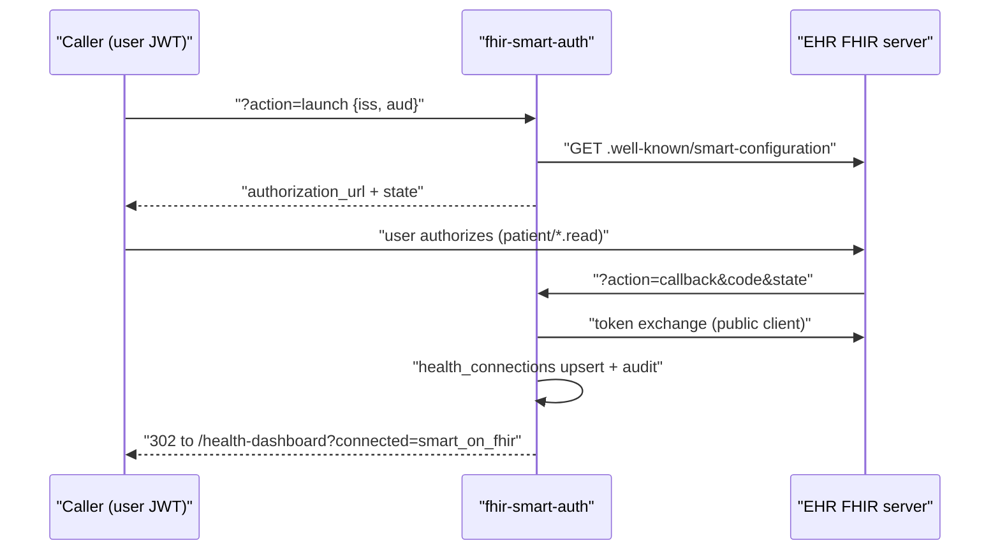

# SMART on FHIR

`fhir-smart-auth` implements the SMART App Launch OAuth handshake against any FHIR R4 server (the EHR-universal protocol Epic and Oracle Health/Cerner speak). That is the whole story: it negotiates and stores tokens, and **no code anywhere fetches actual clinical data** — there is no Patient/Observation/lab retrieval in any edge function, and the function itself is called by nothing in the frontend.

## Overview

The function (`supabase/functions/fhir-smart-auth/index.ts`) routes on `?action=`:

- **`launch`** — JWT-required POST with `{iss, launch?, aud, scope?}`. Discovers `${iss}/.well-known/smart-configuration`, builds the authorization URL (client id from the `SMART_CLIENT_ID` secret, default scopes `openid fhirUser launch/patient patient/*.read offline_access`, base64 `state` with `user_id`/`iss`/`aud`/timestamp/nonce), writes an audit row, and returns `{authorization_url, state, metadata}` as JSON for the caller to redirect.
- **`callback`** — exchanges the code at the server's `token_endpoint` (public client: `client_id` only, no secret, no PKCE), enforces a 15-minute state expiry, upserts a row into `health_connections`, audits, and redirects to `${APP_URL}/health-dashboard?connected=smart_on_fhir`.
- **`metadata`** — proxies a FHIR server's `.well-known/smart-configuration` back to the caller.

Both EHR launch (with a `launch` context token) and standalone launch are handled; supporting Epic vs Cerner is just a matter of which `iss` the caller supplies.

## How It Works

## Gotchas

> [!warning] The callback leg is unreachable as written
> `auth.getUser()` runs at the top of the function, before action routing. The `callback` hit is a browser redirect from the EHR and carries no `Authorization` header, so it 401s before `handleCallback` executes (the platform JWT gate in front of edge functions blocks it too). The redirect URI it registers is the raw function URL `${SUPABASE_URL}/functions/v1/fhir-smart-auth?action=callback`, so unlike the [[Health OAuth Flow|generic connect flow]] the Netlify proxy is not the problem — the auth check is.

> [!warning] The stored connection targets columns that do not exist
> The callback writes `provider_user_id` and `scopes` to `health_connections`, but no migration defines either column on that table (`20251025065152` creates it; `20260104100000` re-baselines it with `external_user_id`, not `provider_user_id`). The insert/update error is never checked, and the user is redirected to `?connected=smart_on_fhir` regardless — a silent-success path. Two smaller bugs: the metadata fallback fetches `${iss}/metadata` but still parses the *failed* `.well-known` response (lines 117–125), and the launch audit uses action `oauth_initiated`, which violates `health_connection_audit`'s `valid_action` CHECK constraint (`supabase/migrations/20251105010000_create_comprehensive_health_connections_expansion.sql:431`), so that audit row silently fails too.

> [!warning] Nothing calls it, and nothing reads FHIR data
> No file under `src/` invokes `fhir-smart-auth`. The "SMART on FHIR (Generic) — Epic, Cerner, Allscripts" card in `src/components/ComprehensiveHealthConnectors.tsx:156` connects through the legacy `health-api/` Node service (`buildHealthApiUrl('/api/connections/me/connect/...')`), which `CURRENT_STATE.md` marks broken and undeployed; a second `smart_fhir` card at line 345 is honestly labeled `coming_soon`. Downstream is equally empty: `health_clinical_records` (created FHIR-shaped by migration `20251105020000`) is written by no function, and the client-side `FHIRObservationMapper` in `src/lib/clinical-mappers.ts` is imported by nothing. Treat SMART on FHIR as scaffolding for a future clinical feature, not a live integration.

## Data Model

- `health_connections` — token store the callback targets (columns per `supabase/migrations/20260104100000_comprehensive_schema_fix.sql:116`; see the column mismatch above)
- `health_connection_audit` — append-only audit log with a CHECK-constrained `action` list
- `health_clinical_records` — FHIR R4-compatible clinical store from `supabase/migrations/20251105020000_add_clinical_fhir_ble_support_ADDITIVE_ONLY.sql`, currently written by nothing; only `safety-monitor` watches its row counts
- Provider registry row `smart_on_fhir` (same migration) advertises `clinical_records, lab_results, medications, allergies, immunizations, conditions, procedures`

All tables carry [[Row Level Security]].

## Key Files

- `supabase/functions/fhir-smart-auth/index.ts` — launch/callback/metadata SMART App Launch handler
- `supabase/migrations/20251105020000_add_clinical_fhir_ble_support_ADDITIVE_ONLY.sql` — clinical/FHIR/BLE schema and the `smart_on_fhir` registry row
- `supabase/migrations/20251105010000_create_comprehensive_health_connections_expansion.sql` — `health_connection_audit` and the provider registry
- `src/lib/clinical-mappers.ts` — FHIR Observation/clinical-record mappers, currently unimported
- `src/components/ComprehensiveHealthConnectors.tsx` — the EHR cards (wired to the dead legacy `health-api/`)

## Related

- [[Health OAuth Flow]] — the generic wearable connect flow this clinical variant parallels
- [[Health Integrations MOC]] — hub for all provider notes
- [[OAuth Edge Functions]] — catalog of the connect/auth function family
- [[Dexcom CGM]] — a working example of the token-store-plus-ingest pattern FHIR lacks
- [[Health Data Normalization]] — where clinical observations would map to unified metrics
- [[Secrets Management]] — home of `SMART_CLIENT_ID` and the other provider credentials
- [[Common Gotchas]] — the undeployed `health-api/` service the EHR UI cards still point at
