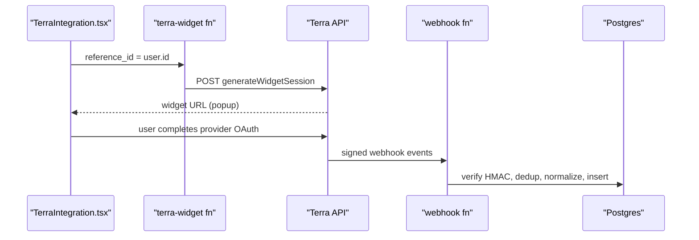

# Terra Integration

Terra (api.tryterra.co) is EverAfter's primary health-data aggregator: one OAuth widget connects dozens of wearables and CGMs, and Terra pushes normalized events back via webhook. The integration spans all three layers of the [[Dual Backend System]] — a Deno edge-function suite, Express routes, and a frontend client — and, confusingly, includes *two* parallel webhook pipelines writing to different tables.

## Overview

- **Connect**: `terra-widget` generates a Terra widget session URL; the user picks a provider (Fitbit, Oura, Garmin, Dexcom, FreeStyle Libre, Withings, Polar by default) and completes OAuth on Terra's side.
- **Ingest**: Terra POSTs signed events (`activity`, `sleep`, `body`, `daily`, glucose inside `body`) to a webhook function.
- **Backfill**: `terra-backfill` pulls historical data on demand (default 7 days).
- **Test**: `terra-test` injects five kinds of mock payloads into the pipeline without real devices.

The device count varies by document: the UI claims "300+", `CLAUDE.md` says "50+", and `src/lib/terra-config.ts` enumerates 25 `TERRA_PROVIDERS`.

## How It Works

### The two webhook pipelines

> [!warning] `webhook-terra` and `terra-webhook` are different functions with different behavior
> - `supabase/functions/webhook-terra/index.ts` — uses [[Shared Edge Function Utilities|_shared/connectors.ts]]. **Rejects** requests when the `terra-signature` HMAC-SHA256 check fails or `TERRA_WEBHOOK_SECRET` is unset. Dedups via `webhook_events.dedup_key`, resolves the user through `provider_accounts.external_user_id`, and writes standard metrics (`steps`, `resting_hr` from `avg_hr_bpm`, `hrv` from `rmssd`, `sleep_efficiency`) into `health_metrics`.
> - `supabase/functions/terra-webhook/index.ts` — self-contained. **Skips verification entirely** ("Webhook signature verification skipped") when the secret or header is missing. Logs every event to `terra_webhook_events`, stores the raw payload in `terra_metrics_raw`, resolves the user through `terra_users`, and upserts into `terra_metrics_normalized` on `(user_id, provider, metric_type, metric_name, timestamp)`.
>
> `TERRA_INTEGRATION_COMPLETE.md` documents only `terra-webhook`; whichever URL is registered as the Destination in the Terra dashboard decides which pipeline actually runs. See [[Webhook Ingestion Pipeline]] and [[Webhook Signature Verification]].

### Widget and backfill

`terra-widget` calls `POST https://api.tryterra.co/v2/auth/generateWidgetSession` with `TERRA_API_KEY` + `TERRA_DEV_ID` headers and passes `reference_id` (the EverAfter user id) so the callback maps back to a user. `terra-backfill` fetches `activity`, `sleep`, `body`, and `daily` for an N-day window, records a `terra_sync_jobs` row, and stamps `terra_connections.last_sync_at`.

> [!warning] Backfilled data never reaches `terra_metrics_normalized`. `terra-backfill` inserts raw payloads into `terra_metrics_raw` with `processing_status: "processed"` but performs no normalization step, so backfills are invisible to the dashboard queries that read normalized metrics.

### Express and frontend layers

- `server/api/connections/terra.ts` — `POST /connect/terra` (widget session via the [[Terra Client Library]]) and `GET /oauth/terra/callback` (token exchange, `Source` upsert through the [[Prisma Schema]]).
- `server/api/connections/webhooks.ts` — `POST /webhooks/terra` verifies the HMAC with `crypto.timingSafeEqual` and enqueues jobs on the `ingest-terra` [[BullMQ Scheduler|BullMQ]] queue (skipped when `REDIS_URL` is unset).
- `src/lib/terra-client.ts` — frontend `TerraClient` (widget session, backfill trigger, daily summaries, CSV/JSON export and hard delete with `terra_audit_log` entries). Mock mode requires all of `VITE_DEV_MODE`/`DEV`, `VITE_MOCK_TERRA_DATA`, and `VITE_ALLOW_DEV_MOCKS`.
- `src/components/TerraIntegration.tsx` — the [[Health UI Components|UI]]: connect popup, per-provider sync, privacy export/delete.

> [!warning] `src/lib/terra-config.ts` validates `import.meta.env.TERRA_API_KEY`, `TERRA_DEV_ID`, and `TERRA_WEBHOOK_SECRET`. Vite only exposes `VITE_`-prefixed variables to the browser, so this validation always fails in a real build — `TerraIntegration.tsx` will show the "Terra Setup Required" wizard unless mock mode is on. (Exposing those secrets to the frontend would be its own problem; see [[Secrets Management]].)

## Data Model

Migration `supabase/migrations/20251029120000_create_terra_integration_system.sql` creates seven tables: `terra_users`, `terra_connections`, `terra_metrics_raw`, `terra_metrics_normalized`, `terra_sync_jobs`, `terra_webhook_events`, `terra_audit_log`. The older `webhook-terra` path instead uses `provider_accounts`, `webhook_events`, and `health_metrics` — see [[Key Tables]].

## Key Files

- `supabase/functions/terra-widget/index.ts` — widget session generator (Terra API key + dev-id)
- `supabase/functions/terra-webhook/index.ts` — webhook pipeline writing `terra_*` tables
- `supabase/functions/webhook-terra/index.ts` — webhook pipeline writing `health_metrics`
- `supabase/functions/terra-backfill/index.ts` — N-day historical pull into `terra_metrics_raw`
- `supabase/functions/terra-test/index.ts` — mock activity/sleep/heart-rate/glucose/daily payload injector
- `server/api/connections/terra.ts` — Express connect + OAuth callback routes
- `server/api/connections/webhooks.ts` — Express webhook receiver feeding BullMQ
- `src/lib/terra-client.ts` — frontend client SDK (mock-mode aware)
- `src/lib/terra-config.ts` — provider/event-type constants and (broken) config validation
- `src/components/TerraIntegration.tsx` — main Terra UI; `src/components/TerraSetupWizard.tsx` and `src/components/TerraMetricsVisualization.tsx` support it
- `TERRA_INTEGRATION_COMPLETE.md` — setup guide (Destinations, secrets, deploy)

## Related

- [[Health Integrations MOC]] — hub for all provider notes
- [[Terra Client Library]] — the Node-side axios wrapper used by Express
- [[Webhook Ingestion Pipeline]] — the generic push-ingestion architecture both pipelines implement
- [[Health Data Normalization]] — how raw payloads become standard metrics
- [[Health OAuth Flow]] — the connect/callback pattern Terra's widget replaces
- [[Fitbit Integration]] / [[Dexcom CGM]] — providers reachable both directly and via Terra
- [[Connection Rotation]] — scheduled re-syncs across connected providers
