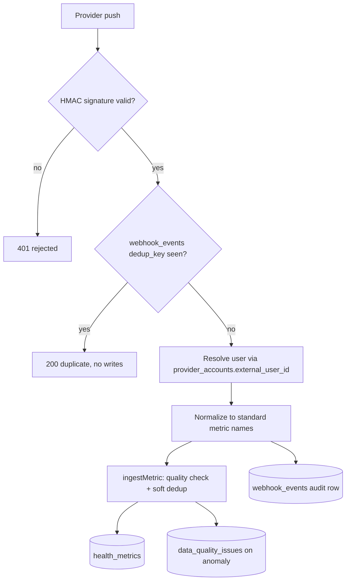

# Webhook Ingestion Pipeline

How provider data reaches the database: signature-verified provider webhooks (`webhook-terra`, `webhook-fitbit`, `cgm-dexcom-webhook`) normalize payloads and write `health_metrics` through the shared `ingestMetric` helper, while two generic device endpoints (`device-webhook-handler`, `device-stream-handler`) run a parallel path into `metrics_norm` and `health_metrics` respectively.

## How It Works

Per-provider specifics ([[Webhook Signature Verification]] has the HMAC details):

- **`webhook-terra`** — verifies `terra-signature` (HMAC-SHA256 hex over the raw body with `TERRA_WEBHOOK_SECRET`), resolves the user from `payload.user.user_id` / `reference_id`, and for `daily` payloads ingests `steps`, `resting_hr`, `hrv`, and `sleep_efficiency`. Every event is recorded in `webhook_events` with the payload and signature.
- **`webhook-fitbit`** — verifies `x-fitbit-signature` (HMAC-SHA1 base64 with `FITBIT_SUBSCRIBER_VERIFICATION_CODE`). Notification-driven: Fitbit says what changed and the function fetches the data before ingesting (see [[Fitbit Integration]]). Its dedup key is deterministic (`owner-collection-date`), so retries genuinely dedupe.
- **`cgm-dexcom-webhook`** — HMAC-SHA256, writes `glucose_readings` via `upsertGlucoseReading` instead of `health_metrics` (see [[Dexcom CGM]] and [[Glucose Monitoring and Alerts]]).
- `webhook-dexcom` and `webhook-oura` are honest 501 stubs.

### The shared ingest helper

`ingestMetric` (`supabase/functions/_shared/connectors.ts:128`) is the single write path into `health_metrics`. It performs a **soft** duplicate check (same user/source/metric within a 5-minute window, timestamps within 1 minute and values within 0.1 are treated as duplicates), validates the value against per-metric clinical ranges (glucose 40–400 mg/dL, heart rate 30–220 bpm, SpO2 70–100 %, …), then inserts with `quality_score`, `is_anomaly`, and the untouched provider payload in the `raw` jsonb column ([[Health Data Normalization]]).

> [!warning] Idempotency is softer than documented
> `CLAUDE.md` claims unique constraints on `(user_id, provider, external_id, ts)` prevent duplicates. Verified 2026-08-16: **`health_metrics` has no unique constraint at all** (`supabase/migrations/20251025110000_create_health_connectors_system.sql` creates only regular indexes) — dedup is the query-then-insert window check above. Real DB-level uniqueness exists only for `glucose_readings` (`user_id, engram_id, ts, src`) and `health_unified_metrics` (partial unique index on `user_id, provider_key, source_record_id`). Also, `webhook_events.dedup_key` has a plain (non-unique) index, and `webhook-terra` builds its dedup key from the **arrival** timestamp (`generateDedupKey('terra', eventId, new Date().toISOString())`), so a redelivered Terra event hashes differently and the check never fires.

### The device endpoints

- **`device-webhook-handler`** — a generic push endpoint: logs to `webhook_logs`, bumps `connections.last_webhook_at`, inserts `payload.data.metrics[]` straight into `metrics_norm`, then evaluates device health (freshness, 24 h completeness against an assumed 1-per-minute cadence, 7-day uptime) into `device_health`, raising `STALE_DATA` (>2 h silent) and `LOW_COMPLETENESS` (<70 %) rows in `alerts`.
- **`device-stream-handler`** — JWT-authenticated app-driven ingestion: verifies the caller owns the `device_connections` row, validates the point against `data_transformation_rules.validation_rules`, logs to `data_quality_logs`, inserts into `health_metrics`, and on `critical_low`/`critical_high` breaches writes `device_alerts` (emergency severity looks up `emergency_contacts` but only logs "would notify" — see [[Safety Guardrails]]).

> [!warning] `device-webhook-handler` verifies nothing
> Unlike the provider webhooks it performs no signature check and trusts `user_id` from the request body, writing with the service role. Anyone who can reach it can insert metrics and flip connection status for an arbitrary user.

> [!warning] The registry sync path cannot complete
> `health-sync-processor` (the puller for `health_sync_jobs`) does `const { HealthDataMapper } = await import("../_shared/data-transform.ts")`, but that module exports only standalone `transform*Data` functions — no `HealthDataMapper` symbol exists, so every job with data throws and burns its 3 retries (exponential 5/10/20 min backoff). Verified 2026-08-16.

## Key Files

- `supabase/functions/webhook-terra/index.ts` — the live, signature-verified Terra path
- `supabase/functions/webhook-fitbit/index.ts` — notification-driven Fitbit ingestion
- `supabase/functions/_shared/connectors.ts` — `verifyTerraSignature`, `verifyFitbitSignature`, `generateDedupKey`, `ingestMetric`
- `supabase/functions/device-webhook-handler/index.ts` — unverified generic push into `metrics_norm` + device-health evaluation
- `supabase/functions/device-stream-handler/index.ts` — JWT streaming ingestion with validation-rule alerts
- `supabase/functions/health-sync-processor/index.ts` — `health_sync_jobs` drainer (broken import, above)
- `supabase/migrations/20251025160122_create_provider_accounts_and_webhook_events.sql` — `webhook_events` with `dedup_key`
- `supabase/migrations/20251029140000_create_device_monitoring_system.sql` — `metrics_norm`, `device_health`, `webhook_logs`, `alerts`

## Related

- [[Health OAuth Flow]] — how the tokens that authorize these pushes get stored
- [[Health Data Normalization]] — the metric names, units, and `raw` preservation applied here
- [[Webhook Signature Verification]] — the HMAC patterns per provider
- [[Glucose Monitoring and Alerts]] — the dedicated glucose path beside this one
- [[Device Monitoring and Troubleshooting]] — the UI over `device_health`, `device_alerts`, and quality logs
- [[Webhook Edge Functions]] — sibling overview of all webhook functions
- [[Health Integrations MOC]] — hub for all provider notes
