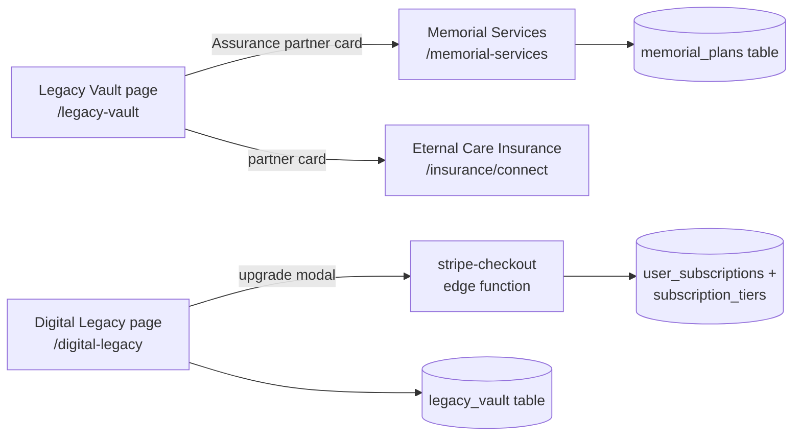

# Digital Legacy and Memorials

Two pages cover the post-life product surface: `/digital-legacy` manages legacy items (time capsules, memorial pages, digital wills, scheduled messages) in the older `legacy_vault` table with a $19.99/month premium upsell, and `/memorial-services` is a funeral/memorial planning marketplace that is mostly demo content backed by a real `memorial_plans` table.

## Digital Legacy page

`src/pages/DigitalLegacy.tsx` (route in `src/App.tsx:193`) is a tabbed CRUD over the `legacy_vault` table — **not** the `vault_items` table used by the [[Legacy Vault]] page. Tabs map to `vault_type`: `time_capsule`, `memorial_page`, `digital_will`, `scheduled_message` (the schema also allows `secure_document`). Each row carries `recipients`, an optional `scheduled_delivery_date`, `delivery_status` (`scheduled | delivered | cancelled`), `is_public`, an optional `memorial_url`, and a `storage_tier` of `standard | 10_year | 25_year | lifetime`.

Premium gating: `checkPremiumStatus` reads the user's active `user_subscriptions` row joined to `subscription_tiers` and treats `legacy_premium` or `ultimate_bundle` as premium — premium users get `25_year` storage on new items. The upgrade modal calls the `stripe-checkout` edge function with `price_id: 'price_legacy_premium_monthly'` (see [[Payments and Subscriptions]] and [[Pricing Tiers]]). In demo mode everything round-trips through localStorage via `src/lib/demo-storage.ts`, and a failed checkout in demo mode simply flips the premium flag locally.

> [!warning] Two parallel legacy stores exist. `legacy_vault` (created in `supabase/migrations/20251026140000_create_monetization_system.sql`) powers this page; `vault_items` (created three days later in `supabase/migrations/20251029150000_create_legacy_vault_system.sql`) powers `LegacyVaultEnhanced`. They do not share data, and only `vault_items` has scheduler/integrity/export support from the [[Vault Edge Functions]]. Nothing delivers `legacy_vault` items either — `delivery_status` never leaves `scheduled` on its own.

> [!warning] The Edit button on this page duplicates instead of updating: it pre-fills the create modal, but `createLegacyItem` always INSERTs a new row (`DigitalLegacy.tsx:158`). There is no update path.

## Memorial Services page

`src/pages/MemorialServices.tsx` (route `/memorial-services`, gated behind `VITE_ENABLE_NON_CORE_ROUTES` in `src/App.tsx:229`) presents the "Memorial Services Network" reached from the Legacy Vault's Assurance section. Three tabs:

- **Explore Services** — category-filtered provider cards (funeral homes, cemeteries, cremation, memorial venues, florists) with call/email/website actions. The five `featuredProviders` are a hard-coded array in the component with fictional contact details.
- **My Plans** — real persistence: `createPlan` inserts a `memorial_plans` row (`service_type`, `preferences` jsonb, `budget` defaulting to 5000, `status: 'planning'`), listed back per user. Statuses are `planning | confirmed | completed`.
- **Documents** — static mock UI; the six document cards and their Uploaded/Pending badges are hard-coded, and the upload/download buttons do nothing.

> [!note] `supabase/migrations/20251029190000_create_memorial_services_system.sql` creates `memorial_plans`, `memorial_documents`, and a `service_providers` table — but the page never queries `service_providers` or `memorial_documents`; only `memorial_plans` is wired up. The provider directory and document vault are future work presented as finished UI.

## How the pieces connect

Both pages support demo mode through `src/lib/demo-storage.ts`, so the flows can be exercised without a signed-in Supabase user.

## Key Files

- `src/pages/DigitalLegacy.tsx` — tabbed legacy-item CRUD, premium banner, Stripe upgrade modal
- `src/pages/MemorialServices.tsx` — provider explorer, memorial plans, mock documents tab
- `src/lib/demo-storage.ts` — localStorage persistence used by both pages in demo mode
- `supabase/migrations/20251026140000_create_monetization_system.sql` — `legacy_vault`, `subscription_tiers`, `user_subscriptions`
- `supabase/migrations/20251029190000_create_memorial_services_system.sql` — `memorial_plans`, `memorial_documents`, `service_providers`

## Gotchas

- `MemorialServices` is invisible in production unless `VITE_ENABLE_NON_CORE_ROUTES=true`; the partner card in the vault still links to it, landing on a redirect when the flag is off (see [[Pages and Routing]]).
- The "500+ verified providers / 50,000+ families served / 4.8 rating" stat tiles are hard-coded marketing numbers, not queries.
- `checkPremiumStatus` optional-chains the embedded `subscription_tiers` because PostgREST returns `null` for a missing to-one embed while the parent row stays truthy — copy that pattern when joining tiers elsewhere.

## Related

- [[Legacy Vault]] — the newer `vault_items`-based implementation of the same product idea
- [[Vault Edge Functions]] — scheduler/export/integrity support that only the newer store has
- [[Time Capsules]] — yet another capsule implementation, on the FastAPI backend
- [[Payments and Subscriptions]] — checkout and subscription mechanics behind Legacy Premium
- [[Eternal Care Insurance]] — sibling trust-partner product
- [[Legacy and Family MOC]] — area hub
