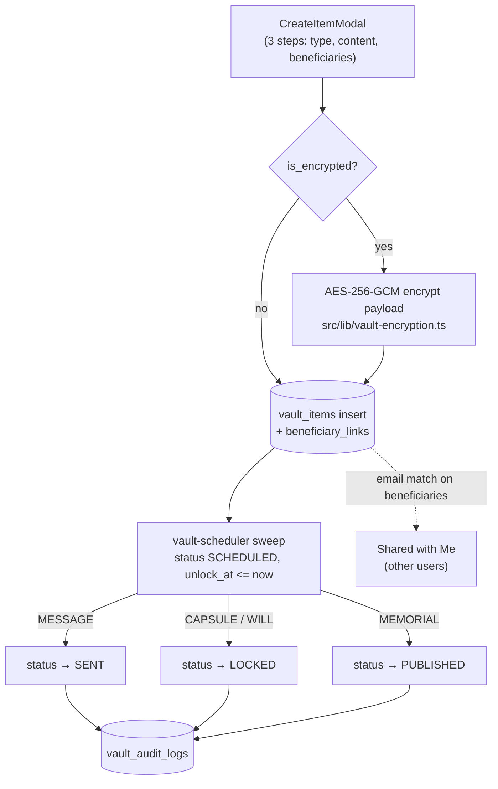

# Legacy Vault

The Legacy Vault is the continuity-planning product: users create time capsules, memorial pages, digital wills, and scheduled messages as `vault_items` rows, optionally encrypt them client-side, and assign beneficiaries who see the items after unlock. The page at `/legacy-vault` is a thin wrapper around a single ~2,000-line component, with three [[Vault Edge Functions]] handling export, integrity checking, and timed unlocks.

## Overview

`src/pages/LegacyVault.tsx` just renders `src/components/LegacyVaultEnhanced.tsx` with a back-to-dashboard button (route registered in `src/App.tsx:201`). The component has three sections:

- **Continuity Plans** — CRUD over `vault_items`, tabbed by type: `CAPSULE`, `MEMORIAL`, `WILL`, `MESSAGE`. Includes search (title + payload), a status filter, and four "AI Continuity Concepts" presets (AI Memory Capsule, Engram Succession Brief, Memorial Presence Page, Heartbeat Sunset Notice) that pre-fill the create modal for archiving or handing over a [[Custom Engrams|custom engram]] when an AI companion is retired.
- **Legacy Assurance** — beneficiary registry, receipts/audit trail, "Run Integrity Check" and "Export Vault" buttons, and three trust-partner cards that navigate to `/insurance/connect` ([[Eternal Care Insurance]]), `/memorial-services` (see [[Digital Legacy and Memorials]]), or `/portal`.
- **Shared with Me** — vault items owned by *other* users where the current user's email matches a linked beneficiary.

The Supabase data access was extracted into `src/lib/vault/data.ts` (pure async helpers) and `src/lib/vault/types.ts` so it can be reused and unit-tested outside the component.

## How It Works

- **Lifecycle**: statuses are `DRAFT | SCHEDULED | LOCKED | PUBLISHED | PAUSED | SENT | ARCHIVED`; new items start as `SCHEDULED` except memorials, which start as `DRAFT` (`LegacyVaultEnhanced.tsx:1387`).
- **Unlock rules**: `DATE`, `DEATH_CERT`, `CUSTODIAN_APPROVAL`, or `HEARTBEAT_TIMEOUT` (with `heartbeat_timeout_days`). Only `DATE` is actually enforced today, by `vault-scheduler` comparing `unlock_at` to now.
- **Beneficiaries**: `beneficiaries` rows (name/email/phone/relationship) are linked to items through `beneficiary_links` with a role of `VIEWER`, `CUSTODIAN`, or `EXECUTOR`. `fetchSharedVaultItems` in `src/lib/vault/data.ts` finds shared items by joining `beneficiary_links → beneficiaries` and matching the viewer's email.
- **Encryption**: `src/lib/vault-encryption.ts` uses Web Crypto AES-GCM (256-bit key, 12-byte IV); the payload is replaced by `{ ciphertext, iv }`. Requires a secure context (HTTPS), otherwise item creation fails with an explicit error. `ItemDetailModal` decrypts in the browser and offers a local `.evault` JSON download.

## Key Files

- `src/pages/LegacyVault.tsx` — route wrapper for the enhanced vault component
- `src/components/LegacyVaultEnhanced.tsx` — the whole UI: sections, create/detail modals, beneficiary manager
- `src/lib/vault/data.ts` — extracted Supabase data layer (fetch items/shared/beneficiaries/receipts, invoke edge functions)
- `src/lib/vault/types.ts` — `VaultItem`, statuses, unlock rules, `LegacyConceptPreset`
- `src/lib/vault-encryption.ts` — AES-GCM encrypt/decrypt + key import/export helpers
- `src/components/FileUploadZone.tsx` — attachment upload used by capsule/memorial/will forms
- `supabase/functions/vault-export/index.ts` — consent-gated watermarked export (detail in [[Vault Edge Functions]])
- `supabase/functions/vault-integrity-check/index.ts` — SHA-256 payload verification against audit log
- `supabase/functions/vault-scheduler/index.ts` — flips due `SCHEDULED` items to SENT/LOCKED/PUBLISHED
- `src/components/VaultConnectPanel.tsx` — partner discovery/connection UI over `src/lib/vault-connect-api.ts`
- `supabase/migrations/20251029150000_create_legacy_vault_system.sql` — creates `vault_items`, `beneficiaries`, `beneficiary_links`, `vault_consents`, `vault_audit_logs`, `vault_receipts`

## Vault Connect

`src/components/VaultConnectPanel.tsx` is a separate surface for sharing the vault with external partners: it lists `vault_partners` (estate planning, insurance, funeral, legal, financial — created in `supabase/migrations/20251027090000_create_vault_connect_system.sql`) and manages `vault_connections` with statuses `pending → active → suspended/revoked`, data-sharing levels, permissions, and expiry. The client library `src/lib/vault-connect-api.ts` validates everything with zod schemas.

> [!note] VaultConnectPanel is not mounted anywhere — no route in `src/App.tsx` and no importing component. It is complete but dormant UI; the trust-partner cards inside the vault's Assurance section navigate to other pages instead.

## Gotchas

> [!warning] The client-side encryption is self-defeating as implemented: `handleSave` exports the raw AES key to base64 and stores it in the same `vault_items` row as `encryption_key_id` (`LegacyVaultEnhanced.tsx:1335,1393`), and decryption re-imports it from that column. Anyone who can read the row can decrypt it, so encryption only guards against casual inspection, not database access.

> [!warning] The "Run Integrity Check" and "Export Vault" buttons invoke the edge functions with **no request body** (`src/lib/vault/data.ts:164,171`), but `vault-integrity-check` requires `user_id` and `vault-export` requires `item_id` + `user_id` — both return 400 in practice. The export handler also looks for `data.downloadUrl`, which the function never returns (it returns the item JSON inline).

- Nothing schedules `vault-scheduler`; unless it is wired to pg_cron or an external cron, `SCHEDULED` items never fire (see [[Vault Edge Functions]]).
- "Delivery" of a `MESSAGE` is a status flip plus audit row — no email is ever sent to `payload.recipients`.
- Do not confuse `vault_items` with the older `legacy_vault` table used by the `/digital-legacy` page — two parallel implementations of the same idea (see [[Digital Legacy and Memorials]]).

## Related

- [[Vault Edge Functions]] — server-side detail on export, integrity check, and the scheduler
- [[Digital Legacy and Memorials]] — the older, parallel legacy store and memorial planning pages
- [[Time Capsules]] — a third capsule implementation on the FastAPI backend
- [[Legacy and Family MOC]] — area hub
- [[Custom Engrams]] — the AI companions the "AI Continuity Concepts" presets are designed to archive
- [[Eternal Care Insurance]] — trust-partner card destination from the Assurance section
- [[Key Tables]] — schema context for the vault tables
