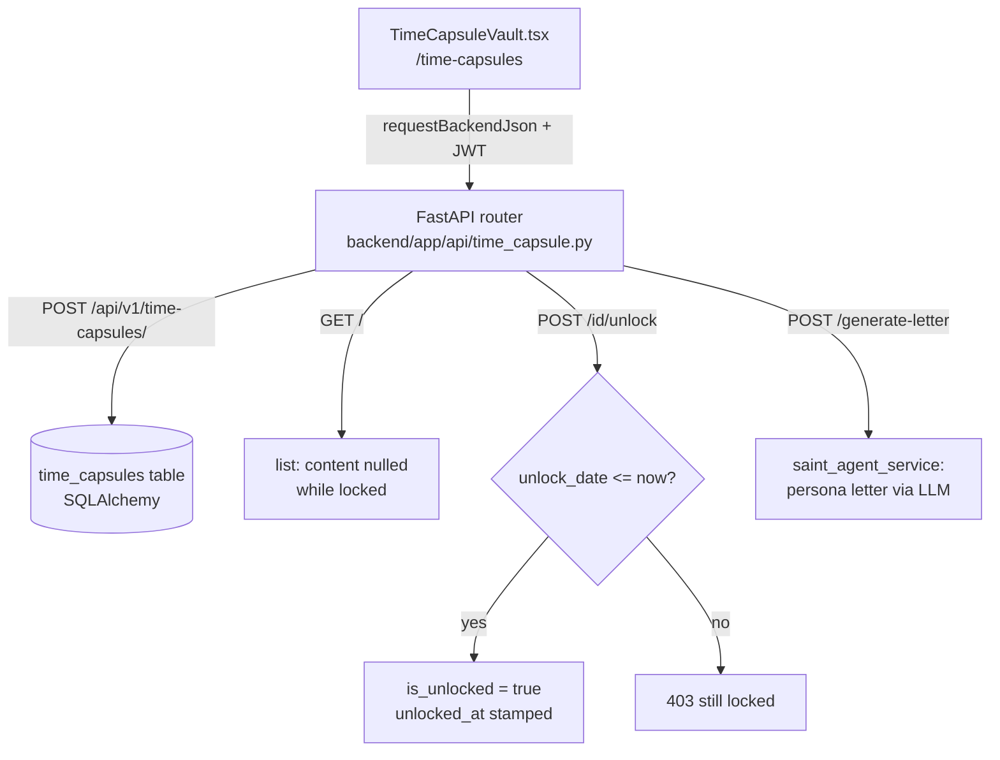

# Time Capsules

`src/components/capsules/` holds one component, `TimeCapsuleVault.tsx` — a "messages across time" UI where users (or a Saint persona writing on their behalf) seal a letter that stays locked until a date or condition. It is confirmed to be scheduled future message delivery, but it runs against the **FastAPI backend** in `backend/`, not Supabase, and unlocking is pull-based: the user clicks "Check Unlock" rather than anything being delivered.

## Overview

Routed at `/time-capsules` (`src/App.tsx:364`), the component lists capsules as locked/unlocked cards. Locked cards hide their content ("Locked until <date>"); unlocked cards render the letter. The create modal picks an author — "Me" or one of [[The Saints]] (Joseph, Michael, Raphael) — a title, a free-text unlock condition ("2030", or an event like "Financial Crisis"), and the message body. When a Saint is selected, "Generate with AI" asks the backend to write the letter in that persona.

## How It Works

- All calls go through `src/lib/backend-request.ts` (`requestBackendJson`), which tries `VITE_API_BASE_URL` and fallbacks, plus `http://localhost:8010` in dev, with the user's access token attached by `src/lib/auth-session.ts` helpers.
- `backend/app/api/time_capsule.py` authenticates with `get_current_user` and scopes every query to the caller's `user_id` — unlike the Supabase [[Vault Edge Functions]], this API does verify the caller.
- The list endpoint enforces secrecy server-side: `content` and `media_url` are returned as `null` until `is_unlocked` is true.
- `POST /{id}/unlock` only checks `unlock_date <= now`. The code comment says condition strings would be matched against event logs "in real impl" — free-text `unlock_condition` values are stored but never evaluated, so condition-locked capsules can never unlock.
- `POST /generate-letter` pulls the Saint's stored knowledge via `saint_agent_service.get_knowledge`, prompts the LLM to write a visionary letter in persona, and heuristically extracts a title from the first line.

## Data Model

`backend/app/models/time_capsule.py` defines the `time_capsules` table (SQLAlchemy, not a Supabase migration): `user_id`, `sender_saint_id`, optional `recipient_email`, `title`, `content`, `media_url`, `unlock_date`, `unlock_condition`, `is_unlocked`, `is_read`, `created_at`, `unlocked_at`.

> [!warning] Three separate time-capsule implementations coexist and share no data:
> 1. This FastAPI `time_capsules` table (route `/time-capsules`).
> 2. `vault_items` with `type='CAPSULE'` in the [[Legacy Vault]] (route `/legacy-vault`), which has scheduler/encryption/beneficiary support.
> 3. `legacy_vault` rows with `vault_type='time_capsule'` on the [[Digital Legacy and Memorials|Digital Legacy]] page (route `/digital-legacy`).
> A capsule created in one UI will never appear in the others.

> [!note] The `backend/` FastAPI app is a third backend beyond the "dual backend" (edge functions + Express) described in `CLAUDE.md` and [[Dual Backend System]] — trust the code here. It also serves the family invitation and quiz-invite endpoints used by [[Family Engrams]].

## Gotchas

- Delivery is entirely user-initiated: no scheduler or cron flips `is_unlocked`, and although `recipient_email` is a column, nothing sends email. A capsule "for my daughter's wedding" unlocks only when someone presses "Check Unlock" after the date.
- The component sends a `Bypass-Tunnel-Reminder: true` header — a tell that the backend is commonly reached through a localtunnel-style dev tunnel.
- If no `VITE_API_*` URL is configured in production, every capsule call fails after trying candidates and the page shows an empty vault; the UI logs errors but renders no error state.
- `unlock_condition` accepts anything ("Financial Crisis") but only `unlock_date` is honored — set a real date if the capsule should ever open.

## Key Files

- `src/components/capsules/TimeCapsuleVault.tsx` — the entire frontend: list, create modal, AI letter generation, unlock button
- `backend/app/api/time_capsule.py` — FastAPI router: create, list (content-hiding), unlock, generate-letter
- `backend/app/models/time_capsule.py` — `time_capsules` SQLAlchemy model
- `src/lib/backend-request.ts` — multi-candidate backend URL resolution used for all `/api/v1` calls

## Related

- [[Legacy Vault]] — the Supabase-native capsule implementation with encryption and beneficiaries
- [[Digital Legacy and Memorials]] — the third capsule variant plus memorial planning
- [[Vault Edge Functions]] — contrast: those unlock via a sweep, this unlocks on demand
- [[The Saints]] — the personas that author AI-generated capsule letters
- [[Family Engrams]] — other features served by the same FastAPI backend
- [[Legacy and Family MOC]] — area hub
