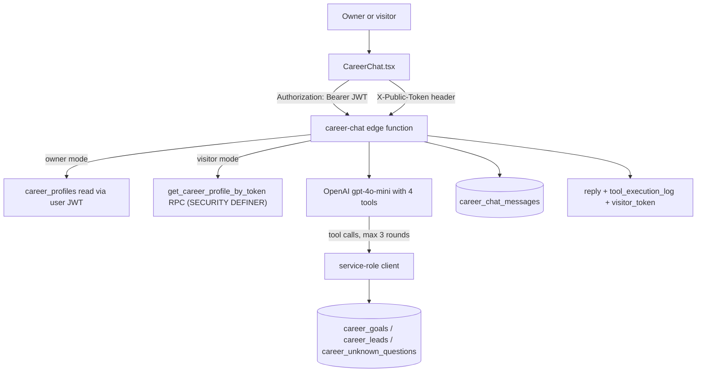

# Career Companion

The Career Companion (branded "Career Agent" in the UI) is a personal career assistant with two faces: a private coach for the logged-in owner (goal tracking, profile Q&A) and a shareable public chat where visitors can ask about the owner's professional background and leave their contact details as leads. It runs entirely on Supabase Edge Functions plus two React components — no Express or FastAPI involvement.

## Overview

- `/career` (protected, `src/App.tsx:348`) renders `src/pages/Career.tsx` with two tabs: **Dashboard** (`CareerDashboard`) and **Chat** (`CareerChat`).
- `/career/public/:token` (`src/App.tsx:387`) renders `src/pages/PublicCareerChat.tsx`, a minimal anonymous wrapper around the same `CareerChat` component. This route is gated by the `VITE_ENABLE_NON_CORE_ROUTES === 'true'` release flag (see [[Pages and Routing]]), while `/career` itself is always mounted behind [[Authentication and JWT Flow|auth]].
- The owner enables public chat from the dashboard settings; `career-profile-update` then mints a 12-character alphanumeric token, and the share URL is `/career/public/<token>`.

## How It Works

`supabase/functions/career-chat/index.ts` builds a system prompt from the career profile (summary, role, industry, skills, interests), keeps the last 10 turns of client-supplied history, and calls OpenAI `gpt-4o-mini` with four function tools:

- `record_user_details` — inserts a visitor lead into `career_leads` (email required).
- `record_unknown_question` — logs unanswerable questions to `career_unknown_questions` for owner follow-up.
- `track_career_goal` — creates rows in `career_goals`; refused unless `isOwner`.
- `get_career_context` — reads profile (always) and active goals (owner only).

Tool execution always uses the service-role client so anonymous visitors can write leads despite [[Row Level Security]]; ownership is enforced in code via the `isOwner` flag. Both user and assistant messages are persisted to `career_chat_messages` (failures are logged but non-fatal).

`supabase/functions/career-profile-update/index.ts` is a small REST handler (GET/POST/PUT/DELETE) over `career_profiles` using the forwarded user JWT (RLS enforced). Enabling public chat without an existing token, or passing `generate_new_token`, generates a token with up to 10 uniqueness retries.

`get_career_profile_by_token` (defined in the migration below) is `SECURITY DEFINER` and only returns profiles where `public_chat_enabled = true`, so disabling public chat immediately kills shared links.

## Key Files

- `src/pages/Career.tsx` — protected page shell, Dashboard/Chat tab switcher, quick-tips sidebar.
- `src/pages/PublicCareerChat.tsx` — anonymous page for `/career/public/:token`; passes the token into `CareerChat`.
- `src/components/CareerChat.tsx` — dual-mode chat UI; picks `Authorization` vs `X-Public-Token` header, shows tool-usage badges, copy-share-link button.
- `src/components/CareerDashboard.tsx` — profile editor (LinkedIn summary, role, skills, public-chat toggle + greeting), goals/leads/unknown-questions views; saves via `career-profile-update`.
- `supabase/functions/career-chat/index.ts` — chat pipeline with OpenAI tool calling.
- `supabase/functions/career-profile-update/index.ts` — profile CRUD + public token minting.
- `supabase/migrations/20260102100000_create_career_agent_system.sql` — all five tables, RLS policies, triggers, and the token RPC.
- `CAREER_AGENT_CONTEXT.md` — root-level planning doc (see warning below).

## Data Model

All in the single migration `20260102100000_create_career_agent_system.sql`:

| Table | Purpose |
|---|---|
| `career_profiles` | One per user; professional info + `public_chat_enabled`/`public_chat_token`/`public_chat_greeting` |
| `career_chat_messages` | Conversation history for both owner (`user_id`) and anonymous (`visitor_token`) sessions |
| `career_goals` | Goals with category, priority, status, `progress_percentage` |
| `career_leads` | Captured visitor contacts with `status: 'new'` workflow |
| `career_unknown_questions` | Questions the AI could not answer, `status: 'pending'` |

## Gotchas

> [!warning] Column mismatch: `job_role` vs `current_role`. The migration defines `career_profiles.job_role` ("renamed from current_role, reserved keyword"), but the code everywhere uses `current_role`: `career-profile-update` writes it, `career-chat`'s `get_career_context` selects it, and both React components type it. Writes that include `current_role` will error against this schema, and the "Current Role" line of the system prompt never populates. The `get_career_profile_by_token` RPC returns `job_role`, which the prompt builder also ignores. Trust the migration; the code needs reconciling.

> [!warning] `CAREER_AGENT_CONTEXT.md` describes a FastAPI + Gradio + Railway implementation (`backend/app/features/career_agent/` with `career_chats`/`user_profiles` tables). That directory does not exist and none of it was built — the shipped implementation is the Supabase Edge Function pair documented here. Treat the doc as an abandoned plan.

> [!note] `career-chat` requires `OPENAI_API_KEY` in [[Environment Variables|Edge Function secrets]] and returns `CONFIG_MISSING` without it. The deployment notes in `CLAUDE.md` list only `GROQ_API_KEY` as currently set, so this function may be dead in production until the key is added.

- The server generates a fresh `visitor_${Date.now()}_...` token per request; `CareerChat.tsx` stores the returned `visitor_token` in state but never sends it back, so an anonymous visitor's messages/leads are not linkable across turns — continuity exists only in the client-supplied `conversation_history`.
- Error responses follow the standard `{code, message, hint}` shape (see [[Edge Functions Overview]]); `CareerChat.tsx` maps `AUTH_*`/`INVALID_TOKEN`/`CONFIG_MISSING` codes to friendly copy.

## Related

- [[Products MOC]] — parent hub for product surfaces.
- [[AI Chat Edge Functions]] — sibling chat functions; career-chat follows the same OpenAI-with-tools pattern.
- [[Authentication and JWT Flow]] — owner mode rides the standard Supabase JWT; public mode bypasses it via token header.
- [[Row Level Security]] — why tool execution needs the service-role client for anonymous visitors.
- [[Edge Functions Overview]] — error-envelope and CORS conventions this feature follows.
- [[Pages and Routing]] — release-flag gating of the public chat route.
- [[Safety Guardrails]] — contrast: career-chat has prompt-level "don't make things up" rules but none of St. Raphael's medical guardrails.
