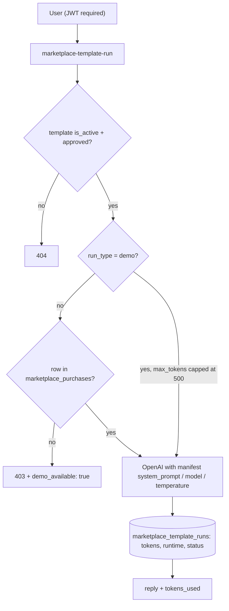

# Marketplace and Creator Dashboard

The AI Marketplace is a template economy: creators publish AI personalities ("templates") with a price, buyers purchase them, run them through a metered edge function, or clone them into their own engram roster. The Creator Dashboard is the seller side — revenue stats, an approval pipeline, and an experimental "Memory Mining" tab for monetizing engram data.

## Overview

- `/marketplace` (`src/App.tsx:140`, public but gated by `VITE_ENABLE_NON_CORE_ROUTES`) lists `marketplace_templates` where `is_active = true`, featured first. Categories: Finance, Wellness, Personal Development, Career, Creativity, Relationships, Aesthetics.
- `/creator` (`src/App.tsx:142`, protected + same gate) renders `src/pages/CreatorDashboard.tsx`, which auto-creates a `marketplace_creator_profiles` row (tier `free`) on first visit.
- Purchasing invokes the `stripe-checkout` function (see [[Payments and Subscriptions]]); a purchased template can be "Added to Engrams", which inserts a clone into `archetypal_ais` (`training_status: 'training'`, `ai_readiness_score: 50`) and back-links `cloned_engram_id` on the `marketplace_purchases` row — from there it behaves like any of the user's [[Custom Engrams]] and can be refined via [[365-Day Personality Training]].
- Revenue share shown in the UI: 80% (free) / 85% (verified) / 90% (premium) — matching `revenue_share_percentage DECIMAL DEFAULT 80.00` on `marketplace_creator_profiles`. Approval workflow: `draft` → `pending_review` → `approved`/`rejected`.

## How It Works — Template Runs

`supabase/functions/marketplace-template-run/index.ts` is the metered execution path:

The behavior of each template lives in `marketplace_template_manifests` (`system_prompt`, `model`, `temperature`, `max_tokens`), joined via `manifest:marketplace_template_manifests(*)`. Demo mode skips the purchase check but caps output at 500 tokens. Paid runs also increment `marketplace_templates.total_runs`. The function uses the anon client with the forwarded user JWT, so [[Row Level Security]] governs all reads.

## Memory Mining (FastAPI backend)

The Creator Dashboard's "Akashic Memory Mining" tab does not use Supabase functions at all — it calls the Python FastAPI backend via `buildApiUrl` (`src/lib/env.ts:86`):

- `GET /api/v1/marketplace/assets/mining` — lists the user's `DailyQuestionResponse` engrams permitted for training (`backend/app/api/marketplace_assets.py:12`).
- `POST /api/v1/marketplace/assets/mining/{engram_id}/permit?permit=bool` — toggles `training_permitted` per engram.

Routers are mounted in `backend/app/main.py` under the `/api/v1/marketplace` prefix. This is a third backend beyond the [[Dual Backend System]] described in `CLAUDE.md` (Edge Functions + Express) — worth knowing when tracing requests.

## Seeding the Catalog

Three overlapping seed paths exist:

- `scripts/seed_marketplace.ts` — upserts 4 templates (Grief Counselor, Wealth Mentor, Relationship Coach, Life Coach at $19.99–$29.99) plus `gpt-4` manifests, using the **anon key**.
- `scripts/seed_marketplace.py` — same catalog via raw REST with the **service-role key** (hardcoded project URL `sncvecvgxwkkxnxbvglv`), created because the anon-key TS script is blocked by RLS.
- `supabase/migrations/20251029161000_seed_marketplace_demo_archetypes.sql` — 6 demo archetypes with full manifests (St. Raphael, St. Michael, MLK Jr., Agatha Christie, Dante, Lyra) and bulk-approves pre-existing rows.

## Key Files

- `src/pages/Marketplace.tsx` — catalog, search/filter, purchase + add-to-engrams flows, details modal.
- `src/pages/CreatorDashboard.tsx` — stats cards, template status groups, Memory Mining tab.
- `supabase/functions/marketplace-template-run/index.ts` — purchase-gated OpenAI execution + run logging.
- `supabase/functions/stripe-checkout/index.ts` — checkout session creation the Marketplace invokes (see warning).
- `scripts/seed_marketplace.ts`, `scripts/seed_marketplace.py` — catalog seeders.
- `supabase/migrations/20251026140000_create_monetization_system.sql` — `marketplace_templates`, `marketplace_purchases` (+ subscription tables, `legacy_vault`).
- `supabase/migrations/20251029160000_create_marketplace_enhancements.sql` — manifests, reviews, runs, creator profiles, versions, purchased instances; adds `approval_status`, `total_runs`, `revenue_total` etc. to templates.
- `backend/app/api/marketplace_assets.py` — FastAPI mining endpoints.

## Data Model

`marketplace_templates` (catalog + approval/versioning columns), `marketplace_purchases` (unique per `user_id, template_id`, `cloned_engram_id`), `marketplace_template_manifests` (agent config), `marketplace_template_runs` (per-run usage/billing log), `marketplace_creator_profiles` (Stripe Connect fields, revenue share, tier), `marketplace_template_reviews`, `marketplace_template_versions`, `marketplace_purchased_instances`. See [[Key Tables]] for how these sit alongside the rest of the schema.

## Gotchas

> [!warning] The purchase flow is broken as coded. `Marketplace.tsx` invokes `stripe-checkout` with `{type: 'marketplace_template', template_id, price_usd, success_url, cancel_url}`, but `supabase/functions/stripe-checkout/index.ts:46` requires `{price_id, success_url, cancel_url, mode}` and rejects anything else with a validation error. Until stripe-checkout grows a marketplace branch (or the page sends a Stripe `price_id` + `mode`), every purchase click fails. See [[Payment Edge Functions]].

> [!warning] The "Demo" button is dead code: `TemplateCard` in `src/pages/Marketplace.tsx:486` calls `setDemoTemplate(template)`, but that setter lives in the parent `Marketplace` component's scope and is never passed down as a prop, and `demoTemplate` state is never rendered. `marketplace-template-run`'s demo mode is fully implemented server-side but has no UI entry point.

> [!warning] `CreatorDashboard` navigates to `/creator/new` and `/creator/template/:id`, but neither route exists in `src/App.tsx` — "Create Template" and "Edit" land on the 404 catch-all. The `activeTab` type also includes `'analytics'` with no corresponding tab button.

- `total_runs` is incremented through the user's own JWT-scoped client; if RLS forbids buyers updating `marketplace_templates`, the increment silently fails (it is wrapped in a try/catch warn).

## Related

- [[Products MOC]] — parent hub.
- [[Payments and Subscriptions]] — Stripe checkout/webhook plumbing this product depends on.
- [[Custom Engrams]] — what a purchased template becomes after "Add to Engrams".
- [[Archetypal AIs]] — the `archetypal_ais` table receiving template clones.
- [[365-Day Personality Training]] — the daily-response engrams that Memory Mining monetizes.
- [[Pricing Tiers]] — subscription-side monetization next to this one-off template economy.
- [[Row Level Security]] — governs template reads, purchases, and the seeding pitfalls.
