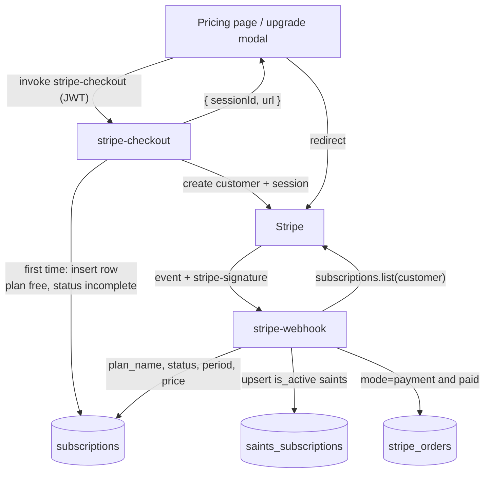

# Payments and Subscriptions

EverAfter takes money through Stripe Checkout: two Edge Functions (`stripe-checkout`, `stripe-webhook`) manage a per-user `subscriptions` row, record one-time payments, and activate premium Saints in `saints_subscriptions`. Feature gating on the frontend is done per domain against separate premium tables — and, confusingly, the component named `FeatureBlockedState` is not a paywall at all.

## Overview

- The backend is exactly two functions, documented mechanically in [[Payment Edge Functions]]: `stripe-checkout` creates Stripe customers + Checkout sessions, `stripe-webhook` verifies events and syncs state back.
- Product-side, users buy from the plan cards on `/pricing` and various in-app upgrade modals — see [[Pricing Tiers]] for the lineup and what each unlocks.
- Core billing state is one `subscriptions` row per user (`plan_name` ∈ free/pro/enterprise). Paid plans additionally flip rows in `saints_subscriptions`, which powers [[The Saints]] roster.
- One-time payments (Checkout `mode: 'payment'`) land in `stripe_orders`.

## How It Works — Subscription Lifecycle

1. **Checkout** — `supabase/functions/stripe-checkout/index.ts` validates `{price_id, success_url, cancel_url, mode}` (mode must be `payment` or `subscription`), resolves the user from the `Authorization` JWT, and lazily bootstraps both the Stripe customer and the `subscriptions` row (`plan_name: 'free'`, `status: 'incomplete'`). It returns the session `url` and the frontend does `window.location.href = url`.
2. **Payment happens on Stripe's hosted page**, then Stripe calls the webhook.
3. **Sync** — `supabase/functions/stripe-webhook/index.ts` verifies the `stripe-signature` (see [[Webhook Signature Verification]]), ACKs immediately, and in `EdgeRuntime.waitUntil` re-fetches the customer's latest subscription **from the Stripe API** rather than trusting the event payload, then updates the row: `stripe_subscription_id`, `stripe_price_id`, `plan_name` (via `PRICE_TO_PLAN_MAP`), `status`, period bounds, `cancel_at_period_end`, `trial_end`.
4. **Cancellation** — when Stripe reports zero subscriptions, the row is downgraded to `plan_name: 'free'`, `status: 'canceled'`, `stripe_subscription_id: null`. There is no proration/portal logic anywhere; cancellation is expected to happen Stripe-side.

Status values the table accepts (CHECK constraint): `active`, `canceled`, `past_due`, `trialing`, `incomplete`.

> [!warning] The webhook writes `subscription.status as any` straight from Stripe, but Stripe also emits `unpaid`, `paused`, and `incomplete_expired` — all rejected by the `subscriptions.status` CHECK in `supabase/migrations/20251025060239_consolidate_missing_tables.sql`. Those updates will fail silently in the deferred handler.

### Saint activation

`syncCustomerFromStripe()` upserts into `saints_subscriptions` on `(user_id, saint_id)`:

| plan_name | Saints activated |
|---|---|
| pro | michael |
| enterprise | michael, martin, agatha |

[[St Raphael]] is free for everyone: the signup trigger inserts a `raphael` row for each new user (`supabase/migrations/20260103100000_fix_signup_trigger_conflicts.sql`), and `supabase/migrations/20251025150119_restore_saints_data_for_all_users.sql` backfilled existing users. Downgrades never deactivate saints — rows keep `is_active: true` forever.

## Data Model

- `subscriptions` — one row per user: `stripe_customer_id`/`stripe_subscription_id` (unique), `stripe_price_id`, `plan_name` CHECK (`free|pro|enterprise`), `status`, period timestamps, `cancel_at_period_end`, `trial_end`. Created identically (`CREATE TABLE IF NOT EXISTS`) in both `supabase/migrations/20251025060239_consolidate_missing_tables.sql` and `supabase/migrations/20251025100000_complete_365_questions_and_features.sql`.
- `saints_subscriptions` — `saint_id` CHECK (`raphael|michael|martin|agatha`), `is_active`, `activated_at`, `deactivated_at`, `settings jsonb`, `UNIQUE(user_id, saint_id)`. Owner-only [[Row Level Security]] policies (`auth.uid() = user_id`). Read by `src/components/CompactSaintsOverlay.tsx` to light up the saints roster.
- `stripe_orders` — one-time payments: `checkout_session_id`, `payment_intent_id`, `customer_id`, amounts, `payment_status`.
- Legacy Bolt-template tables `stripe_customers` and `stripe_subscriptions` (plus `stripe_user_subscriptions`/`stripe_user_orders` views) from `supabase/migrations/20251020025826_winter_palace.sql` are **orphaned** — no function or component reads or writes them; the current webhook uses the newer `subscriptions` table instead.
- Per-feature premium tables (`user_subscriptions`, `subscription_tiers`, `insight_subscriptions`, `health_premium_features`, `engram_premium_features`, `marketplace_purchases`) from `supabase/migrations/20251026140000_create_monetization_system.sql` — see gating below and [[Key Tables]].

## Feature Gating — and what FeatureBlockedState actually is

> [!note] Naming trap: `src/components/FeatureBlockedState.tsx` sounds like a paywall but is a dumb presentational panel (`title`, `reason`, `detail` props, rose "Unavailable" styling) used for **runtime-dependency** blocking, not subscription blocking. Callers: `src/components/ProtectedRoute.tsx:180` (renders it when a route's runtime gate from `src/lib/runtime-readiness.ts` has blocking deps `auth.session`/`frontend.supabase`), `src/pages/StRaphaelHealthHub.tsx` (hub blocked until live health deps recover), and `src/components/SaintChat.tsx:484` (chat storage/history deps). See [[Authentication and JWT Flow]] for the route-guard side.

Actual paywall checks are scattered per domain, each reading its own table client-side:

- **Insight Pro** — `src/components/CognitiveInsights.tsx` reads `insight_subscriptions.subscription_tier === 'insight_pro'` and locks 4 of 6 analytics views.
- **Legacy Plus/Eternal** — `src/pages/DigitalLegacy.tsx` joins `user_subscriptions → subscription_tiers` and accepts `legacy_premium` or `ultimate_bundle`.
- **Health Premium** — `src/components/RaphaelHealthInterface.tsx` checks boolean flags on `health_premium_features`.
- **Marketplace** — `src/pages/Marketplace.tsx` and `src/pages/MyAIs.tsx` read `marketplace_purchases` (see [[Marketplace and Creator Dashboard]]).
- **Engram fast-track** — `src/components/CustomEngramsDashboard.tsx` treats an engram as chat-ready when `is_ai_active || ai_readiness_score >= 50`; the `engram_premium_features` table exists but nothing in `src/` reads it.

> [!warning] There is no fulfillment path for these gates. `stripe-webhook` only writes `subscriptions`, `stripe_orders`, and `saints_subscriptions` — nothing ever inserts into `user_subscriptions`, `insight_subscriptions`, `health_premium_features`, `engram_premium_features`, or `marketplace_purchases` after a successful payment. As written, paying via any in-app upgrade modal cannot unlock the feature that advertised it.

## Gotchas

- `stripe-checkout` **requires** `mode`, but five of six call sites (Marketplace, DigitalLegacy, CustomEngramsDashboard, CognitiveInsights, RaphaelHealthInterface) omit it — they send a `type` field the function ignores — so those requests fail validation with 400. Only `src/pages/Pricing.tsx` sends a valid body. `src/pages/Marketplace.tsx` also omits `price_id` entirely.
- `PRICE_TO_PLAN_MAP` in the webhook holds placeholder IDs and defaults unmapped prices to `pro`; none of the Pricing page's `price_*_monthly` IDs are in it.
- Required secrets: `STRIPE_SECRET_KEY`, `STRIPE_WEBHOOK_SECRET` (see [[Secrets Management]]); both are dereferenced with `!` at module scope. Root `CLAUDE.md` lists only `GROQ_API_KEY` as currently set, so payments are likely not live in the deployed project.
- `subscriptions` has only a SELECT RLS policy — inserts/updates work solely because both functions use the service-role key.

## Key Files

- `supabase/functions/stripe-checkout/index.ts` — checkout session + customer/row bootstrap
- `supabase/functions/stripe-webhook/index.ts` — signature check, subscription sync, saint activation
- `src/pages/Pricing.tsx` — the only fully-valid `stripe-checkout` caller
- `src/components/FeatureBlockedState.tsx` — runtime-block panel (not a paywall)
- `src/components/ProtectedRoute.tsx` — route-level runtime gating that renders it
- `supabase/migrations/20251025060239_consolidate_missing_tables.sql` — `subscriptions` + `saints_subscriptions` DDL
- `supabase/migrations/20251020025826_winter_palace.sql` — orphaned Bolt-era Stripe tables/views

## Related

- [[Payment Edge Functions]] — function-level mechanics of the same two endpoints
- [[Pricing Tiers]] — the product tiers, prices, and gate mapping
- [[The Saints]] — the personas activated by paid plans
- [[St Raphael]] — the always-free saint seeded at signup
- [[Webhook Signature Verification]] — how the Stripe check compares to health webhooks
- [[Row Level Security]] — owner-only policies on billing tables
- [[Secrets Management]] — where `STRIPE_SECRET_KEY` / `STRIPE_WEBHOOK_SECRET` must live
- [[Marketplace and Creator Dashboard]] — one-time template purchases riding the same checkout
