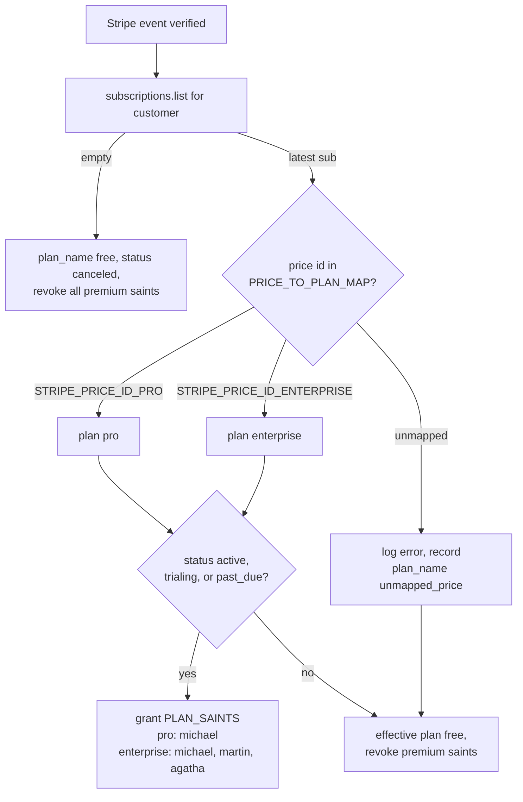

# Pricing Tiers

EverAfter has two tier vocabularies that do not line up: the seven consumer plans sold on `/pricing` (engram/health/insight/legacy/ultimate), and the `free|pro|enterprise` plan names that `stripe-webhook` actually knows how to grant. A Stripe price becomes an entitlement only if it matches one of two secret-configured price IDs — any unmapped price grants nothing, by design.

## The Pricing Page Lineup

`src/pages/Pricing.tsx` renders a hardcoded `plans` array (lines 9–138). Each paid card invokes the `stripe-checkout` function ([[Payment Edge Functions]]) with its `priceId` and `mode: 'subscription'`:

| Plan (card id) | Price | `priceId` sent | Advertised unlocks |
|---|---|---|---|
| Free Starter (`free`) | $0 forever | — (none) | [[St Raphael]] free, 2 [[Custom Engrams\|custom engrams]], 365 daily questions |
| Engram Premium | $14.99/mo | `price_engram_premium_monthly` | 50% fast-track activation, premium question categories, A/V uploads, unlimited engrams |
| Health Premium | $24.99/mo | `price_health_premium_monthly` | Nutrition plans, telemedicine, refills, advanced analytics |
| Insight Pro | $7/mo | `price_insight_pro_monthly` | Sentiment timeline, archetypal clusters, mood correlations |
| Legacy Plus (`legacy_premium`) | $9.99/mo | `price_legacy_premium_monthly` | 10 GB storage, 10 scheduled messages, memorial pages |
| Legacy Eternal | $49/yr | `price_legacy_eternal_yearly` | Perpetual hosting, verified heir delivery, blockchain timestamps |
| Ultimate Bundle | $49.99/mo | `price_ultimate_bundle_monthly` | Everything above + $20/mo marketplace credit ("BEST VALUE" badge) |

The page also carries a callout to the [[Marketplace and Creator Dashboard|AI Marketplace]] ("templates starting at $16.99" — one-time purchases, not tiers).

> [!warning] `/pricing` and `/marketplace` are gated by `VITE_ENABLE_NON_CORE_ROUTES` (`src/App.tsx:170-171` via `src/lib/routeAvailability.ts`), which is set nowhere in production — both routes redirect to `/` in the deployed app. See [[Pages and Routing]] and [[Environment Variables]]. The `priceId` strings are also human-readable placeholders; unless prices with those exact IDs exist in the Stripe account, `stripe.checkout.sessions.create` fails and the caller gets a 500.

## How a Stripe Price Becomes an Entitlement

The webhook side is the only place entitlements are granted, and after PR #118 it is honest: the price→plan map is built at boot from Supabase secrets, and unmapped prices grant nothing (`supabase/functions/stripe-webhook/index.ts:127-144`, confirmed by `CURRENT_STATE.md`). There are no price IDs in code — see [[Secrets Management]].

- `ENTITLED_STATUSES = {active, trialing, past_due}` — `past_due` is a deliberate grace period while Stripe retries payment; `canceled`/`unpaid`/`incomplete` revoke.
- `syncPremiumSaints()` reconciles `saints_subscriptions` in **both** directions: every saint in `ALL_PREMIUM_SAINTS` (`michael`, `martin`, `agatha`) is upserted with `is_active` true or false per the *effective* plan, so downgrades and cancellations now strip the saints they granted. [[St Raphael]] is never touched by billing — he is seeded free at signup ([[The Saints]]).
- The row records the raw truth (`plan_name`, actual Stripe `status`, `stripe_price_id`) separately from the effective entitlement.

> [!note] The sibling note [[Payments and Subscriptions]] (written 2026-07-02) predates this fix: its claims that unmapped prices default to `pro`, that the map holds placeholder IDs in code, and that "downgrades never deactivate saints" describe the pre-PR-#118 webhook and are now stale. Trust the code and `CURRENT_STATE.md` ("Stripe entitlements" bullet). The owner action is still open: set `STRIPE_PRICE_ID_PRO` / `STRIPE_PRICE_ID_ENTERPRISE` to real production price IDs.

## The Two Tier Vocabularies

The webhook's world (`free|pro|enterprise` → premium saints) and the Pricing page's world (engram/health/insight/legacy/ultimate → per-domain feature tables) never intersect:

- None of the page's seven `price_*` IDs can map to `pro`/`enterprise` unless the owner points the secrets at them — and even then the buyer would receive premium *saints*, not the health/engram/legacy features the card advertised.
- Nothing writes the per-domain premium tables after payment. `stripe-webhook` touches only `subscriptions`, `stripe_orders`, and `saints_subscriptions`; `user_subscriptions`, `insight_subscriptions`, `health_premium_features`, `engram_premium_features`, and `marketplace_purchases` have no fulfillment path (see [[Key Tables]]).

### Where each client-side gate reads

- **Insight Pro** — `src/components/CognitiveInsights.tsx:60-65` reads `insight_subscriptions.subscription_tier === 'insight_pro'` (table from `supabase/migrations/20251027000000_create_cognitive_insights_system.sql`).
- **Legacy Plus / Ultimate** — `src/pages/DigitalLegacy.tsx:99-110` joins `user_subscriptions → subscription_tiers`, accepts `legacy_premium` or `ultimate_bundle` ([[Digital Legacy and Memorials]]).
- **Health Premium** — `src/components/RaphaelHealthInterface.tsx:66` reads boolean flags on `health_premium_features` (rendered inside the live St Raphael hub — [[Health UI Components]]).
- **Marketplace** — `src/pages/Marketplace.tsx:93` and `src/pages/MyAIs.tsx:62` read `marketplace_purchases`.

`subscription_tiers` is seeded by `supabase/migrations/20251026140000_create_monetization_system.sql:299-304` with four rows: `engram_premium` 14.99, `health_premium` 24.99, `legacy_premium` **19.99**, `ultimate_bundle` 49.99 (monthly USD).

## Gotchas

- **Price drift between page and seed**: the page sells "Legacy Plus" at $9.99/mo but the seeded `legacy_premium` tier says $19.99/mo; "Insight Pro" and "Legacy Eternal" have no `subscription_tiers` row at all.
- **`unmapped_price` cannot actually be recorded**: `subscriptions.plan_name` has `CHECK (plan_name IN ('free','pro','enterprise'))` (`supabase/migrations/20251025060239_consolidate_missing_tables.sql:224`) and no later migration relaxes it. Writing `plan_name: 'unmapped_price'` violates the CHECK, the update fails, and the handler throws before `syncPremiumSaints` runs — the net effect (no grant) matches the design, but the "record it visibly" half only reaches the function logs, not the table.
- **Status CHECK is narrower than Stripe**: the same migration's `status` CHECK (line 225) rejects `unpaid`, `paused`, and `incomplete_expired`. For those statuses the row update fails and throws first, so the saint *revocation* that `effectivePlan: 'free'` should trigger is skipped for that event.
- **Five of six checkout callers send an invalid body**: `stripe-checkout` requires `mode` ∈ `payment|subscription`, but the upgrade modals in `src/pages/DigitalLegacy.tsx:559`, `src/components/CustomEngramsDashboard.tsx:856`, `src/components/CognitiveInsights.tsx:133`, `src/components/RaphaelHealthInterface.tsx:343`, and `src/pages/Marketplace.tsx:124` all send a `type` field instead (Marketplace also omits `price_id`), so they 400 at validation. Only `src/pages/Pricing.tsx:176` sends a valid body.
- **Demo mode refuses checkout**: `src/lib/demo/demo-data-provider.ts:865` intercepts `stripe-checkout` with a 400 `DEMO_MODE` response.

## Key Files

- `src/pages/Pricing.tsx` — the seven plan cards, prices, and placeholder price IDs
- `supabase/functions/stripe-webhook/index.ts` — `PRICE_TO_PLAN_MAP`, `ENTITLED_STATUSES`, `PLAN_SAINTS`, bidirectional saint sync
- `supabase/functions/stripe-checkout/index.ts` — body validation the upgrade modals fail
- `src/lib/routeAvailability.ts` — the non-core release flag gating `/pricing`
- `supabase/migrations/20251026140000_create_monetization_system.sql` — `subscription_tiers` seed and per-domain premium tables
- `supabase/migrations/20251025060239_consolidate_missing_tables.sql` — `subscriptions` CHECK constraints the webhook can trip
- `CURRENT_STATE.md` — ground truth on the honest-entitlements fix and the open secrets action

## Related

- [[Payments and Subscriptions]] — the checkout/webhook lifecycle these tiers ride on (note the staleness callout above)
- [[Payment Edge Functions]] — function-level mechanics of `stripe-checkout` / `stripe-webhook`
- [[The Saints]] — what `pro`/`enterprise` actually unlock
- [[Marketplace and Creator Dashboard]] — one-time template pricing outside the tier system
- [[Digital Legacy and Memorials]] — the Legacy Plus upsell surface and its gate
- [[Secrets Management]] — where the two price-ID secrets must be set
- [[Pages and Routing]] — the `VITE_ENABLE_NON_CORE_ROUTES` gate on `/pricing`
- [[Key Tables]] — the per-domain premium tables with no fulfillment path
