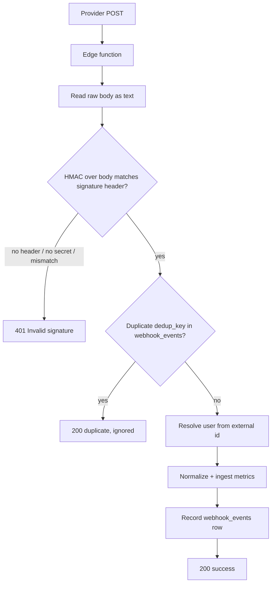

# Webhook Signature Verification

Webhook endpoints are the sanctioned exception to the JWT rule: they authenticate the *sender* by verifying an HMAC signature over the raw request body, then write with the service-role client. This note covers each provider's mechanics as of 2026-08-16 — all four live paths (Terra, Dexcom CGM, Fitbit, Stripe) now fail closed.

## The Flow

Verification always runs against the **raw text body** before `JSON.parse` — re-serializing first would break the HMAC. Dedup and ingestion are covered in [[Webhook Ingestion Pipeline]]; the [[Shared Edge Function Utilities]] note documents the helpers.

## Per-Provider Mechanics

| Provider | Function | Algorithm | Header | Secret |
|---|---|---|---|---|
| Terra | `webhook-terra` | HMAC-SHA256, hex | `terra-signature` | `TERRA_WEBHOOK_SECRET` |
| Terra (parallel) | `terra-webhook` | HMAC-SHA256, hex | `terra-signature` | `TERRA_WEBHOOK_SECRET` |
| Dexcom | `cgm-dexcom-webhook` | HMAC-SHA256, hex | `x-dexcom-signature` | `DEXCOM_WEBHOOK_SECRET` |
| Fitbit | `webhook-fitbit` | HMAC-SHA1, base64 | `x-fitbit-signature` | `FITBIT_SUBSCRIBER_VERIFICATION_CODE` |
| Stripe | `stripe-webhook` | Stripe SDK scheme | `stripe-signature` | `STRIPE_WEBHOOK_SECRET` |

**Terra — two functions, both verified.** `supabase/functions/webhook-terra/index.ts` uses `verifyTerraSignature()` from `supabase/functions/_shared/connectors.ts:46` and ingests into `webhook_events` + `health_metrics`. `supabase/functions/terra-webhook/index.ts` has its own copy of the same HMAC and ingests into `terra_webhook_events` / `terra_metrics_raw` / `terra_metrics_normalized`. `CLAUDE.md` and `CURRENT_STATE.md` name `webhook-terra` as the live [[Terra Integration]] path; `terra-webhook` is the target the `terra-test` diagnostics function probes. `terra-webhook` is explicit about fail-closed behavior (`index.ts:377-403`): unset secret → 503, missing header → 401 — and it records even invalid-signature events in `terra_webhook_events` with `signature_valid: false` before rejecting, a deliberate forensic trail.

**Dexcom.** `supabase/functions/cgm-dexcom-webhook/index.ts` verifies via `verifyDexcomSignature()` in `supabase/functions/_shared/glucose.ts:184`, then upserts EGV readings — see [[Dexcom CGM]] and [[Glucose Monitoring and Alerts]].

**Fitbit.** `supabase/functions/webhook-fitbit/index.ts` verifies HMAC-SHA1/base64 (`_shared/connectors.ts:78`), then — unlike push-payload providers — calls back to the Fitbit API with the user's stored OAuth token to fetch the actual data ([[Fitbit Integration]]).

**Stripe.** `supabase/functions/stripe-webhook/index.ts:41` delegates to `stripe.webhooks.constructEventAsync(body, signature, secret)` — the SDK's timestamped, constant-time scheme. Failure returns 400; on success, processing is deferred with `EdgeRuntime.waitUntil` so Stripe gets a fast 200. Entitlement logic downstream is covered in [[Payment Edge Functions]].

## Fail-Closed Verification, Verified

All three hand-rolled verifiers (`verifyTerraSignature`, `verifyFitbitSignature`, `verifyDexcomSignature`) short-circuit to `false` when the signature header **or** the secret env var is absent, so an unconfigured secret rejects traffic instead of waving it through. PR #120 (2026-07-22) added a live self-test: `terra-test` POSTs an unsigned body at `terra-webhook` and asserts it gets a 401.

> [!warning] Older docs describe a fail-open Terra path — that is fixed
> [[Security Overview]] (written 2026-07-02) says "two Terra paths fail open". Since PR #120 both deployed Terra functions fail closed. The fail-open code that *remains* is legacy and undeployed: `server/api/connections/webhooks.ts:26-29` returns `true` when `TERRA_WEBHOOK_SECRET` is unset, and its handler (line 46) skips verification entirely when the `terra-signature` header is missing. It does use Node's `crypto.timingSafeEqual`, but on the [[Express Server]] stack that nothing deploys. Do not copy it.

## Stubs and Unverified Endpoints

- `supabase/functions/webhook-dexcom/index.ts` — **honest 501 stub.** Stores nothing, deliberately does not log the payload (see [[PHI Handling]]); the real Dexcom path is `cgm-dexcom-webhook`.
- `supabase/functions/webhook-oura/index.ts` — **honest 501 stub**; Oura data arrives via the Terra aggregator instead ([[Oura Integration]]).
- `supabase/functions/device-webhook-handler/index.ts` — performs **no signature verification** and writes a caller-supplied `user_id`/payload into `webhook_logs` and `connections` with the service-role client. No in-code sender authentication exists; only the platform-level JWT gate (which the anon key satisfies) stands in front of it.

## Gotchas

- **String-compare, not constant-time.** The three custom verifiers compare hex/base64 digests with `===` rather than a timing-safe comparison. Practical exploitability of HMAC timing over a network is low, but Stripe's SDK does this properly and the legacy Express code used `timingSafeEqual` — worth fixing if these are ever touched.
- **Fitbit's GET verification handshake echoes instead of checking.** `webhook-fitbit/index.ts:20-30` returns any `?verify=` value straight back with a 200. Fitbit's documented subscriber verification expects the endpoint to *compare* the code and answer 204 (match) or 404 (mismatch), so as written the handshake does not validate anything — and a 200-with-body is not what Fitbit looks for.
- **Dexcom webhook assumes a single connection.** `cgm-dexcom-webhook/index.ts:32-36` looks up `connector_tokens` by `connector_id = 'dexcom'` alone — no user scoping, `.maybeSingle()`. With more than one connected Dexcom user this query breaks (or lands readings on the wrong account). Fine for the current single-user reality, a landmine at scale.
- **Two Terra functions must share one secret.** Both read `TERRA_WEBHOOK_SECRET`; whichever URL is registered in the Terra dashboard receives traffic. Keep the secret in sync or one path silently 401s everything.

## Key Files

- `supabase/functions/_shared/connectors.ts` — `verifyTerraSignature` (:46), `verifyFitbitSignature` (:78), dedup + ingest helpers.
- `supabase/functions/_shared/glucose.ts` — `verifyDexcomSignature` (:184).
- `supabase/functions/webhook-terra/index.ts` / `supabase/functions/terra-webhook/index.ts` — the two verified Terra receivers.
- `supabase/functions/cgm-dexcom-webhook/index.ts` — live Dexcom EGV receiver.
- `supabase/functions/webhook-fitbit/index.ts` — Fitbit receiver with API callback.
- `supabase/functions/stripe-webhook/index.ts` — Stripe SDK verification + entitlement sync.
- `server/api/connections/webhooks.ts` — legacy, undeployed, fail-open (reference only).

## Related

- [[Security Overview]] — signature verification is invariant 4; this note supersedes its Terra fail-open claim.
- [[Webhook Ingestion Pipeline]] — what happens to a payload after the signature passes.
- [[Webhook Edge Functions]] — the full function-by-function catalog.
- [[Secrets Management]] — where the five webhook secrets live and how they are set.
- [[Terra Integration]] / [[Dexcom CGM]] / [[Fitbit Integration]] — provider-level context for each receiver.
- [[Payment Edge Functions]] — the Stripe webhook's downstream entitlement logic.
