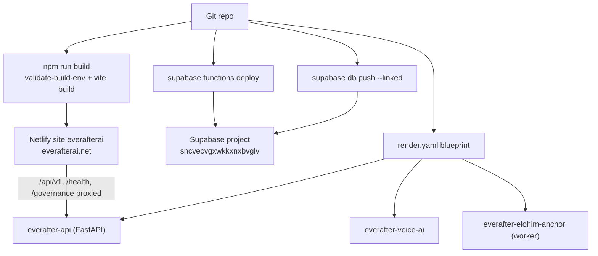

# Deployment

EverAfter deploys to three platforms: the React SPA to Netlify, the 55 edge functions and Postgres migrations to Supabase, and a Python FastAPI backend (plus voice and ledger services) to Render via `render.yaml`. The Express server and BullMQ worker described in the [[Dual Backend System]] have **no committed deployment config** — see the warning below.

## Overview

## Netlify Frontend

- **Production:** https://everafterai.net · **Dev alias:** https://dev--everafterai.netlify.app · **Site:** `everafterai` (`2b042583-f657-4e89-914e-af3623dd3e78`) — per `CLAUDE.md`.
- Build: `npm run build` → `dist/`. The build script first runs `scripts/validate-build-env.mjs`, which **fails the build** if `VITE_SUPABASE_URL` / `VITE_SUPABASE_ANON_KEY` are missing, masked, or don't look like a publishable key; it warns and ignores a localhost `VITE_API_BASE_URL` in production builds.
- Deploy: `npx netlify-cli deploy --dir=dist --alias=dev` (preview) or `--prod`.
- `netlify.toml` specifics:
  - Secret scanning stays on; only the two publishable Supabase values are allowlisted via `SECRETS_SCAN_OMIT_KEYS`.
  - Cache headers: `/*` gets `no-store` (SPA shell must update instantly), `/assets/*` gets `immutable` one-year caching. The broad rule is deliberately listed **first** because Netlify applies the *last* matching rule.
  - Proxies `/api/v1/*`, `/health`, and `/governance/*` to `https://everafter-api-voac.onrender.com` (the Render FastAPI backend), then falls back to `/index.html` for SPA routing.

## Supabase Edge Functions and Database

- **Project ref:** `sncvecvgxwkkxnxbvglv` → https://sncvecvgxwkkxnxbvglv.supabase.co. `supabase/config.toml` (`project_id = "everafter"`) only configures the *local* stack.
- Functions: `supabase functions deploy raphael-chat` (one) or `supabase functions deploy` (all 55) after `supabase link --project-ref sncvecvgxwkkxnxbvglv`. Catalog in [[Edge Functions Overview]].
- SQL [[Migrations|migrations]] (122 files in `supabase/migrations/`): `SUPABASE_ACCESS_TOKEN='...' npx supabase db push --linked`.
- Secrets live in Dashboard → Edge Functions → Secrets or `supabase secrets set` — see [[Secrets Management]] and [[Environment Variables]].
- Post-deploy smoke test: `USER_JWT='token' ./scripts/smoke-test.sh` ([[Testing Strategy]]).

> [!warning] `CLAUDE.md` lists `GROQ_API_KEY` as the secret currently set for `raphael-chat`, but no function under `supabase/functions/` references Groq — the AI functions all read `OPENAI_API_KEY`. If only the Groq key is set in production, chat functions fail with `CONFIG_MISSING`.

> [!note] "Cron" functions (`glucose-aggregate-cron`, `agent-cron`, `vault-scheduler`) are plain HTTP functions; nothing in the repo schedules them. They must be wired to pg_cron or the dashboard scheduler after deploy.

## Render Services (`render.yaml`)

The blueprint defines three services rooted in this repo:

| Service | Runtime | Root | Notes |
|---|---|---|---|
| `everafter-api` | Python 3.11 (free) | `backend/` | `uvicorn app.main:app`, health check `/health`, CORS pinned to `everafterai.net`. Requires `SUPABASE_JWT_SECRET` or it rejects all Supabase tokens. |
| `everafter-elohim-anchor` | Docker worker (starter) | `backend/` | Seals engrams/responses into a signed ledger on a 1 GB persistent disk at `/data` — losing the disk's keyring permanently breaks the ledger. |
| `everafter-voice-ai` | Python (free) | `voice-ai-service/` | ElevenLabs-backed voice sidecar; `everafter-api` discovers its host via `fromService`. |

`RENDER_BACKEND_SETUP.md` documents the manual setup; heavy ML deps were moved to `backend/requirements-ml.txt` so the free-tier API can boot without them.

## Express Server and Worker

`CLAUDE.md` says to run `server/index.ts` (port 3001) and `server/workers/scheduler.ts` ([[BullMQ Scheduler]]) on Railway/Render with PM2 or Docker, and they need Postgres ([[Prisma Schema]]) plus Redis.

> [!warning] There is no Procfile, Dockerfile, or render.yaml entry for the [[Express Server]] or the BullMQ worker anywhere in the repo — the only Render blueprint deploys the *Python* backend. Treat "Railway/Render for Express" as an intention, not a configured pipeline; in production the Netlify proxy points at the FastAPI service, not Express.

## Key Files

- `netlify.toml` — build command, cache headers, Render proxy redirects, SPA fallback
- `scripts/validate-build-env.mjs` — pre-build env validation gate
- `render.yaml` — blueprint for the three Render services
- `supabase/config.toml` — local-stack config only (not deployed settings)
- `supabase/migrations/` — 122 SQL migrations applied via `db push`
- `RENDER_BACKEND_SETUP.md` — Render walkthrough for `everafter-api`
- `DEPLOYMENT_CHECKLIST_NEW.md` — the current production checklist (security → functions → frontend)
- `DEPLOYMENT_CHECKLIST.md` — older generic checklist (mentions Vercel and a `supabase_schema.sql` that predates the migration workflow)

## Related

- [[Operations MOC]] — hub for all operations notes
- [[Environment Variables]] — what each deploy target needs configured
- [[Secrets Management]] — where the sensitive halves live
- [[Commands Cheatsheet]] — the exact commands referenced above
- [[Testing Strategy]] — smoke tests to run after each deploy
- [[Edge Functions Overview]] — what actually gets deployed to Supabase
- [[Dual Backend System]] — why there are this many backends to deploy
