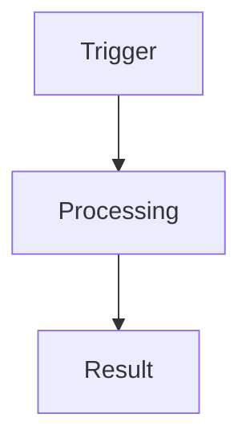

# {{title}}

> One-to-three sentence plain-language summary of what this feature is and why it exists.

## Overview

What the feature does, who uses it, and where it lives in the product.

## How It Works

Flow from trigger to result. Add a Mermaid diagram if the flow crosses systems:

## Key Files

- `src/path/to/file.tsx` — what it does
- `supabase/functions/name/index.ts` — what it does

## Gotchas

> [!warning]
> Things that will bite you.

## Related

- [[Home]] — vault entry point
