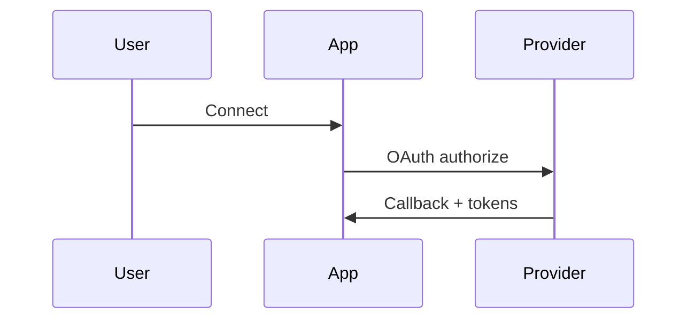

# {{title}}

> Which provider this integrates, what data it brings in, and through which path (direct OAuth, aggregator, webhook).

## Connection Flow

## Data Ingested

| Metric | Unit | Table |
| ------ | ---- | ----- |
|        |      |       |

## Key Files

- OAuth start/callback —
- Webhook handler —
- Frontend UI —

## Secrets / Config

- `PROVIDER_CLIENT_ID`, `PROVIDER_CLIENT_SECRET`

## Gotchas

> [!warning]
> Rate limits, sandbox vs production, token refresh quirks.

## Related

- [[Health Integrations MOC]]
