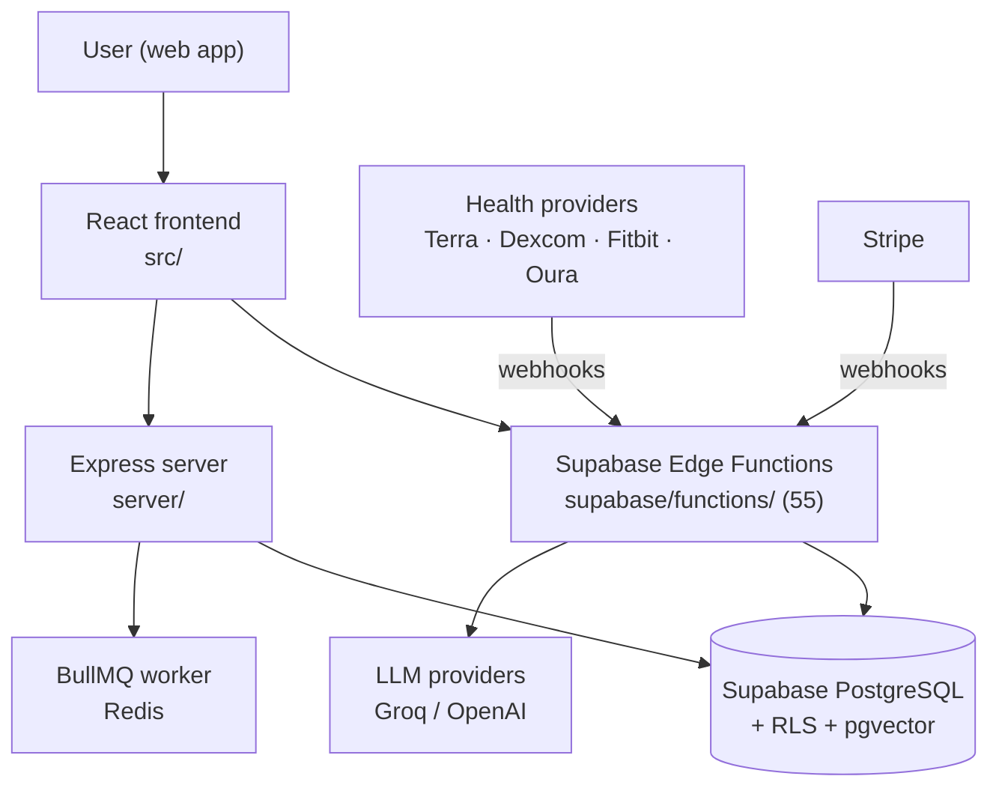

# Home

This vault is the second brain for **EverAfter** — a digital legacy and health companion platform pairing AI personas (St Raphael and the other Saints), user-trained Custom Engrams, multi-provider health monitoring, and family legacy preservation. Everything here is written against the actual code in the parent repository.

> [!tip] New here?
> Read [[System Overview]] first, then open the domain map that matches what you're touching. The visual map lives in [[EverAfter Map.canvas|EverAfter Map]]. Vault conventions are in the `README.md` next to this note.

## Domain Maps

| Map | What it covers |
| --- | -------------- |
| [[Architecture MOC]] | System design, [[Dual Backend System]], auth, [[Tech Stack]], repo layout |
| [[Frontend MOC]] | React app — [[Pages and Routing]], [[Design System]], state, onboarding |
| [[Backend MOC]] | All 55 Supabase Edge Functions, [[Express Server]], [[BullMQ Scheduler]] |
| [[Database MOC]] | Migrations, [[Key Tables]], [[Prisma Schema]], [[Row Level Security]] |
| [[AI Systems MOC]] | [[St Raphael]], [[Custom Engrams]], [[The Saints]], embeddings, [[Safety Guardrails]] |
| [[Health Integrations MOC]] | Terra, Dexcom, Fitbit, Oura, FHIR, webhooks, glucose alerts |
| [[Legacy and Family MOC]] | [[Legacy Vault]], [[Family Engrams]], memorials, [[Time Capsules]] |
| [[Products MOC]] | [[Career Companion]], [[Marketplace and Creator Dashboard]], insurance, [[Beyond Modules]] |
| [[Security MOC]] | [[PHI Handling]], [[Webhook Signature Verification]], [[Secrets Management]] |
| [[Operations MOC]] | [[Deployment]], [[Environment Variables]], [[Testing Strategy]], [[Common Gotchas]] |

## Fast Answers

- *How do I run / test / deploy this?* → [[Commands Cheatsheet]]
- *What keeps biting people?* → [[Common Gotchas]]
- *Where does a health reading go after the provider sends it?* → [[Webhook Ingestion Pipeline]]
- *How does a chat message become an AI response?* → [[St Raphael]]
- *Which env vars and secrets exist, and where?* → [[Environment Variables]] · [[Secrets Management]]
- *Which of the 150+ root docs should I actually read?* → [[Documentation Index]]

## The Big Picture

## Vault Conventions

- Every note carries `tags` and an `updated` date in frontmatter — trust fades with age; bump the date when you re-verify.
- `#moc` notes are curated indexes; regular notes go deep on one subsystem.
- Backticked paths (`src/App.tsx`) point into the parent repo, one directory up from this vault.
- `> [!warning]` callouts mark operational hazards learned the hard way.
- New note? Grab a starter from `99 Templates/`.
